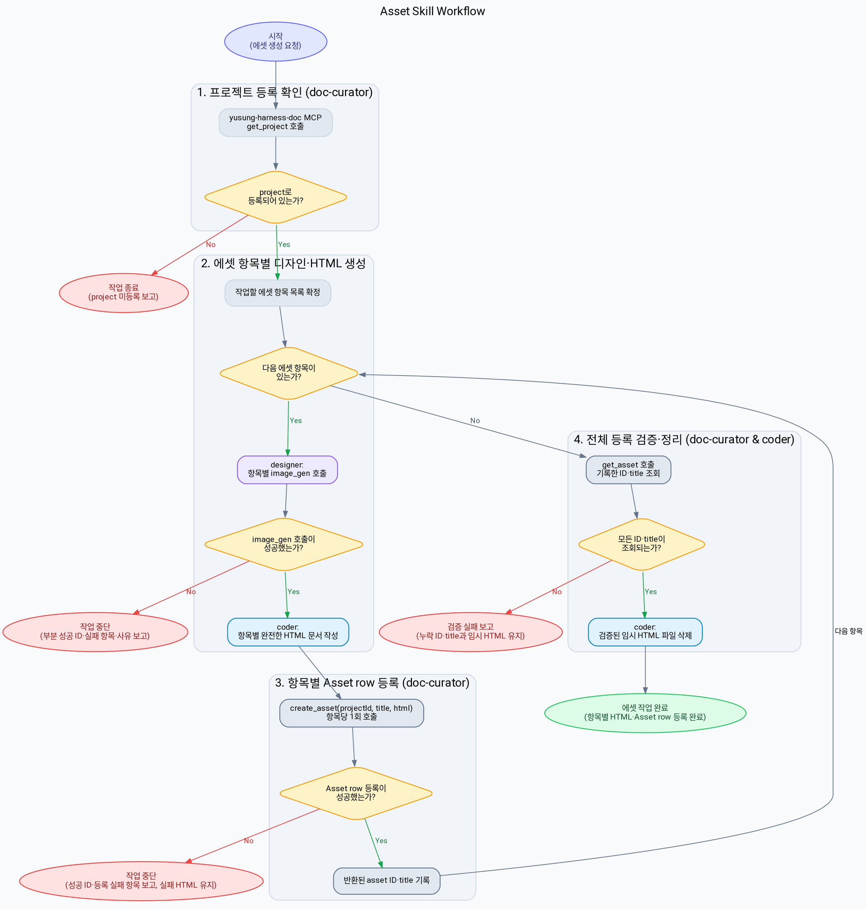
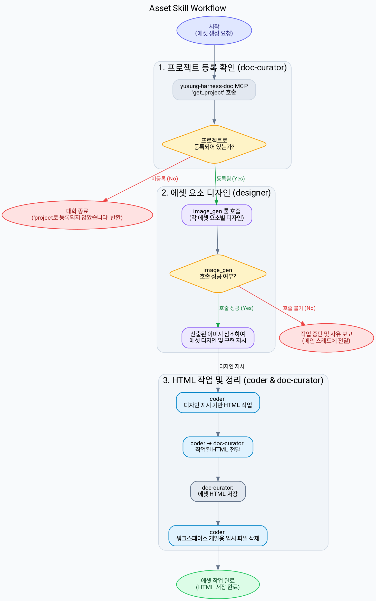

## 에이전트 호출 경계

- 새 에이전트를 생성하는 `spawn_agent`는 `root만` 호출한다.
- non-root 에이전트는 `spawn_agent`를 `직접 또는 간접`으로 호출하거나 다른 에이전트에게 생성을 요청하지 않는다.
- non-root 에이전트는 root가 이미 생성한 에이전트와 협력할 때 `send_message`, `followup_task`, `wait_agent`를 사용할 수 있다.
- 추가 역할이나 에이전트가 필요하면 필요한 역할, 작업 범위와 기대 증거를 `root에 handoff`한다.

디자인 컨셉, 테마색 조합 설정, 로고, 컴포넌트 요소 등의 디자인 에셋을 정리한다.

## root가 호출할 에이전트 목록

| 에이전트명 | 하는일                                                                   |
| ---------- | ------------------------------------------------------------------------ |
| designer   | 디자인 컨셉, 테마 색 조합 설정, 로고 디자인, 컴포넌트 요소 등등을 디자인 |
| coder      | 코드 검색, 코드 작성, 코드 수정                                          |
| researcher | 비슷한 컨셉의 도메인을 서비스하는 각종 사이트들의 레퍼런스 체크          |

## 워크플로우

> - doc-curator는 먼저 yusung-harness-doc MCP 서버의 `get_project`를 호출하여 작업 대상 레포가 project로 등록되어 있는지 확인한다.
> - project로 등록되어 있지 않으면 `project로 등록되지 않았습니다. 먼저 레포를 project로 등록하세요`라고 반환한 후 작업을 종료한다.
> - 작업 대상으로 확정한 에셋 항목을 하나씩 순회한다.
>   - designer는 각 에셋 항목을 디자인할 때마다 `image_gen` 툴을 호출한다.
>   - `image_gen` 호출이 불가능하면 작업을 즉시 중단하고, 이미 등록된 asset ID와 실패한 에셋 항목 및 사유를 메인 에이전트에 보고한다.
>   - coder는 생성된 이미지를 참조하여 에셋 항목마다 독립적으로 렌더링 가능한 완전한 HTML 문서 하나를 작성한다.
>   - doc-curator는 각 HTML 문서마다 `create_asset(projectId, title, html)`을 한 번씩 호출하고 반환된 asset ID와 title을 기록한다.
>   - `create_asset` 호출이 실패하면 작업을 즉시 중단한다. 이미 등록된 row는 삭제하거나 통합하지 않고, 성공한 asset ID와 실패 항목을 보고하며 실패한 임시 HTML 파일은 재시도를 위해 유지한다.
> - 모든 에셋 등록 후 doc-curator는 `get_asset`을 호출하여 기록한 asset ID와 title이 모두 조회되는지 검증한다.
> - 검증이 성공한 HTML 임시 파일만 워크스페이스에서 삭제한다. 검증에 실패한 파일은 유지하고 누락된 asset ID와 title을 보고한다.

### 판단 알고리즘

### 판단 알고리즘

## 에셋의 생성 원칙

<RULE>
- `projectId`는 에셋의 소유 프로젝트를 묶는 범위로만 사용한다. 여러 에셋을 하나로 합치는 저장 단위로 사용하지 않는다.
- 저장 단위는 에셋 항목 하나이다. 에셋 항목마다 완전한 HTML 문서 파일 하나와 Asset row 하나를 생성한다.
- 각 HTML은 `doctype`, `html`, `head`, `body`를 포함하여 독립적으로 렌더링할 수 있어야 한다.
- 에셋 항목마다 `create_asset(projectId, title, html)`을 한 번 호출한다. title은 어떤 에셋 항목인지 명확히 식별할 수 있게 작성한다.
- 여러 에셋을 합친 통합 HTML 문서나 통합 Asset row를 생성하지 않는다.
- 같은 에셋 항목의 상태·크기·색상 등 세부 변형은 해당 항목의 HTML 문서 안에 함께 표현한다.
- `기타`에 여러 구체적인 에셋이 포함되면 각 에셋을 별도의 HTML 문서와 Asset row로 분리한다.
- 산출물은 에셋 항목별 ***에셋 팔레트 형식의 디자인 시스템 문서***이다. 와이어프레임과 연동된 인터랙티브 디자인이 아니다.
    > 산출물의 예시는 다음과 같다. 예시는 개별 에셋 문서의 시각적 참고일 뿐, 통합 산출물 형식이나 그대로 모방할 양식이 아니다.
    > - 예시1: [asset-example1](./references/asset-example1.html)
    > - 예시2: [asset-example2](./references/asset-example2.html)
    > - 예시3: [asset-example3](./references/asset-example3.html)

</RULE>

## 정의 되어야할 에셋의 목록

| 에셋명                      | 설명                                                                         |
| --------------------------- | ---------------------------------------------------------------------------- |
| 로고(Logo)                  | 작업 서비스를 대표할 수 있는 로고 디자인 에셋                                |
| 워드마크(WordMark)          | 서비스 이름 자체를 로고화한 디자인 에셋                                      |
| 심볼(Symbol)                | 독립적인 그래픽·아이콘·그림                                                  |
| 컬러 팔레트(Color Pallette) | 서비스 테마 컬러 색감 팔레트                                                 |
| 액션 아이콘(Action Icon)    | 애니메이션 움직이는 아이콘                                                   |
| 마스코트(Mascot)            | 서비스 아이덴티티가 포함된 서비스 마스코트                                   |
| 폰트(Fonts)                 | 서비스에서 사용할 글자 폰트                                                  |
| 타이포 그래피(Typography)   | 글자 크기, 글자 굵기, 줄간격, 자간, 제목(h1~h6) 등을 적용한 본문의 계층 구조 |
| 파비콘(Favicon)             | 웹 사이트 탭 좌측에 조그맣게 보이는 아이콘                                   |
| 앱 아이콘(App Icon)         | 앱 배포시 사용할 아이콘                                                      |
| 버튼(Button)                | 서비스에서 사용할 버튼 디자인                                                |
| Badges(배지)                | 서비스에서 상태나 플래그를 표현하는 배지 디자인                              |
| 기타                        | 정의된 에셋 외에 서비스 특성상 필요하다고 판단되는 디자인 에셋 모음          |
