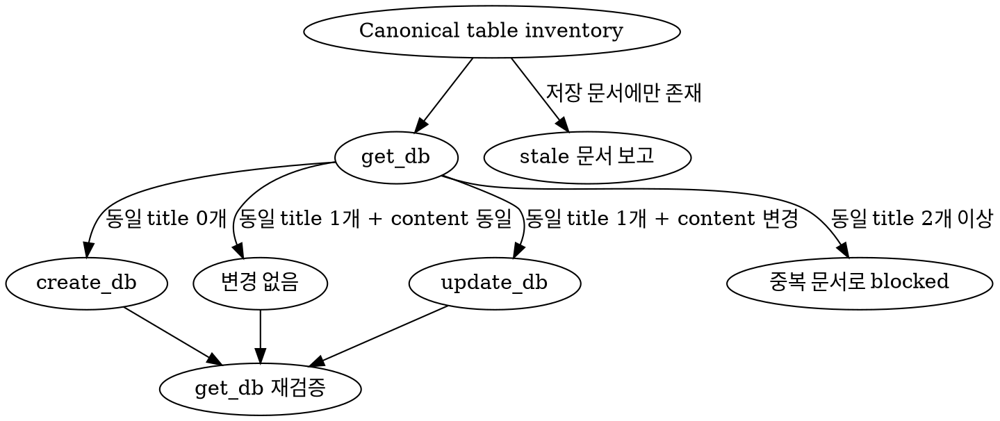

## 에이전트 호출 경계

- 새 에이전트를 생성하는 `spawn_agent`는 `root만` 호출한다.
- non-root 에이전트는 `spawn_agent`를 `직접 또는 간접`으로 호출하거나 다른 에이전트에게 생성을 요청하지 않는다.
- non-root 에이전트는 root가 이미 생성한 에이전트와 협력할 때 `send_message`, `followup_task`, `wait_agent`를 사용할 수 있다.
- 추가 역할이나 에이전트가 필요하면 필요한 역할, 작업 범위와 기대 증거를 `root에 handoff`한다.

# DB 구조 문서화

- 특정 source revision에 선언된 AS-IS 물리 스키마만 문서화한다.
- 애플리케이션이 소유하는 물리 테이블과 join table마다 DB 문서 한 건을 유지한다.
- 목표 스키마 설계, 운영 DB drift 검사와 HTML ERD 생성은 이 스킬의 범위에 포함하지 않는다.
- ERD가 필요하면 `erd` 스킬로 분리한다.

## root가 호출할 담당 에이전트

| 에이전트 | 책임 |
| --- | --- |
| `coder` | 저장소와 revision을 고정하고 schema source를 탐색하여 테이블별 직접 근거를 수집한다. |
| `doc-curator` | 프로젝트 등록과 기존 DB 문서를 조회하고 `create_db` 또는 `update_db`로 저장한 뒤 재조회하여 검증한다. |

- root가 에이전트를 호출하고 재사용하며, 에이전트끼리 중복 범위를 조정한다.
- `coder`는 문서를 저장하지 않고 `doc-curator`는 확인되지 않은 스키마를 추론하지 않는다.

## 참조 문서

- 분석을 시작하기 전에 [schema source 탐색 규칙](./references/db-source-discovery.md)을 읽는다.
- 테이블 문서를 작성하기 전에 [DBTableDoc/1.0 템플릿](./references/db-table-template.md)을 읽고 섹션 순서를 그대로 사용한다.
- 복합 제약조건이나 불일치 표현이 필요하면 [테이블 문서 예시](./references/db-table-example.md)를 읽는다.

## 안전 경계

<HARD-GATE>

- `doc-curator`는 먼저 `get_project`로 프로젝트와 `repoPaths`를 확인한다. 등록되지 않은 프로젝트이면 저장하지 말고 `curate` 스킬로 등록하도록 안내한다.
- 대상 repository, source revision 또는 DB scope를 식별할 수 없으면 분석과 저장을 중단한다.
- 여러 database 또는 schema가 존재하고 대상 범위를 코드에서 확정할 수 없으면 사용자 결정을 받기 전까지 저장하지 않는다.
- migration·DDL이 존재하지만 누락·충돌로 canonical table inventory를 확정할 수 없으면 영향을 받는 테이블을 추측하거나 저장하지 않는다.
- migration·DDL이 전혀 없는 프로젝트는 runtime schema synchronization 설정과 단일 canonical ORM schema가 저장소에서 명확히 확인될 때만 `partial` 문서로 작성한다. 둘 중 하나라도 불명확하면 저장하지 않는다.
- 운영·개발 DB에 연결하거나 metadata와 row를 조회하지 않는다. migration은 외부 연결이 없는 격리된 임시 DB에서만 재생한다.
- migration, DDL, seed, code generation 또는 ORM sync를 대상 repository나 실제 DB에 적용하지 않는다.
- 실제 row, sample data, 개인정보, credential, token, connection string과 환경 변수 값을 수집하거나 문서에 기록하지 않는다.
- `get_context`는 yusung-harness-doc 서버 자체 SQLite schema 조회 도구이므로 대상 프로젝트 DB 분석에 사용하지 않는다.

</HARD-GATE>

## 분석 흐름

```text
get_project + repoPaths
          │
          ▼
repository·revision·DB scope 고정
          │
          ▼
migration·DDL·ORM source 탐색
          │
          ▼
canonical table inventory 작성
          │
          ▼
테이블별 DBTableDoc/1.0 작성
          │
          ▼
get_db → create/update/blocked 판정
          │
          ▼
get_db 재조회 → 저장 결과 검증
```

1. `get_project` 결과의 repository 경로와 사용자 요청 범위를 대조한다.
2. source revision을 commit hash로 기록한다. working tree 변경을 포함하면 `HEAD+dirty`로 표시하고 관련 변경 경로를 근거 목록에 기록한다.
3. `db-source-discovery.md`에 따라 schema snapshot, migration·DDL, ORM schema/entity를 찾는다.
4. 재생 가능한 migration은 외부 연결이 차단된 임시 DB에서만 적용하여 최종 schema를 확인한다. 안전한 재생을 보장할 수 없으면 정적으로 분석한다.
5. 물리 테이블과 join table의 canonical inventory를 만들고 view, trigger, system table과 migration metadata table을 제외 목록에 분리한다.
6. 각 테이블의 컬럼 순서, 물리 타입, nullable, default/generated, PK, FK, UNIQUE, CHECK, index와 referential action을 정규화한다.
7. schema source가 다르면 `db-source-discovery.md`의 우선순위가 높은 물리 근거를 채택하고 차이를 `불일치·미확인`에 기록한다. 동일 우선순위 근거가 충돌하면 영향을 받는 테이블을 blocked 처리한다.
8. 각 테이블을 `DBTableDoc/1.0`으로 작성하고 컬럼·제약조건·인덱스·관계가 직접 근거와 연결되는지 교차 검증한다.
9. `get_db`로 기존 문서를 조회한 뒤 테이블별 create/update 분기를 결정한다.
10. 저장 후 `get_db`를 다시 호출하여 title, content와 문서 수를 inventory와 대조한다.

## 문서 계약

- `title`은 SQL quote 구분자만 제거하고 물리 테이블 identifier의 casing과 문자를 그대로 보존한다.
- 서로 다른 database 또는 schema에서 같은 테이블명이 충돌할 때만 `database.schema.table` 형식의 fully-qualified title을 사용한다.
- 비교용 normalized key는 내부 판정에만 사용하고 저장 title을 변경하지 않는다.
- `content`는 `DBTableDoc/1.0` Markdown 전체를 사용한다.
- 각 문서는 자신의 outbound FK와 대상 테이블에서 확인한 inbound 관계를 함께 기록한다.
- 관계의 constraint, 컬럼, 대상 컬럼, `ON UPDATE`, `ON DELETE`가 양쪽 문서에서 일치하도록 검증한다.
- 확인되지 않은 역할, cardinality 또는 비즈니스 규칙은 추론하지 말고 `미확인`으로 기록한다.
- 문서와 목록은 database, schema, table, column ordinal, constraint name, index name 순으로 결정론적으로 정렬한다.

## 동기화 알고리즘



- 동일 title이 없으면 `create_db(projectId, title, content)`를 한 번 호출한다.
- 동일 title이 한 건이고 content가 같으면 mutation을 생략한다.
- 동일 title이 한 건이고 content가 다르면 `update_db(projectId, dbId, title, content)`를 호출한다.
- 동일 title이 둘 이상이면 임의 문서를 선택하지 말고 해당 title을 blocked 처리한다.
- inventory에는 없고 기존 DB 문서에만 존재하는 title은 stale 또는 rename 후보로 보고한다. 자동 삭제하거나 `OBSOLETE`로 변경하지 않는다.
- 한 테이블의 실패 때문에 이미 검증된 다른 테이블의 결과를 사실과 다르게 보고하지 않는다. 저장별 성공·실패·미변경 상태를 개별 기록한다.

## 결과 보고

- 다음 항목을 root에 반환한다.
  - 프로젝트 ID, repository 경로, source revision과 DB scope
  - canonical table 수와 제외한 DB 객체 목록 및 이유
  - `created`, `updated`, `unchanged`, `blocked`, `stale` title 목록
  - source conflict, 미확인 항목과 저장 실패 원인
  - 저장 후 재조회한 문서 ID와 title
- 저장하지 못한 테이블이 있으면 전체 작업을 완전한 성공으로 보고하지 않는다.

## 완료 조건

- canonical inventory의 모든 검증된 물리 테이블에 정확히 한 개의 문서가 존재한다.
- 각 문서가 `DBTableDoc/1.0`의 모든 고정 섹션을 포함한다.
- 컬럼 ordinal과 복합 키·제약조건·인덱스의 컬럼 순서를 보존한다.
- 모든 FK가 양쪽 테이블 문서에서 동일한 대상으로 표현된다.
- 모든 구조 정보가 revision과 schema source 근거에 연결된다.
- 사실, schema source 선택, 불일치와 미확인 정보를 구분한다.
- 중복 문서와 stale 문서를 자동으로 덮어쓰거나 삭제하지 않는다.
- 실제 데이터와 비밀값이 문서와 결과 보고에 포함되지 않는다.
