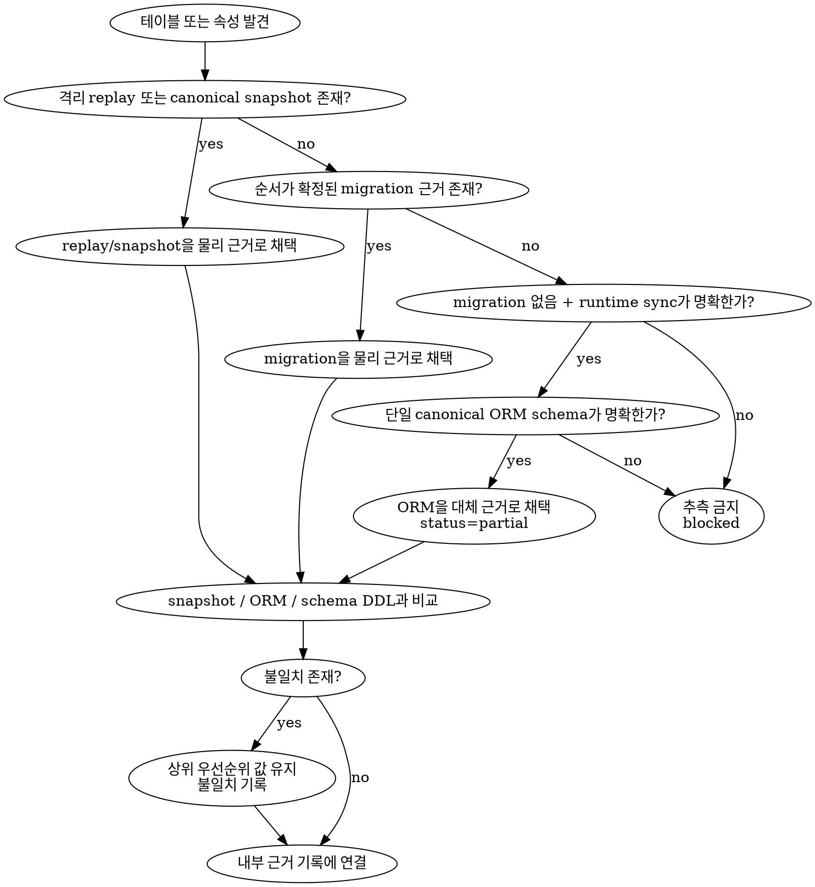

# DB source discovery rules

이 문서는 저장소의 특정 revision을 기준으로 현행 물리 데이터베이스 스키마를 재구성할 때 사용하는 근거 선택 규칙이다. 산출물은 설계 제안, API 사용처 분석이나 운영 데이터베이스의 상태 추정이 아니라, 확인한 저장소 revision에서 재현 가능한 AS-IS 스키마 문서여야 한다.

## 목차

- [불변 원칙](#불변-원칙)
- [분석 범위](#분석-범위)
- [근거 우선순위](#근거-우선순위)
- [Framework별 탐색 경로](#framework별-탐색-경로)
- [탐색 절차](#탐색-절차)
- [근거 선택 알고리즘](#근거-선택-알고리즘)
- [충돌 기록 규칙](#충돌-기록-규칙)
- [내부 근거 검증 계약](#내부-근거-검증-계약)
- [완료 점검](#완료-점검)

## 불변 원칙

- 분석 시작 시 저장소 경로와 source revision을 고정한다.
- 물리 스키마의 1차 근거는 순서가 확정된 migration이다.
- ORM model, entity와 decorator는 물리 구조를 보강하는 근거이며 상위 근거를 덮어쓰지 않는다. application query는 schema-bearing DDL 탐색에만 사용한다.
- 서로 다른 근거를 임의로 합성하지 않는다. 차이는 `conflict`로 기록하고 물리 구조는 우선순위가 높은 근거를 따른다.
- 실제 레코드, sample row, 개인정보, 비밀값, credential, connection string과 `.env` 내용은 조회하거나 문서에 포함하지 않는다.
- 대상 repository 또는 실제 데이터베이스에는 DDL, DML, migration apply/rollback과 schema synchronization을 실행하지 않는다.
- migration 재생이 필요하면 외부 연결이 차단된 일회성 임시 데이터베이스에서만 수행하고, seed와 애플리케이션 bootstrap은 실행하지 않는다. 안전한 격리를 보장할 수 없으면 정적으로 분석한다.
- 운영·개발 데이터베이스에는 연결하지 않는다. live catalog 비교와 drift 분석은 v1 범위에서 제외한다.

## 분석 범위

- 기본 포함 대상은 애플리케이션이 소유한 physical table과 physical join table이다.
- view, materialized view, foreign table, sequence, trigger와 procedure는 테이블 inventory와 구분한다. 현재 DB 문서에는 테이블 동작을 이해하는 데 필요한 항목만 관련 테이블의 근거로 연결한다.
- DBMS system schema와 framework migration metadata table은 기본 문서 대상에서 제외하되, inventory에 이름과 제외 이유를 남긴다.
- 여러 database 또는 schema가 같은 테이블 이름을 사용하면 `database.schema.table` 순서의 fully-qualified name으로 식별한다.
- 대소문자와 quoted identifier는 migration에 선언된 물리 이름을 보존한다.

## 근거 우선순위

| 우선순위 | 근거 | 사용 규칙 |
| ---: | --- | --- |
| 1 | 격리된 migration 재생 결과 또는 revision에 고정된 canonical schema snapshot | 외부 연결 없는 임시 DB에서 재생한 최종 상태를 우선한다. 재생하지 못하면 framework 설정상 canonical이며 해당 revision과 동기화된 `structure.sql`, `schema.rb` 같은 snapshot을 사용한다. |
| 2 | 순서가 확정된 migration·DDL의 최종 상태 | 생성, 변경, rename, drop을 migration 순서대로 해석한 결과를 사용한다. 상위 snapshot이 stale하거나 revision 연계를 증명할 수 없으면 snapshot을 제외하고 이 근거를 채택한다. |
| 3 | 선언형 ORM schema 또는 entity/model | 테이블 목적, 코드 속성명과 관계 의미를 보강한다. migration과 다른 컬럼, nullability, default, constraint는 물리 구조로 채택하지 않는다. |
| 4 | repository, query builder, raw SQL | 물리 table 이름이나 별도 schema DDL의 탐색 단서로만 사용한다. API 사용처와 조회·쓰기 흐름은 문서화하지 않고 application validation을 물리 제약조건으로 기록하지 않는다. |
| 5 | 기존 문서와 주석 | 탐색 단서로만 사용한다. 직접 schema 근거가 없으면 사실로 확정하지 않는다. |

- migration·DDL이 전혀 없고 runtime schema synchronization이 저장소 설정으로 명확히 활성화되며 단일 canonical ORM schema를 식별할 수 있는 경우에만 ORM schema를 대체 근거로 사용할 수 있다.
- 대체 근거를 사용한 문서는 `partial`로 표시하고, migration 또는 재현 가능한 schema snapshot이 없다는 근거 공백을 남긴다.
- migration 일부가 누락되었거나 순서, dialect, baseline을 결정할 수 없으면 최종 상태를 추측하거나 저장하지 않고 해당 테이블을 blocked 처리한다.

## Framework별 탐색 경로

| Framework / 도구 | migration 우선 탐색 | 보조 탐색 | 주의사항 |
| --- | --- | --- | --- |
| Prisma | `prisma/migrations/*/migration.sql` | `schema.prisma` | migration과 schema가 다르면 migration의 물리 구조를 채택하고 drift를 기록한다. |
| TypeORM | 설정의 `migrations` 경로, `*Migration*.ts`의 `up` SQL | `@Entity`, `@Column`, `@Index`, data source 설정 | migration이 없고 `synchronize: true`와 단일 entity set이 모두 확인될 때만 entity 기반 `partial` 문서다. |
| Sequelize | `migrations/*`, Umzug 설정 | `models/*`, `define`, association | model validation은 DB CHECK/UNIQUE로 간주하지 않는다. |
| Django | 각 app의 `migrations/*.py` 의존 순서 | `models.py`, `Meta.indexes`, `Meta.constraints` | model 현재 상태보다 migration state를 우선한다. database router로 DB가 갈리면 scope를 분리한다. |
| Rails | `db/migrate/*` | `db/structure.sql`, `db/schema.rb`, model association | snapshot은 검증용이다. migration과 다르면 migration 우선 conflict로 처리한다. |
| Laravel | `database/migrations/*` | Eloquent model, schema builder | accessor, cast, validation을 물리 컬럼 타입이나 constraint로 오인하지 않는다. |
| Alembic / SQLAlchemy | `alembic/versions/*` revision graph | `MetaData`, declarative model | branch와 merge revision을 해석할 수 없으면 최종 상태를 확정하지 않는다. |
| Flyway | `V*__*.sql`, repeatable migration과 설정 위치 | JPA/Hibernate entity | 적용 순서와 baseline을 기록한다. Hibernate validation은 물리 schema 근거가 아니다. |
| Liquibase | root changelog와 include 순서 | JPA/Hibernate entity | context, label, precondition에 따라 대상이 갈리면 선택 근거를 기록한다. |
| Knex / Kysely | migration 설정과 migration 파일 | schema type, query builder | TypeScript type은 DB constraint가 아니다. |
| Drizzle | configured migration output의 SQL | `pgTable`, `mysqlTable`, `sqliteTable` schema | 선언 schema와 생성된 SQL이 다르면 migration SQL을 우선한다. |
| Supabase | `supabase/migrations/*.sql` | local schema dump, generated types | RLS policy와 trigger는 관련 테이블의 보조 근거로 연결하되 실제 row는 조회하지 않는다. |

## 탐색 절차

```text
repository path + source revision
              |
              v
     DB framework/config 탐색
              |
              v
  migration graph/order와 dialect 확정
              |
              v
  replay/snapshot 또는 migration 기준 inventory 생성
              |
              +----> canonical snapshot 교차 검증
              |
              +----> ORM/schema DDL 보강
              |
              v
 table별 내부 근거 기록 + conflict 목록
```

1. `rg --files`로 DB config, migration, schema snapshot, ORM model과 repository 후보를 찾는다.
2. DB engine, dialect, database/schema scope, migration root와 적용 순서를 저장소 설정으로 확정한다.
3. migration을 순서대로 읽어 table create/alter/rename/drop의 최종 결과를 계산한다.
4. physical table inventory를 fully-qualified name으로 정렬한다.
5. 각 table의 column ordinal, physical type, nullability, default/generated expression을 수집한다.
6. PK, UNIQUE, FK, CHECK, EXCLUDE와 이름 없는 constraint를 수집한다.
7. index의 방식, column/expression 순서, 정렬 방향, unique, include와 predicate를 수집한다.
8. FK마다 outbound와 inbound 관계, cardinality, `ON UPDATE`, `ON DELETE`를 양쪽 table 문서에 연결한다.
9. ORM schema와 schema-bearing raw SQL을 비교하여 물리 구조 근거를 보강하고 불일치를 기록한다. API와 application read/write 사용처는 분석하지 않는다.
10. `db-table-template.md`에 맞춰 table별 문서를 만들고 저장 content 밖의 내부 근거 기록이 실제 source revision과 schema source를 참조하는지 검증한다.

## 근거 선택 알고리즘



## 충돌 기록 규칙

- 충돌 단위는 table, column, constraint, index 또는 relationship이다.
- 각 충돌에 `canonical 물리 근거`, `불일치 근거`, `채택한 값`, `채택 이유`, `영향`을 기록한다.
- replay, canonical snapshot, migration 또는 DDL 근거가 존재할 때 ORM에만 있는 index나 relation은 물리 schema에 존재한다고 쓰지 않는다.
- 선택된 canonical 물리 근거에서 nullable인데 ORM에서 required이면 물리 nullability는 nullable로 기록한다.
- 선택된 canonical 물리 근거의 FK action과 ORM cascade 설정이 다르면 canonical 근거의 `ON UPDATE`와 `ON DELETE`를 기록한다.
- rename인지 drop/create인지 증명되지 않으면 동일 객체로 합치지 않는다.

## 내부 근거 검증 계약

- schema source의 종류, source revision, 저장소 상대 위치, migration identifier 또는 code symbol과 확인한 사실은 저장 content 밖의 내부 분석 기록에서 관리한다.
- line number는 내부 탐색의 보조 위치로 사용할 수 있지만 migration identifier와 symbol을 대신하지 않는다.
- 내부 분석 기록으로 각 table의 column, constraint, index와 relationship을 재현할 수 있어야 한다.
- generated file, build artifact와 dependency 내부 schema는 소유권과 생성 원본이 확인된 경우에만 내부 보조 근거로 사용한다.
- 일반 application query와 API 사용처는 schema source 검증에 사용하지 않는다.
- 실제 row 수, row 값, token, password, host credential과 전체 connection URL은 내부 근거가 될 수 없다.
- 내부 근거 식별자, source mapping, 저장소 경로, 파일명, line number와 code symbol은 `DBTableDoc/2.0` 저장 content에 포함하지 않는다.

## 완료 점검

- 포함 대상 table 수와 생성할 DB 문서 수가 일치한다.
- 제외된 database object마다 제외 이유가 있다.
- 모든 column, constraint와 index가 내부 분석에서 migration 근거 또는 명시된 대체 근거로 재현된다.
- 모든 FK의 outbound와 inbound 설명이 같은 constraint와 action을 가리킨다.
- source revision, dialect와 migration 순서를 다시 사용해 같은 inventory를 재현할 수 있다.
- 저장소 근거만 확인한 문서를 운영 데이터베이스의 현재 상태라고 표현하지 않는다.
