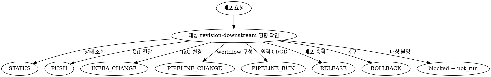

# 배포 오케스트레이션

- 저장소 설정, Architecture PLAN, IaC와 workflow를 읽어 공급자와 명령을 발견한다. 특정 클라우드, Git host 또는 CI/CD 명령을 추측하거나 하드코딩하지 않는다.
- 요청을 `STATUS`, `PUSH`, `INFRA_CHANGE`, `PIPELINE_CHANGE`, `PIPELINE_RUN`, `RELEASE`, `ROLLBACK`으로 분류한다.
- 복합 요청은 의존 순서대로 분해하고 각 operation을 독립적으로 승인·실행·검증한다.
- `STATUS`를 제외한 외부 변경은 정확한 대상과 revision을 사용자에게 제시하고 해당 operation의 명시 승인을 받은 뒤 `root`가 실행한다.
- 승인, 실행과 검증을 동일한 `sourceRevision` 및 artifact·deployment revision에 연결한다.

## 역할과 스킬 경계

| 주체 | 책임 |
| --- | --- |
| `integration` 스킬 handoff | 현재 계약이 지원하는 commit·merge로 push 가능한 revision을 준비한다. 특정 에이전트가 이 스킬을 소유한다고 가정하지 않는다. |
| `coder` | IaC와 CI/CD workflow 파일을 작성·수정한다. |
| `architect` | 인프라, 런타임, 배포·승격과 롤백 전략을 결정한다. |
| `tester` | release 후보와 같은 full commit SHA의 검증을 실행하거나 제출된 증거를 검증한다. 원격 workflow를 dispatch하거나 apply·배포·롤백하지 않는다. |
| `reviewer` | production 진입 전 같은 revision에 대해 `RELEASE_GATE`를 판정한다. |
| `root` | 사용자 승인을 수집하고 승인 범위 안에서 push, IaC apply, 원격 pipeline, release와 rollback을 실제 실행한다. |

- deploy는 역할별 결과를 조정하고 `DeploymentRunV1`으로 통합한다.
- deploy에서 `git add`, `commit`, `merge`, `rebase` 또는 tag 생성을 절대 수행하지 않는다. commit·merge는 `integration` 스킬로 handoff하고, 현재 계약이 지원하지 않는 rebase·tag 생성은 별도의 사용자 승인 작업으로 분리한다.
- deploy가 IaC·workflow 코드 작성, 아키텍처 결정 또는 tester의 증거 판정을 대신하지 않는다.
- 로컬 파일 변경이 필요하면 해당 역할이나 스킬 경계로 handoff하고 결과 revision을 다시 고정한 뒤 배포 흐름을 재개한다.

## 전체 흐름

```text
integration 스킬 handoff: revision 준비
                │
                ▼
tester: 동일 revision 검증 증거 생성·판정
                │
                ▼
root: exact 승인 후 push·IaC apply·pipeline·release
                │
                ▼
deploy: 원격 SHA·artifact·health 증거 통합
```

## 입력과 대상 고정

- repository 절대 경로, operation, source ref, 대상 환경과 완료 기준을 확인한다.
- branch, tag와 축약 SHA를 read-only로 full commit SHA에 resolve하여 `sourceRevision`으로 고정한다.
- HEAD, branch, clean·dirty 상태, remote와 upstream을 기록한다.
- push 전에 작업 트리가 clean하고 HEAD가 승인 대상 full SHA와 일치하는지 확인한다. dirty tree, resolve 실패 또는 SHA 불일치는 `blocked + not_run`으로 반환한다.
- IaC backend·workspace, CI/CD workflow, environment, artifact와 배포 revision을 실제 설정과 원격 상태에서 확인한다.
- secret은 이름과 존재 여부만 확인하고 값은 읽거나 출력하지 않는다.
- 대상, revision, 입력, plan 또는 downstream 영향이 확정되지 않으면 mutation을 실행하지 않고 `blocked + not_run`으로 반환한다.

## ArchitecturePlan 설계 개념과 저장 정합성

- ArchitecturePlan은 설계 개념과 스킬 이름으로 유지하며 저장 정본은 `Architecture(type: PLAN)`이다.
- `get_architecture({ projectId })` 결과에서 `type: "PLAN"`을 선택하여 환경, provider target, region, runtime, 네트워크·데이터 경계, 배포·승격, migration, 관측성과 rollback 전략을 확인한다.
- 요청이나 발견된 IaC·workflow 변경이 Architecture PLAN의 인프라, 런타임 또는 배포 전략과 다르면 실행을 차단한다.
- 불일치를 `architect`에게 전달하여 결정을 받고 `architecturePlan` 스킬이 `upsert_architecture({ type: "PLAN" })`로 문서와 구조도를 갱신하도록 handoff한다.
- 갱신된 Architecture PLAN과 구현 revision이 확보되기 전에는 apply, pipeline run, release와 rollback을 재개하지 않는다.

## 작업 모드 선택



### `STATUS`

- Git remote ref, pipeline run, artifact, 인프라와 배포 상태를 read-only로 조회한다.
- 조회 결과가 다른 revision이나 환경의 것인지 구분하고 mutation 성공 증거로 재사용하지 않는다.
- 조회 과정의 비의도 side effect가 있으면 기록하고 후속 mutation을 차단한다.

### `PUSH`

- `integration`이 준비한 clean revision만 대상으로 삼는다.
- repository, remote, branch, full SHA와 push로 시작될 downstream workflow를 확인한다.
- 승인을 받은 뒤 일반 fast-forward push만 실행한다.
- 실행 후 원격 branch를 다시 조회하여 remote SHA가 승인한 full SHA와 exact-match하는지 확인한다.

### `INFRA_CHANGE`

- IaC 코드 변경은 `coder`, 전략 결정은 `architect`에게 handoff한다.
- 승인 대상 source SHA에서 provider의 read-only plan을 생성하고 canonical plan artifact의 digest를 계산한다.
- plan의 create·update·delete·replace, migration, blast radius와 rollback 가능성을 요약한다.
- plan 이후 source SHA, state, provider target 또는 변수 입력이 바뀌면 plan과 기존 승인을 무효화한다.
- 정확한 plan digest 승인을 받은 뒤에만 apply하고 실제 provider 상태와 health를 다시 조회한다.

### `PIPELINE_CHANGE`

- workflow 파일 변경은 `coder`에게 handoff하고 `integration`이 새 revision을 준비하도록 한다.
- trigger, permissions, secret 이름, environment, concurrency, artifact, promotion과 rollback 경로를 검토한다.
- local workflow 변경만으로 원격 pipeline이나 release가 수행됐다고 보고하지 않는다.
- 원격 반영이나 실행이 필요하면 별도의 `PUSH` 또는 `PIPELINE_RUN` operation으로 분리한다.

### `PIPELINE_RUN`

- workflow, full ref/SHA, 입력값, 대상 환경과 downstream release 여부를 확인한다.
- `root`가 승인받은 입력으로 한 번만 dispatch하고 안정적인 원격 run ID를 기록한다. `tester`에게 dispatch를 맡기지 않는다.
- dispatch 성공을 pipeline 성공이나 배포 성공으로 판정하지 않는다.
- terminal 상태까지 확인하고 같은 source SHA에서 생성된 artifact의 ID와 digest를 검증한다.

### `RELEASE`

- 환경, artifact 또는 deployment revision, 배포 대상, 전략, health 기준과 rollback trigger를 확인한다.
- `root`만 exact 승인 후 immutable artifact·deployment revision을 배포하거나 승격한다. `tester`에게 release를 맡기지 않는다.
- 배포 revision, smoke, health와 정해진 관측 구간을 확인한다.
- pipeline 성공만으로 release 성공을 선언하지 않는다.

### `ROLLBACK`

- 현재 장애 상태, 복구 대상 환경, known-good artifact·deployment revision, 영향 범위와 데이터 호환성을 확인한다.
- rollback도 별도 mutation으로 취급하여 정확한 복구 대상 승인을 받는다.
- 승인 범위 안에서 복구한 뒤 배포 revision, smoke, health와 관측 구간을 다시 확인한다.
- 자동 rollback이 발생하면 trigger, 실제 복구 revision과 결과를 별도 operation으로 기록한다.

## 승인 계약

- `STATUS`를 제외한 각 원격 mutation 직전에 다음 approval envelope를 사용자에게 제시한다.
- 승인은 operation별 일회성으로 사용하고 인접 operation, 후속 재시도 또는 다른 환경으로 전용하지 않는다.
- 대상, revision, plan digest, 입력값 또는 영향 요약이 바뀌면 승인을 무효화하고 새 승인을 받는다.
- 최초 요청, 이전 배포 승인, 코드 승인 또는 `CONDITIONAL_GO`를 원격 mutation 승인으로 간주하지 않는다.
- 승인 증거에는 승인 주체 `user`, 승인 시점, 승인 문구와 아래 exact scope를 연결한다. secret 값은 redacted 처리한다.

| operation | 승인에 포함할 exact scope |
| --- | --- |
| `PUSH` | repository, remote, branch, full SHA, downstream workflow |
| `INFRA_CHANGE` apply | provider target, environment/workspace, region, plan digest, source SHA, create·update·delete·replace·migration 변경 요약 |
| `PIPELINE_RUN` | workflow, ref/full SHA, redacted 입력값, 대상 환경 |
| `RELEASE` | 환경, artifact/deployment revision, 배포·승격 대상 |
| `ROLLBACK` | 환경, known-good artifact/deployment revision, 복구 대상 |

- delete, replace 또는 production migration이 있으면 대상 resource·migration, 데이터 영향, backup과 rollback 절차를 별도로 명시하고 승인받는다.
- mutation 명령은 승인된 scope를 exact-match하는지 직전에 재확인한 뒤 `root`만 실행한다.

## Production `RELEASE_GATE`

- production release 또는 production에 영향을 주는 promotion 전에 다음 기본 게이트를 모두 충족한다.
  1. `tester`가 release 대상과 같은 full source revision에서 필수 검증을 실행하고 eligible한 `complete + pass` 증거를 반환한다.
  2. `reviewer`가 같은 revision의 `RELEASE_GATE`에서 `GO`를 반환한다.
  3. 사용자가 exact production release approval envelope를 승인한다.
- reviewer가 `CONDITIONAL_GO`를 반환하면 이를 `GO`로 바꾸지 않는다. 사용자가 각 finding의 위험, 범위, 만료·재검토 조건을 명시적으로 수용하고 그 후 exact production release를 별도로 승인한 경우에만 제한된 예외로 진행한다.
- `HOLD` 또는 `UNDETERMINED`는 위험 수용이나 일반 배포 승인으로 우회하지 말고 `blocked + not_run`으로 반환한다.
- tester evidence가 다른 revision이거나 fail, partial, blocked, inconclusive, not_run 또는 ineligible이면 production을 실행하지 않는다.

## 안전 경계

<HARD-GATE>

- force push, `--force-with-lease`, mirror push와 ref 삭제 push를 수행하지 않는다.
- branch protection, environment protection, required review, required check 또는 provider policy를 우회하지 않는다.
- secret, token, private key, credential, connection string과 개인정보를 명령, 로그, artifact 또는 결과에 노출하지 않는다.
- IaC state를 직접 편집·삭제·이동하거나 state lock을 강제로 해제하지 않는다.
- 명시적으로 승인되지 않은 resource delete·replace와 production migration을 수행하지 않는다.
- 실패, skip, flaky, inconclusive 또는 다른 revision의 검증을 무시하고 pipeline·release·promotion을 진행하지 않는다.
- 승인 범위를 넓혀 해석하거나 mutation 실패 후 수정된 명령을 자동 재시도하지 않는다.
- 대상 불명, 승인 없음, Architecture PLAN 불일치, revision 불일치 또는 공급자 상태 drift가 있으면 mutation을 수행하지 않는다.
- 권한·sandbox·approval 오류를 우회하거나 더 강한 credential로 재시도하지 않는다.

</HARD-GATE>

## 실행과 사후 검증

1. 원격 mutation 직전에 source revision, 대상 상태와 approval envelope를 다시 확인한다.
2. redacted command·API operation, cwd 또는 provider context, 시작·종료 시각, exit code·terminal status와 응답 ID를 기록한다.
3. 실행 직후 operation별 authoritative remote 상태를 새로 조회한다.
4. 기대 상태와 실제 상태가 다르면 성공으로 보고하지 말고 `failed` 또는 `inconclusive`로 판정한다.
5. 부분 적용, 새 revision, 생성 artifact, state lock, 비용 발생 resource와 자동 rollback을 `sideEffects`에 기록한다.
6. 실패 시 승인된 rollback 범위를 확인한다. 새 mutation이 필요하면 별도 `ROLLBACK` 승인을 받는다.
7. 모든 결과를 하나의 `DeploymentRunV1`에 연결하고 secret 값을 redacted 처리한다.

## `DeploymentRunV1` 출력 계약

```ts
type DeploymentStatus = "complete" | "partial" | "blocked";
type DeploymentResult =
  | "succeeded"
  | "failed"
  | "rolled_back"
  | "inconclusive"
  | "not_run";
type DeploymentOperation =
  | "STATUS"
  | "PUSH"
  | "INFRA_CHANGE"
  | "PIPELINE_CHANGE"
  | "PIPELINE_RUN"
  | "RELEASE"
  | "ROLLBACK";

interface DeploymentRunV1 {
  schemaVersion: 1;
  deploymentRunId: string;
  status: DeploymentStatus;
  result: DeploymentResult;
  operations: Array<{
    operation: DeploymentOperation;
    status: DeploymentStatus;
    result: DeploymentResult;
    target: string;
    approvalEvidenceIds: string[];
    evidenceIds: string[];
  }>;
  sourceRevision: string | null;
  target: {
    repository: string;
    environment: string | null;
    providerTarget: string | null;
    regionOrWorkspace: string | null;
  };
  approvalEvidence: Array<{
    id: string;
    kind: "mutation" | "risk_acceptance";
    operation: DeploymentOperation | null;
    approvedBy: "user";
    exactScope: Record<string, string>;
    approvalText: string;
    evidenceRef: string;
    approvedAt: string;
  }>;
  executions: Array<{
    operation: DeploymentOperation;
    redactedCommandOrAction: string;
    context: Record<string, string>;
    cwd: string | null;
    startedAt: string;
    finishedAt: string;
    terminalStatus: string;
    exitCode: number | null;
    remoteId: string | null;
    evidenceId: string;
  }>;
  evidenceCatalog: Array<{
    id: string;
    kind:
      | "approval"
      | "execution"
      | "remote_ref"
      | "iac_plan"
      | "iac_apply"
      | "pipeline_run"
      | "artifact"
      | "deployment"
      | "smoke"
      | "health"
      | "observation"
      | "test_run"
      | "release_review";
    sourceRevision: string | null;
    evidenceRef: string;
    summary: string;
    redacted: boolean;
  }>;
  releaseGate: {
    test: {
      testRunId: string;
      mode: "RELEASE_VALIDATION";
      sourceRevision: string;
      status: "complete" | "partial" | "blocked";
      result: "pass" | "fail" | "inconclusive" | "not_run";
      evidenceEligible: boolean;
      evidenceId: string;
    };
    review: {
      reviewId: string;
      mode: "RELEASE_GATE";
      sourceRevision: string;
      reviewStatus: "complete" | "partial" | "blocked";
      verdict: "GO" | "CONDITIONAL_GO" | "HOLD" | "UNDETERMINED";
      evidenceId: string;
    };
    acceptedRiskApprovals: Array<{
      findingId: string;
      approvalEvidenceId: string;
      scope: string;
      expiresAt: string | null;
      reviewCondition: string;
    }>;
  } | null;
  remoteRef: {
    name: string;
    expectedSha: string;
    actualSha: string;
    evidenceId: string;
  } | null;
  infrastructure: {
    planDigest: string;
    planEvidenceId: string;
    applyId: string | null;
    applyEvidenceId: string | null;
    changes: string[];
    providerStateEvidenceIds: string[];
  } | null;
  pipelineRuns: Array<{
    runId: string;
    workflow: string;
    sourceRevision: string;
    terminalStatus: string;
    evidenceId: string;
    artifactIds: string[];
  }>;
  artifacts: Array<{
    id: string;
    revision: string;
    digest: string;
    pipelineRunId: string | null;
    evidenceId: string;
  }>;
  deploymentRevision: string | null;
  verification: {
    smokeEvidenceIds: string[];
    healthEvidenceIds: string[];
    observationWindow: string | null;
  };
  sideEffects: string[];
  rollback: {
    attempted: boolean;
    targetRevision: string | null;
    result: DeploymentResult | null;
    evidenceIds: string[];
  };
  blockers: string[];
  summary: string;
}
```

- `status`는 요청한 operation의 수행 완결성을, `result`는 외부 대상의 실제 결과를 나타내도록 분리한다.
- `operations[].evidenceIds`, 실행·remote ref·IaC·pipeline·artifact·검증·release gate의 모든 evidence ID를 `evidenceCatalog[].id`에 exact-match시킨다.
- `approvalEvidence[].evidenceRef`와 `evidenceCatalog[kind: "approval"]`를 연결하고 승인 원문은 secret을 redacted 처리한다.
- `operations[].approvalEvidenceIds`는 같은 operation의 `kind: "mutation"` 승인만 참조하고, `acceptedRiskApprovals[].approvalEvidenceId`는 `operation: null`, `kind: "risk_acceptance"` 승인만 참조한다.
- production에서는 tester mode가 `RELEASE_VALIDATION`, reviewer mode가 `RELEASE_GATE`인지 exact-match하고 다른 작업 모드의 결과를 release gate 증거로 사용하지 않는다.
- 다음 status·result 조합만 허용한다.

| status | 허용 result |
| --- | --- |
| `complete` | `succeeded`, `failed`, `rolled_back`, `inconclusive` |
| `partial` | `failed`, `rolled_back`, `inconclusive` |
| `blocked` | `not_run`, `inconclusive` |

- 일부 operation만 실행됐으면 `partial`로 기록하고 미실행 operation과 이유를 숨기지 않는다. `partial + succeeded`로 판정하지 않는다.
- 아무 operation도 실행하지 못했으면 `blocked + not_run`, 원격 상태를 확정할 수 없으면 `complete|partial|blocked + inconclusive` 중 수행 완결성에 맞는 조합으로 판정한다.
- rollback 후 known-good revision과 health가 확인되면 `result: rolled_back`으로 판정하고 원래 실패를 `operations`와 `summary`에 유지한다.

### 복합 operation 집계 우선순위

- top-level `status`를 다음 순서로 집계한다.
  1. 모든 요청 operation이 mutation 전에 차단됐으면 `blocked`로 판정한다.
  2. 하나 이상의 직접 증거가 있지만 요청 operation 일부가 미완료·차단됐으면 `partial`로 판정한다.
  3. 모든 요청 operation이 terminal 상태와 필수 증거를 가졌으면 `complete`로 판정한다.
- top-level `result`를 다음 순서로 집계한다.
  1. 실행된 operation이 하나도 없으면 `not_run`으로 판정한다.
  2. 복구되지 않은 mutation 실패가 하나라도 있으면 `failed`로 판정한다.
  3. 실패한 mutation의 최종 외부 상태가 승인된 known-good revision으로 복구되고 사후 health가 확인됐으면 `rolled_back`으로 판정한다.
  4. 필수 operation이 미완료·차단됐거나 terminal 상태, revision 또는 authoritative 외부 상태가 하나라도 불명확하면 `inconclusive`로 판정한다.
  5. 그 외에는 모든 필수 operation과 증거가 성공한 경우에만 `succeeded`로 판정한다.
- `failed` operation을 후속 `succeeded` operation으로 덮어쓰지 않는다. 성공한 rollback만 해당 실패를 top-level `rolled_back`으로 전환한다.

## operation별 완료 증거

| operation | 성공을 선언하기 위한 최소 증거 |
| --- | --- |
| `STATUS` | 조회 대상, 조회 시각과 authoritative 상태 |
| `PUSH` | 승인한 full SHA와 원격 branch SHA의 exact match |
| `INFRA_CHANGE` | 승인한 plan digest의 apply 결과, 실제 provider 상태와 health |
| `PIPELINE_CHANGE` | 변경 파일과 `integration`이 준비한 새 source revision; 원격 실행 성공은 별도 증거 |
| `PIPELINE_RUN` | terminal run 성공 상태, 같은 source revision의 artifact ID와 digest |
| `RELEASE` | 실제 배포 revision, smoke·health 통과와 완료된 관측 구간 |
| `ROLLBACK` | 실제 복구 revision, 사후 smoke·health 통과와 완료된 관측 구간 |

- 필수 증거가 하나라도 없으면 해당 operation을 `succeeded`로 판정하지 않는다.
- push, pipeline, artifact와 release revision이 서로 다르면 배포 성공을 선언하지 않는다.

## Forward-test 체크

- dirty tree 또는 승인 SHA와 HEAD가 다른 `PUSH`를 `blocked + not_run`으로 판정하는지 확인한다.
- exact approval이 없는 일반 `PUSH`도 실행하지 않는지 확인한다.
- plan digest 또는 apply 승인이 없는 `INFRA_CHANGE`를 실행하지 않는지 확인한다.
- pipeline dispatch 응답만으로 pipeline 또는 release를 `succeeded`로 판정하지 않는지 확인한다.
- 같은 revision의 tester pass와 reviewer `GO`가 없고 승인된 conditional 예외도 없는 production release를 차단하는지 확인한다.
- 승인된 `ROLLBACK`만 실행하고 복구 revision과 사후 smoke·health를 다시 검증하는지 확인한다.
