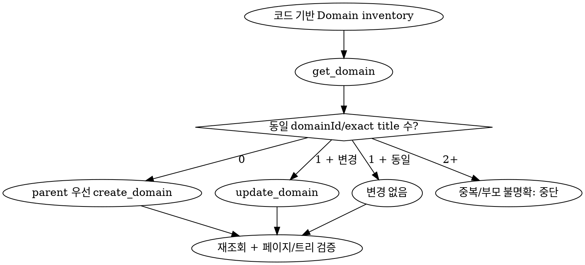

# Domain

## 정의

- Domain은 사용자가 해결하려는 현실 세계의 문제와 그 문제를 해결하는 규칙, 개념, 행위를 포함하는 지식 영역이다.
- Domain 산출물은 ERD가 아니라 업무 Domain의 목적·책임·비즈니스 규칙을 설명하는 Markdown 페이지다.
- 한 프로젝트의 한 업무 Domain은 정확히 한 `Domain` 레코드와 한 Markdown 페이지로 표현한다.
- `domainId`를 페이지의 안정적인 identity로 사용한다. 제목으로 새 ID를 만들거나 slug, path, revision, position을 발명하지 않는다.
- `parentId`는 구조적 상위·하위 업무 경계만 표현한다. 서비스 호출, import, 외래 키 같은 런타임 의존성 DAG로 해석하지 않는다.

```text
코드·문서 근거
      |
      v
업무 Domain inventory
      |
      v
get_domain ──> domainId/exact title 매칭
      |
      v
parent 우선 create_domain/update_domain
      |
      v
get_domain 재조회 ──> 페이지 유일성·부모 체인·본문 검증
```

## 금지 규칙

- 폴더, 기술 계층, 프레임워크 module, DB table을 근거 없이 업무 Domain으로 승격하지 않는다.
- 단순 API 호출, import, foreign key를 상위·하위 Domain 관계로 추정하지 않는다.
- Domain `content`에 ERD JSON 또는 `kind: "domain-erd"` payload를 저장하지 않는다.
- exact title 후보가 둘 이상이면 임의 병합, 임의 update, 새 페이지 생성을 하지 않는다.
- 저장소에서 사라진 stale Domain 페이지를 자동 삭제하지 않는다. 삭제 도구가 없으므로 stale 후보와 코드 근거를 결과에 보고한다.

## 코드 기반 inventory

1. 대상 프로젝트와 repository 경로를 확인한다.
2. 현재 source revision을 기록한다.
3. 코드와 활성 문서에서 다음 근거를 수집한다.
   - 사용자가 해결하는 업무 문제
   - 명시된 비즈니스 규칙과 불변식
   - 핵심 용어와 상태 전이
   - 사용 사례와 주요 행위
   - 다른 업무 경계와의 협력 계약
4. 근거가 같은 이름의 한 업무 경계를 설명하면 하나의 Domain 후보로 합친다.
5. 구조적 포함 관계가 코드·문서에 명시된 경우에만 부모 Domain을 지정한다. 불명확하면 root로 두거나 쓰기를 중단하고 확인 필요 사항을 보고한다.

## 기존 페이지 선택

1. 쓰기 전에 반드시 `get_domain({ projectId })`을 호출한다.
2. 사용자가 지정했거나 이전 실행에서 확인한 `domainId`가 있으면 해당 ID를 우선한다.
3. ID가 없으면 trim한 exact title로 후보를 센다. 대소문자를 구분한다.
   - 0개: 새 페이지를 생성한다.
   - 1개: 내용이나 부모가 바뀌면 기존 `domainId`를 update하고, 같으면 쓰지 않는다.
   - 2개 이상: 데이터 충돌로 중단한다.
4. 새 child는 부모 페이지가 저장되어 실제 ID가 확인된 뒤 생성한다.



## MCP 쓰기 계약

- `create_domain`
  - `projectId`, `title`, `content`는 필수다.
  - `parentId` 생략 또는 `null`은 root를 만든다.
  - positive integer `parentId`는 해당 Domain의 child를 만든다.
- `update_domain`
  - `projectId`, `domainId`, `title`, `content`는 필수다.
  - `parentId` 생략은 기존 부모를 유지한다.
  - `parentId: null`은 root로 이동한다.
  - positive integer `parentId`는 해당 부모 아래로 subtree 전체를 이동한다.
- parent는 같은 프로젝트에 존재해야 한다. self-parent, descendant reparent, 손상된 cycle은 서버가 거부한다.
- 제목은 trim 후 같은 프로젝트 안에서 대소문자를 구분해 유일해야 한다.

## 페이지 템플릿

모든 Domain 페이지는 다음 고정 섹션을 순서대로 사용한다.

```md
# <Domain 이름>

## 목적

- 이 Domain이 해결하는 업무 문제와 사용자 가치를 설명한다.

## 역할과 책임

- 소유하는 의사결정, 상태, 정책과 책임을 설명한다.

## 비즈니스 규칙과 불변식

- 항상 지켜져야 하는 규칙과 허용하지 않는 상태를 설명한다.

## 핵심 용어

- 업무 용어와 코드에서 대응하는 개념을 정의한다.

## 주요 행위

- 대표 use case, command, 상태 전이를 설명한다.

## 경계와 협력

- 상위 Domain, 하위 Domain, 다른 Domain과 주고받는 계약을 설명한다.

## 코드 근거

- 저장소 기준 상대 경로, symbol, 확인한 동작을 기록한다.
```

## 저장 순서

1. root부터 깊이 오름차순으로 저장하여 모든 부모 ID를 확보한다.
2. 기존 페이지는 `domainId`로 update하고 새 페이지에만 create를 사용한다.
3. 저장 직후 `get_domain`을 다시 호출한다.
4. 다음을 검증한다.
   - inventory의 각 업무 Domain이 정확히 한 페이지인지
   - title과 Markdown 본문이 의도한 값인지
   - root의 `parentId`가 `null`인지
   - child의 `parentId`가 확인한 부모 ID인지
   - parent chain에 누락이나 cycle이 없는지
5. 생성·수정·변경 없음·blocked·stale 후보와 source revision을 결과로 보고한다.
