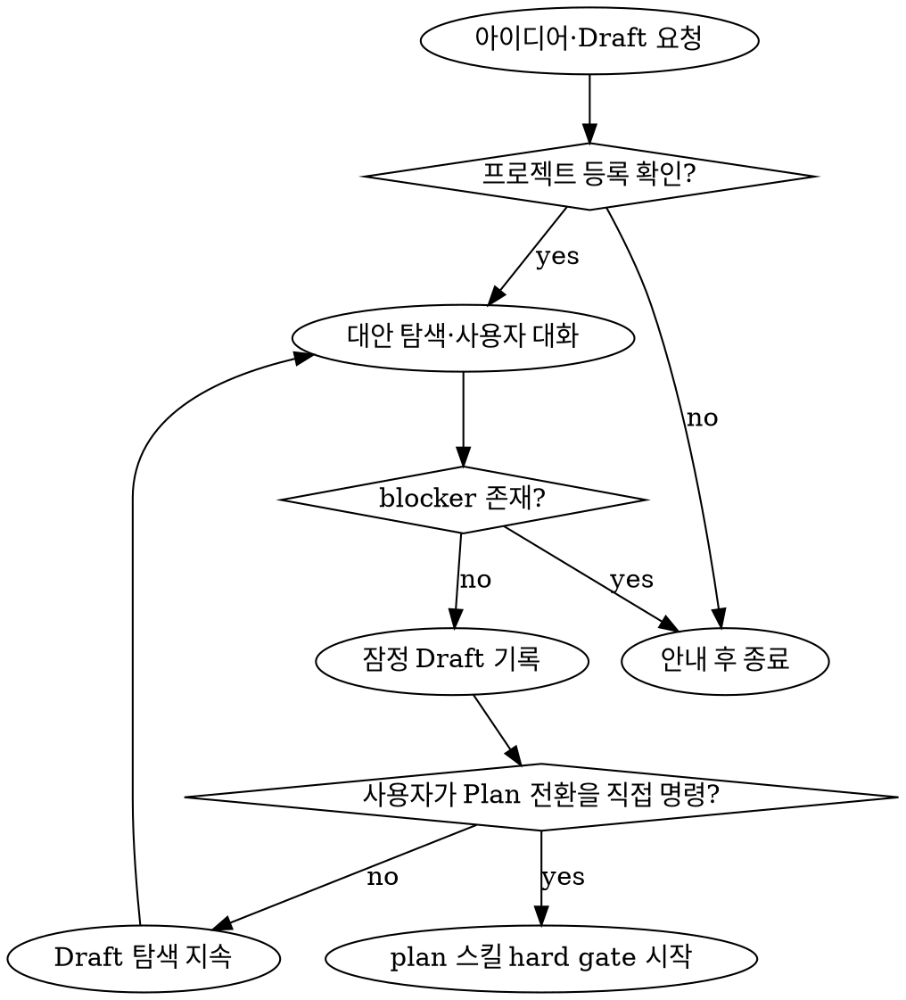

다양한 가능성을 염두에 두며, 프로젝트 제안을 하는 스킬

## 호출할 에이전트 목록

| 에이전트명  | 하는일                                                             |
| ----------- | ------------------------------------------------------------------ |
| planner     | draft 문서 작성                                                    |
| researcher  | 발산적 사고로 검색, 비슷한 컨셉의 레퍼런스 체크                    |
| doc-curator | planner에게 전달받은 draft 내용 yusung-harness-doc mcp로 문서 생성 |

## 워크플로우

> - drafter는 먼저 'get_project'를 통해 작업 지시가 내려진 레포가 project로 등록이 되어있는지 확인한다.
> - 만약 project로 등록이 되어있지 않으면, 'project로 등록되지 않았습니다. 먼저 레포를 project로 등록하세요' 라고 반환한 후 대화를 종료한다.

### 설계 방향성 추론

- 설계 방향성을 지속적으로 유저와 대화하며 잡아나간다.
- 메인 에이전트 스레드에서 request_user_input tool을 호출해서 4개정도의 질문을 던지고 선택하는 식으로 작업을 이어나가도록 한다.

```rs
session
    .request_user_input(...)
    .await
```

- fuction call 예시

```json
{
  "name": "request_user_input",
  "arguments": {
    "questions": [
      {
        "id": "brand_identity",
        "header": "Brand",
        "question": "브랜드 아이덴티티 방향을 선택해 주세요.",
        "options": [
          {
            "label": "유저 친화적인 B2C 앱 (Recommended)",
            "description": "빠른 피드백과, 유저 CS가 중요한 앱 방향성입니다."
          },
          {
            "label": "기업 친화적인 B2B 앱",
            "description": "기업에 서비스할 SaaS기반 앱 방향성입니다."
          },
          {
            "label": "정부 서비스 목적의 B2G 앱",
            "description": "여러 공공기관과 협업 목적의 앱 방향성입니다."
          }
        ]
      }
    ]
  }
}
```

## 보완 규칙

- 이 절은 앞서 작성된 내용을 삭제하거나 대체하지 않고 Draft의 의미와 책임 경계를 구체화한다.

### Draft의 목적과 책임 경계

- Draft는 Plan 단계에 진입하기 전에 문제, 대상 사용자, 기대 가치, 성공 신호, 제품 방향과 가능한 대안을 지속적으로 발산하고 수렴하는 잠정 탐색 단계다.
- Draft의 목적은 하나의 구현안을 확정하는 것이 아니라 여러 방향과 가능성을 비교하고, 확인된 사실과 가설을 분리하며, 다음 탐색에 필요한 질문을 발견하는 것이다.
- 구현 아이디어는 `hypotheses`, `alternatives`, `assumptions`와 같은 비구속 후보로만 기록한다.
- Draft에서 선택하거나 추천한 방향은 구현 명세, 구현 승인 또는 실행 지시로 해석하지 않는다.
- Draft에서는 코드·설정·스키마 수정, 테스트·빌드·배포 실행, Task 분해·실행, API·파일·아키텍처 결정 확정을 수행하지 않는다.
- Draft의 결과를 구현에 직접 전달하지 않는다. Plan 단계가 Draft의 목표, 범위, 대안과 가정을 입력으로 받아 코드·제약·아키텍처를 다시 검증한 뒤 구현 결정을 내리게 한다.

### 역할과 용어

- 앞에서 사용한 `drafter`는 별도 에이전트명이 아니라 root가 `planner`, `researcher`, `doc-curator`를 조율하여 수행하는 Draft 책임을 뜻한다.
- `planner`는 탐색 결과와 사용자 결정을 Draft로 구조화하고, `researcher`는 필요한 외부 사실과 유사 사례를 조사하며, `doc-curator`는 구조화된 Draft를 문서로 저장한다.
- 각 에이전트는 Draft의 비구속적 탐색 범위를 벗어나 구현 또는 후속 단계의 결정을 대신하지 않는다.

### 반복 탐색 규칙

- `질문 → 응답 → 대안 확장·축소 → 가정 갱신` 흐름을 반복하며 방향성과 가능성을 지속적으로 모색한다.
- 앞에서 명시한 "4개정도의 질문"은 한 번의 호출이 아니라 여러 탐색 라운드에 걸친 대략적인 총량으로 해석한다.
- `request_user_input`은 메인 에이전트인 root만 호출하며 한 번에 현재 방향에 가장 큰 영향을 주는 질문 1~3개를 제시한다.
- 사용자 응답을 받으면 현재 선호를 기록하고, 대안·가정·미결 질문 전체에 미치는 영향을 다시 검토한다.
- 사용자의 선택도 현재 Draft에서의 잠정 선호이며 구현 방식의 확정이나 승인이 아니다.
- 탐색 정보는 다음과 같이 구분한다.
  - `confirmed`: 사용자 결정, 프로젝트 문서 또는 검증된 근거로 확인한 사실
  - `hypotheses`: 아직 검증되지 않은 문제·가치·방향에 대한 가설
  - `alternatives`: 비교할 수 있는 비구속 후보 방향
  - `assumptions`: 탐색을 진행하기 위해 잠정적으로 채택한 가정
  - `decisions_needed`: 현재 Draft 탐색을 진행하거나 방향을 정리하기 위해 필요한 사용자 선택
  - `future_decisions`: 구현 또는 후속 단계에서 검증하고 결정해야 하며 현재 Draft를 막지 않는 항목
  - `open_questions`: 추가 탐색이나 조사로 답해야 하는 질문
  - `blockers`: 현재 Draft 탐색 또는 기록을 진행할 수 없게 하는 문제
- `decisions_needed`와 `blockers`는 현재 Draft를 진행하는 데 필요한 항목으로만 사용하고, 구현 방식 선택은 `future_decisions` 또는 `open_questions`에 남긴다.

### Draft 출력 계약

- Draft에는 다음 내용을 포함한다.
  - 해결하려는 문제와 대상 사용자
  - 기대 가치와 성공 신호
  - 목표와 비목표
  - 탐색한 대안, 장단점과 현재의 잠정 선호
  - `confirmed`, `hypotheses`, `alternatives`, `assumptions`
  - `decisions_needed`, `future_decisions`, `open_questions`, `blockers`
  - 다음 탐색 또는 후속 단계에서 확인할 사항
- 저장된 Draft에도 `mode: Draft`와 잠정 산출물임을 표시하며, 저장 완료를 Plan 승인이나 구현 승인으로 간주하지 않는다.
- Draft에는 구현 Task, 파일별 변경 목록, 확정 API, 확정 데이터 구조 또는 확정 아키텍처를 포함하지 않는다.

### Plan 전환 및 구현 경계

- Draft의 준비도가 높아져도 자동으로 Plan 단계에 진입하지 않는다.
- 사용자가 Plan 전환을 직접 명령한 경우에만 Draft 탐색을 종료하고 `plan` 스킬의 hard gate와 입력 계약을 새로 적용한다.
- Draft 진행 중 사용자가 "구현해 달라"고 요청해도 Draft를 곧바로 구현 근거로 사용하지 않고 Plan 단계 전환이 필요함을 안내한다.
- Plan은 Draft에서 목표, 범위, 대안, 사용자 결정과 가정을 승계할 수 있지만 구현 방향은 코드와 프로젝트 제약을 근거로 별도로 검증하고 확정한다.

```text
아이디어·문제
     │
     ▼
프로젝트 확인
     │
     ▼
대안 발산 ↔ 사용자 대화 ↔ 가정 갱신
     │
     ▼
잠정 Draft
     ├─ Plan 명령 없음 ──> Draft 탐색 지속
     └─ 명시적 Plan 명령
                │
                ▼
         Plan hard gate·재검증
                │
                ▼
              구현

Draft ──X──> 코드 변경 / Task 실행 / 구현 결정 확정
```

### Draft 전환 선택 알고리즘


