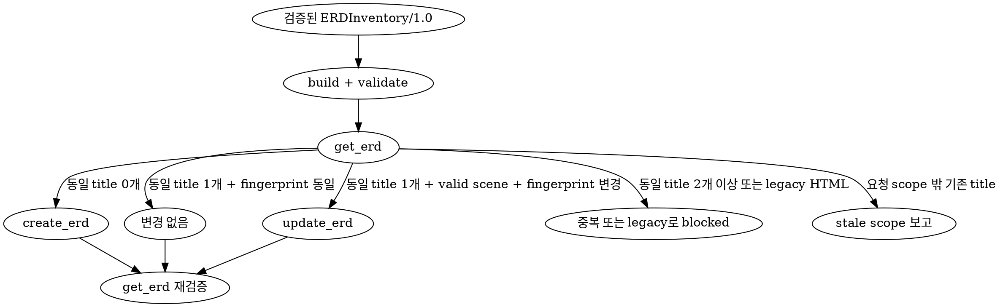

# Excalidraw 물리 DB ERD

- 특정 source revision에서 확인한 AS-IS physical table, ordered column과 FK 관계만 시각화한다.
- 목표 schema, 운영 DB drift, application read/write 흐름과 Domain ERD는 포함하지 않는다.
- HTML, Mermaid와 SVG를 ERD 저장 산출물로 만들지 않는다.
- 선택한 database scope마다 하나의 결정론적인 Excalidraw scene을 유지한다.

## 담당 에이전트

| 에이전트 | 책임 |
| --- | --- |
| `coder` | repository와 revision을 고정하고 canonical table/FK inventory를 수집하여 Excalidraw scene을 생성·검증한다. |
| `doc-curator` | 프로젝트·기존 DB/ERD 문서를 조회하고 `create_erd` 또는 `update_erd`로 저장한 뒤 재조회한다. |

- root가 에이전트를 호출하고 재사용하며 중복 범위를 조정한다.
- `coder`는 MCP 문서를 저장하지 않고 `doc-curator`는 확인되지 않은 schema를 추론하지 않는다.

## 필수 참조

- 분석 전에 [DB source discovery 규칙](../db/references/db-source-discovery.md)을 읽고 canonical physical source 우선순위를 그대로 적용한다.
- inventory와 scene을 만들기 전에 [ERDExcalidraw/1.0 계약](./references/erd-excalidraw-contract.md)을 읽는다.
- 입력 형식이 필요할 때만 [최소 inventory 예시](./references/erd-inventory-example.json)를 읽는다.

## 안전 경계

<HARD-GATE>

- `doc-curator`는 먼저 `get_project`로 프로젝트와 `repoPaths`를 확인한다. 등록되지 않은 프로젝트이면 저장하지 말고 `curate` 스킬로 등록하도록 안내한다.
- 대상 repository, source revision 또는 database scope를 식별할 수 없으면 분석과 저장을 중단한다.
- migration·DDL이 누락·충돌하여 canonical table inventory 또는 FK endpoint를 확정할 수 없으면 해당 scope의 ERD를 추측하거나 저장하지 않는다.
- migration·DDL이 전혀 없는 프로젝트는 runtime schema synchronization과 단일 canonical ORM schema가 모두 명확할 때만 `partial` inventory를 허용한다.
- 운영·개발 DB에 연결하거나 metadata와 row를 조회하지 않는다. migration은 외부 연결이 없는 격리된 임시 DB에서만 재생한다.
- migration, DDL, seed, code generation과 ORM sync를 대상 repository나 실제 DB에 적용하지 않는다.
- 실제 row, sample data, 개인정보, credential, token, connection string과 환경 변수 값을 scene에 넣지 않는다.
- 이 스킬이 작성하는 artifact에서는 HTML ERD를 Excalidraw scene으로 가장하거나 자동 변환하지 않는다. canonical inventory로 다시 생성한다. 앱 migration·backfill 정책은 이 스킬의 범위 밖이다.
- build와 validate를 모두 통과하지 않은 scene을 MCP에 전달하지 않는다.

</HARD-GATE>

## 작업 흐름

```text
get_project + repoPaths
          │
          ▼
repository·revision·DB scope 고정
          │
          ▼
migration·DDL·ORM source 분석
          │
          ▼
ERDInventory/1.0 작성
          │
          ▼
build → .excalidraw → validate
          │
          ▼
get_erd → create/update/unchanged 판정
          │
          ▼
get_erd 재조회 → 저장 결과 검증
```

1. `get_project`의 repository와 사용자 요청 범위를 대조한다.
2. source revision을 commit hash로 기록한다. working tree를 포함하면 `HEAD+dirty`와 관련 변경 경로를 근거에 남긴다.
3. `db-source-discovery.md`에 따라 migration, DDL, schema snapshot과 ORM source를 탐색한다.
4. 동일 revision·scope의 검증된 DB 문서가 있으면 inventory 교차 검증에 재사용한다. revision 또는 scope가 다르면 기존 DB 문서만으로 ERD를 만들지 않는다.
5. table은 qualified physical name으로 식별하고 column ordinal, PK, FK, UNIQUE, nullability와 physical type을 정규화한다.
6. FK마다 constraint, ordered source/target column, cardinality, `ON UPDATE`와 `ON DELETE`를 수집한다.
7. `ERDInventory/1.0` JSON을 전용 임시 경로에 작성한다.
8. build script로 완전한 `.excalidraw` scene을 생성한다.
9. validate script로 JSON, element reference, binding, table/FK 집합과 inventory fingerprint를 검증한다.
10. `get_erd` 결과에서 stable title을 비교하여 create/update/unchanged/blocked를 판정한다.
11. build output JSON을 parse한 구조화 object를 MCP `scene` 인자로 전달한다.
12. 저장 후 `get_erd`를 다시 호출하고 `record.scene` canonical JSON 문자열을 parse·validate하여 title과 scene을 검증한 build output과 대조한다.

## Inventory 생성 규칙

- root `contract`는 `ERDInventory/1.0`을 사용한다.
- `name`, `scope`, `sourceRevision`, 하나 이상의 `tables`와 `relationships` 배열을 포함한다.
- table과 relationship 배열은 qualified name과 constraint key 순으로 결정론적으로 정렬한다.
- table column 배열은 physical ordinal을 보존한다.
- 모든 column의 `nullable`은 canonical source에서 확인한 명시적 boolean이어야 한다. 누락값을 `false`로 보정하지 않는다.
- FK를 소유한 table을 `sourceTable`, 참조되는 table을 `targetTable`로 기록한다.
- composite FK의 source/target column 수와 ordinal을 일치시킨다.
- 관계가 없는 scope는 빈 `relationships`를 허용한다.
- 확인되지 않은 table, column, 관계와 cardinality를 추가하지 않는다.

## Scene 생성과 검증

- `<ERD_SKILL_DIR>`은 이 `SKILL.md`가 있는 디렉터리로 해석한다.
- build는 기존 output을 기본적으로 덮어쓰지 않는다. 명시적으로 교체할 임시 파일에만 `--force`를 사용한다.

```bash
node <ERD_SKILL_DIR>/scripts/build-erd-excalidraw.mjs \
  --input <inventory.json> \
  --output <scene.excalidraw>

node <ERD_SKILL_DIR>/scripts/validate-erd-excalidraw.mjs \
  --scene <scene.excalidraw> \
  --inventory <inventory.json>
```

- scene root는 `type: "excalidraw"`, `version: 2`, `source: "yusung-harness:erd"`를 사용한다.
- `files`는 빈 객체로 유지하고 image, embeddable과 외부 link를 넣지 않는다.
- 요소 타입은 `rectangle`, `text`, `arrow`만 허용한다. `line`을 포함한 다른 타입은 거부한다.
- `scene.elements`는 최대 5,000개이며 compact `JSON.stringify(scene)`의 UTF-8 크기는 최대 5 MiB(5,242,880 bytes)다.
- 한도를 넘으면 table이나 FK를 생략하지 말고 사용자와 database scope를 줄여 별도 ERD로 생성한다.
- table outer rectangle은 ordered column semantics를 `customData`에 보존한다.
- FK arrow는 source/target table에 양방향 binding하고 관계 semantics를 `customData`에 보존한다.
- 같은 inventory를 두 번 build한 결과가 byte-for-byte 동일한지 확인한다.
- scene을 손으로 후처리하지 않는다. layout 또는 표기 변경은 build script와 계약을 수정한 뒤 재생성한다.

## 문서 계약

- `title`은 `<scope> ERD` 형식의 stable title을 사용한다.
- mutation의 `scene`은 validate를 통과한 build output 파일을 JSON parse한 구조화 object다. JSON 문자열을 MCP 인자로 전달하지 않는다.
- 조회 record의 `scene`은 서버가 canonical serialization한 JSON 문자열이다. 비교 전에 JSON parse와 scene validation을 다시 수행한다.
- 같은 title의 artifact는 같은 database scope를 의미한다.
- 다른 scope를 하나의 title에 합치거나 같은 scope를 임의의 여러 title로 분리하지 않는다.
- 기존 HTML record는 legacy로 보고하고 자동 삭제·덮어쓰기·scene 변환을 하지 않는다.

## 동기화 알고리즘



- 동일 title이 없으면 `create_erd(projectId, title, scene)`을 한 번 호출한다. `scene`에는 build output을 parse한 object를 사용한다.
- 동일 title의 valid scene 한 건이 있고 inventory fingerprint가 같으면 mutation을 생략한다.
- 동일 title의 valid scene 한 건이 있고 fingerprint가 다르면 `update_erd(projectId, erdId, title, scene)`을 호출한다.
- 동일 title이 둘 이상이면 임의 문서를 선택하지 않고 blocked 처리한다.
- 동일 title의 `record.scene`이 HTML 또는 invalid JSON이면 legacy로 보고하고 사용자 승인 없이 덮어쓰지 않는다.
- 요청 scope 밖의 기존 title은 stale 후보로 보고하고 자동 삭제하지 않는다.

## 결과 보고

- 다음 항목을 root에 반환한다.
  - 프로젝트 ID, repository 경로, source revision과 database scope
  - table, column과 FK 수
  - inventory·scene fingerprint와 validation 결과
  - `created`, `updated`, `unchanged`, `blocked`, `stale` title 목록
  - source conflict, 미확인 항목과 저장 실패 원인
  - 저장 후 재조회한 ERD ID와 title
- blocked 또는 저장 실패가 있으면 전체 작업을 완전한 성공으로 보고하지 않는다.

## 완료 조건

- canonical inventory의 모든 table이 정확히 하나의 table element로 존재한다.
- 모든 physical FK가 정확히 하나의 bound arrow로 존재한다.
- table column과 composite FK ordinal을 보존한다.
- scene semantic 집합과 inventory table/FK 집합이 일치한다.
- source revision, scope와 inventory fingerprint가 metadata에 존재한다.
- scene에 HTML, external link, embedded file, 실제 데이터와 비밀값이 없다.
- scene이 허용 타입, 5,000 element와 5 MiB UTF-8 제한을 만족한다.
- 동일 inventory의 반복 build가 동일한 결과를 만든다.
- MCP 저장 후 재조회한 `record.scene`을 parse·validate한 결과가 검증된 scene과 일치한다.
