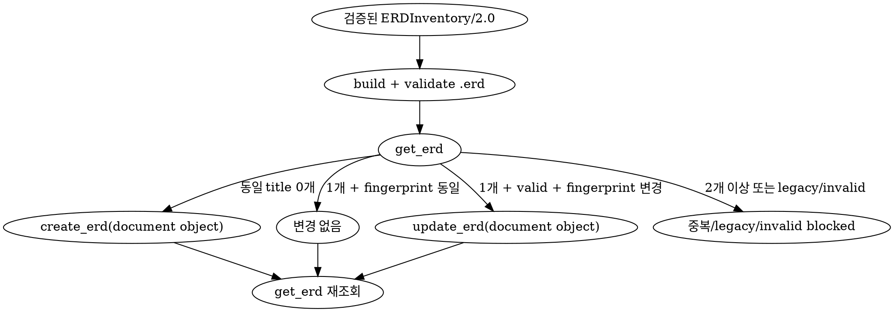

# Dineug v3 물리 DB ERD

- 선택한 source revision과 database scope의 AS-IS table, ordered column, PK, UK와 FK만 시각화한다.
- 목표 schema, 운영 DB drift, application read/write 흐름과 Domain ERD는 포함하지 않는다.
- 산출물은 Dineug ERD Editor v3가 직접 여는 결정론적 `.erd` JSON이다.
- HTML, Mermaid, SVG와 Excalidraw를 신규 ERD 저장 형식으로 만들지 않는다.

## 담당 에이전트

| 에이전트 | 책임 |
| --- | --- |
| `coder` | repository·revision을 고정하고 canonical inventory를 수집하여 `.erd`를 build·validate한다. |
| `doc-curator` | 프로젝트와 기존 ERD를 조회하고 `create_erd` 또는 `update_erd`로 저장한 뒤 재조회한다. |

- root가 에이전트 호출과 범위를 조정한다.
- coder는 MCP 문서를 저장하지 않고 doc-curator는 확인되지 않은 DB 의미를 추론하지 않는다.

## 필수 참조

- 분석 전에 [DB source discovery 규칙](../db/references/db-source-discovery.md)을 읽고 canonical physical source 우선순위를 적용한다.
- inventory와 `.erd` 생성 전에 [Dineug v3 ERD 계약](./references/dineug-erd-v3-contract.md)을 읽는다.
- 입력 예시가 필요할 때만 [ERDInventory/2.0 fixture](./references/erd-inventory-example.json)를 읽는다.

## 안전 경계

<HARD-GATE>

- 저장 작업이면 doc-curator가 먼저 `get_project`로 프로젝트와 `repoPaths`를 확인한다. 등록되지 않은 프로젝트에는 저장하지 않는다.
- repository, source revision 또는 database scope를 식별할 수 없으면 분석과 저장을 중단한다.
- canonical table/PK/UK/FK inventory나 FK endpoint를 확정할 수 없으면 추측한 `.erd`를 만들거나 저장하지 않는다.
- 운영·개발 DB에 연결하거나 metadata와 row를 조회하지 않는다. migration 재생은 외부 연결이 없는 격리 임시 DB에서만 수행한다.
- migration, DDL, seed, code generation과 ORM sync를 대상 repository나 실제 DB에 적용하지 않는다.
- 실제 row, 개인정보, credential, token, connection string과 환경 변수 값을 inventory·memo·`.erd`에 넣지 않는다.
- 이 스킬이 작성하는 artifact에서는 legacy HTML/Excalidraw ERD를 Dineug 문서로 가장하거나 자동 변환하지 않는다. canonical inventory에서 다시 생성한다.
- build와 validate를 모두 통과하지 않은 document를 MCP에 전달하지 않는다.

</HARD-GATE>

## 작업 흐름

```text
get_project + repoPaths
          │
          ▼
repository·revision·DB scope 고정
          │
          ▼
migration·DDL·ORM source 분석
          │
          ▼
ERDInventory/2.0 작성
          │
          ▼
build → .erd → validate
          │
          ▼
get_erd → create/update/unchanged 판정
          │
          ▼
get_erd 재조회 → record.document 검증
```

1. `get_project`의 repository와 사용자 범위를 대조한다.
2. source revision을 commit hash로 기록한다. working tree를 포함하면 `HEAD+dirty`와 관련 경로를 기록한다.
3. `db-source-discovery.md`에 따라 migration, DDL, schema snapshot과 ORM source를 탐색한다.
4. 동일 revision·scope의 검증된 DB 문서는 inventory 교차 검증에만 재사용한다.
5. qualified table, ordered column, table 단위 PK·UK와 실제 FK constraint를 `ERDInventory/2.0`으로 정규화한다.
6. builder로 `.erd`를 만들고 validator로 공식 collection, semantic memo, reference와 fingerprint를 검사한다.
7. 같은 inventory의 반복 build가 byte-for-byte 동일한지 확인한다.
8. stable title의 기존 record를 조회하여 create/update/unchanged/blocked를 판정한다.
9. 저장 후 `record.document`를 parse·validate하고 검증된 build와 대조한다.

## Inventory 규칙

- root `contract`는 `ERDInventory/2.0`이다.
- `name`, `scope`, `engine`, `sourceRevision`, 하나 이상의 `tables`와 `relationships` 배열을 포함한다.
- table은 qualified name, UK는 constraint name, FK는 relationship key 순으로 정렬한다.
- column, PK·UK column과 composite FK endpoint의 physical ordinal을 보존한다.
- 모든 column `nullable`, `foreignKey`와 `autoIncrement`는 canonical source에서 확인한 필수 boolean이다.
- `foreignKey: true` column 집합은 relationship의 모든 source endpoint union과 정확히 같아야 한다.
- PK는 `primaryKey: { columns } | null`, UK는 `uniqueConstraints[{ name, columns }]`로 기록한다. Dineug v3에 저장 위치가 없는 PK name은 inventory에도 넣지 않는다.
- FK 소유 table을 `sourceTable`, 참조 table을 `targetTable`로 기록한다.
- source cardinality는 `0..1|0..N|1|1..N`, target cardinality는 `0..1|1`만 허용한다.
- 확인되지 않은 table, column, constraint, cardinality와 referential action을 추가하지 않는다.

## Build와 validate

- `<ERD_SKILL_DIR>`은 이 `SKILL.md`가 있는 디렉터리다.
- output은 기본적으로 덮어쓰지 않는다. 교체할 전용 임시 파일에만 `--force`를 사용한다.

```bash
node <ERD_SKILL_DIR>/scripts/build-dineug-erd.mjs \
  --input <inventory.json> \
  --output <document.erd>

node <ERD_SKILL_DIR>/scripts/validate-dineug-erd.mjs \
  --document <document.erd> \
  --inventory <inventory.json>
```

- root는 Dineug schema URL, `version: "3.0.0"`, `settings`, `doc`와 공식 여섯 collection만 포함한다.
- inventory `name`은 `settings.databaseName`에 저장하고 database `scope`는 metadata memo에 별도로 유지한다.
- stable ID는 `<kind>-<sha256(key) 앞 20 hex>`를 사용한다.
- FK graph를 Tarjan SCC로 축약하고 stable topological layer에 배치한다.
- provenance metadata memo가 먼저이고 FK memo는 relationship key 순으로 오른쪽 annotation rail에 배치한다.
- compact JSON은 최대 5 MiB, collection entity 합은 최대 5,000, canvas width/height는 2,000~20,000이다.
- 한도를 넘으면 entity를 생략하지 말고 사용자와 scope를 줄여 별도 ERD로 생성한다.
- document를 손으로 후처리하지 않는다. 표기·layout 변경은 builder와 계약을 수정한 뒤 재생성한다.

## 저장 계약

- `title`은 `<scope> ERD` 형식의 stable title을 사용한다.
- mutation의 `document`는 validate를 통과한 `.erd` 파일을 JSON parse한 구조화 object다. JSON 문자열을 인자로 전달하지 않는다.
- 조회 record의 `document`는 서버가 canonical serialization한 JSON 문자열이다. 비교 전에 JSON parse와 validation을 다시 수행한다.
- 같은 title은 같은 database scope를 의미한다.
- 기존 HTML/Excalidraw record는 legacy로 보고하고 사용자 승인 없이 삭제·덮어쓰기·변환하지 않는다.

## 동기화 알고리즘



- 동일 title이 없으면 `create_erd(projectId, title, document)`를 한 번 호출한다.
- valid Dineug record 한 건의 metadata `inventoryFingerprint`가 같으면 mutation을 생략한다.
- fingerprint가 다르면 `update_erd(projectId, erdId, title, document)`를 호출한다.
- 동일 title이 둘 이상이거나 `record.document`가 legacy/invalid이면 임의 선택이나 덮어쓰기를 하지 않는다.
- 요청 scope 밖의 title은 stale 후보로만 보고하고 자동 삭제하지 않는다.

## 결과와 완료 조건

- repository, revision, scope, table·column·PK·UK·FK 수를 보고한다.
- inventory/document fingerprint, byte·entity·canvas budget과 validation 결과를 보고한다.
- created, updated, unchanged, blocked, stale title과 저장 후 ERD ID를 보고한다.
- 모든 physical table/column/PK/UK/FK가 정확히 한 번 공식 collection과 memo에 존재해야 한다.
- doc ID, collection key, endpoint, option bit, composite ordinal과 stable ID가 모두 유효해야 한다.
- metadata memo에 engine, scope, source revision과 inventory fingerprint가 있어야 한다.
- 반복 build가 동일하고 저장 후 parse·validate한 `record.document`가 검증된 document와 일치해야 한다.
- blocked 또는 저장 실패가 있으면 전체 작업을 완전한 성공으로 보고하지 않는다.
