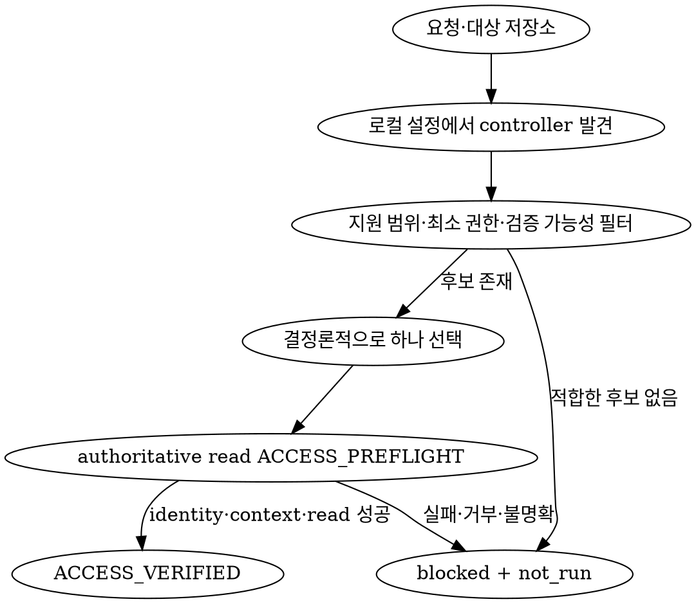

# 원격 인프라 제어

- 대상 저장소와 연결된 실제 provider control plane을 MCP, CLI, API, SDK 또는 검증 가능한 기타 controller로 제어한다.
- 직접 관리되는 원격 리소스의 `READ`, `CREATE`, `UPDATE`, `DELETE`만 수행한다.
- 모든 외부 작업의 첫 단계에서 `ACCESS_PREFLIGHT`를 실행하고 실제 authoritative read로 접근 가능성을 증명한다.
- `READ`는 승인 없이 수행하고 변경은 논리 작업을 하나씩 제시하여 사용자에게 명시적으로 승인받은 뒤 순차 실행한다.
- provider, controller, account, project, region 또는 리소스를 추측하거나 하드코딩하지 않는다.

## 역할과 범위

| 요청 | 담당 |
| --- | --- |
| live inventory, configuration, health와 drift 조회 | `infra.READ` |
| IaC가 관리하지 않는 원격 리소스의 직접 CRUD | `infra` |
| Terraform, Pulumi, CloudFormation 등 IaC 코드 작성·수정 | `coder` |
| IaC plan, apply, destroy | `deploy.INFRA_CHANGE` |
| pipeline, artifact, release, promotion, rollback | `deploy` |
| provider·region·topology·보안·데이터 경계 변경 | `architect` → `architecturePlan` |

- IaC address, state, managed tag·annotation 또는 저장소 선언으로 관리 중임이 확인된 리소스는 조회와 drift 보고만 수행한다.
- IaC-managed 리소스의 변경 요청은 직접 실행하지 말고 `deploy.INFRA_CHANGE`로 handoff한다.
- provider·region·topology, IAM trust, network exposure 또는 데이터 경계를 변경하는 요청은 일반 운영 설정 변경과 구분하고 먼저 `architect`와 `architecturePlan`으로 handoff한다.
- 갱신된 ArchitecturePlan과 exact-match하고 IaC가 관리하지 않는 리소스에 대해서만 승인 흐름을 다시 시작한다.
- 애플리케이션 DB row·DDL, secret 값, 배포 artifact와 트래픽 promotion을 인프라 CRUD로 취급하지 않는다.

## 전체 흐름

```text
대상 저장소·provider 설정 탐색
              │
              ▼
       controller 후보 선택
              │
              ▼
 authoritative read ACCESS_PREFLIGHT
        ├─ 실패·불명확 ──> blocked + not_run, 즉시 종료
        └─ 성공
              │
              ▼
   READ / CREATE / UPDATE / DELETE
        ├─ READ ─────────> 조회·결과 보고
        └─ 변경
              │
              ▼
    논리 작업 1건의 승인서 제시
              │
              ▼
    사용자 승인 → 상태 drift 재검사
              │
              ▼
       실행 → authoritative 재조회
              │
              ▼
 성공 후에만 다음 논리 작업 승인 요청
```

## Controller 선택

- 외부 호출 전 저장소 설정, ArchitecturePlan, IaC와 provider 설정을 read-only로 검사하여 사용 가능한 controller 후보를 찾는다.
- 설치되지 않았거나 구성되지 않았거나 요청 action과 사후 검증을 지원하지 않는 후보는 제외한다.
- 다음 우선순위로 후보를 결정론적으로 선택한다.
  1. 사용자가 명시한 controller
  2. 저장소가 authoritative하다고 선언한 controller
  3. 요청한 action 전체 지원
  4. 가장 좁은 account·project·region·principal 범위
  5. conditional request, idempotency, audit ID, async terminal status와 사후 조회 지원
  6. 안정적인 `controllerId` 정렬
- MCP, CLI, API, SDK라는 형식 자체에 우선순위를 부여하지 않는다.
- `OTHER` controller도 동일한 identity, scope, before/after state와 audit 증거 계약을 충족해야 한다.



## 접근 가능성 하드 게이트

<HARD-GATE>

- `ACCESS_PREFLIGHT`를 첫 외부 인프라 작업으로 실행한다. 성공 전에는 operation 제안, 승인 요청과 mutation을 수행하지 않는다.
- controller가 실제로 호출 가능하고 인증된 principal을 식별할 수 있는지 확인한다.
- provider, principal, account/tenant, project/subscription, environment, region/workspace와 요청 target scope가 exact-match하는지 확인한다.
- `READ`, `UPDATE`, `DELETE`는 정확한 리소스를 authoritative source에서 조회한다.
- `CREATE`는 정확한 parent/container scope를 authoritative source에서 조회하고 생성 예정 identity의 현재 존재 여부를 확인한다.
- controller가 요청 action을 표현할 수 있고 실행 뒤 authoritative read로 결과를 검증할 수 있는지 확인한다.
- `CREATE`에는 create-if-absent 또는 provider idempotency key를, `UPDATE`와 `DELETE`에는 `If-Match`, resource version, generation 또는 동등한 provider 원자적 precondition을 적용할 수 있는지 확인한다.
- controller가 승인한 before-state와 실행을 원자적으로 연결할 precondition을 제공하지 않으면 mutation에 사용하지 않고 `blocked + not_run`으로 처리한다.
- provider가 side-effect 없는 permission simulation을 제공할 때만 write 권한을 검사한다. 검사 수단이 없으면 `unknown`으로 기록하고 승인서에 노출하며, 명시적인 `denied`는 즉시 차단한다.
- 적합한 controller 없음, 인증 없음·만료, target 불명, context 불일치, 401·403, permission·sandbox·approval 오류 또는 접근 결과가 `inaccessible | indeterminate`이면 `blocked + not_run`으로 보고하고 현재 작업을 즉시 종료한다.
- 선택한 controller의 접근 probe가 시작된 뒤 실패하면 다른 credential, account, project, region, controller 또는 더 강한 권한으로 우회하지 않는다.
- plugin·CLI·dependency를 자동 설치하거나 login, credential 생성·교체, 권한 상승과 provider protection 우회를 수행하지 않는다.
- secret, token, private key, credential과 connection string 값을 읽거나 출력하지 않는다. credential source 이름, 존재 여부와 redacted principal identity만 기록한다.

</HARD-GATE>

## Operation 분류

| Action | 승인 | 실행 전 조건 | 성공 최소 증거 |
| --- | --- | --- | --- |
| `READ` | 불필요 | exact provider context와 authoritative target read | exact target, authoritative source, principal, 조회 시각과 실제 상태 |
| `CREATE` | 필요 | parent read, 생성 identity와 desired state 고정 | stable resource ID, terminal operation과 생성 후 desired state |
| `UPDATE` | 필요 | stable ID, before fingerprint/ETag와 field diff 고정 | 승인한 diff와 authoritative after-state fingerprint |
| `DELETE` | 필요 | stable ID, fingerprint, dependency·data·cascade 영향 고정 | terminal deletion 또는 authoritative not-found와 잔존 dependency 확인 |

- restart, start, stop, scale, attach, detach와 운영 범위 안의 설정 변경 등 상태를 바꾸는 동작은 `UPDATE`로 정규화한다.
- IAM trust, 권한 범위, public ingress/egress, network policy와 데이터 경계를 확대·변경하는 정책 작업은 일반 `UPDATE`로 바로 실행하지 말고 `architect`와 `architecturePlan`으로 handoff한다.
- 사용자가 소유한 resource-level deletion protection은 provider·organization policy가 변경을 허용하고 ArchitecturePlan과 exact-match할 때만 별도 `UPDATE` 논리 작업으로 제안한다. 해제 이유, 보호 복원 절차와 후속 삭제 영향을 승인서에 포함하고 별도 승인을 받는다.
- organization policy, provider safeguard, required approval, immutable 또는 IaC-managed protection은 승인 여부와 관계없이 해제하지 않는다.
- wildcard, recursive, bulk, force 또는 불확정 target mutation을 수행하지 않는다.

## 논리 작업

- 논리 작업을 하나의 주 리소스를 하나의 명시된 목표 상태로 전환하는 작업으로 정의한다.
- 같은 리소스에 필요한 여러 결정론적 mutation은 각 subaction의 예상 before/after state와 원자적 precondition 방식을 승인서에 모두 열거한 경우에만 하나의 논리 작업으로 묶는다.
- 첫 mutation 이후의 opaque version/ETag는 바로 앞 subaction의 authoritative after-state가 승인된 예상 중간 상태와 exact-match할 때만 다음 subaction의 runtime precondition으로 사용할 수 있다.
- provider가 subaction별 조건부 mutation과 authoritative 중간 상태 검증을 지원하지 않으면 여러 mutation을 한 작업으로 묶지 말고 별도 논리 작업과 별도 승인으로 분리한다.
- 독립적으로 주소 지정 가능한 다른 리소스는 별도 논리 작업과 별도 승인을 요구한다.
- provider가 내부 생성·수정·삭제하는 비독립 child 또는 cascade는 정확히 식별하고 전체 영향을 승인서에 열거한 경우에만 같은 작업에 포함한다.
- cascade 대상이나 영향이 불명확하면 해당 작업을 `blocked + not_run`으로 처리한다.
- retry, rollback, compensation, remediation과 protection 해제는 새 논리 작업과 새 승인을 요구한다.
- 한 번에 정확히 하나의 변경 작업만 `pending | approved | executing` 상태가 되게 한다.

## 변경 승인 계약

- 현재 논리 작업 하나에 대해서만 다음 approval envelope를 제시하고 사용자 응답을 기다린다.

```yaml
operationId: INFRA-001
action: CREATE | UPDATE | DELETE
controllerId: exact-controller
providerContext: account/project/environment/region
primaryResource: stable ID 또는 생성 예정 identity
beforeState: fingerprint/ETag와 redacted 현재 상태
desiredState: redacted 목표 상태
fieldDiff: exact field-level diff
orderedSubactions:
  - action: redacted action 1
    expectedBeforeState: approved state digest
    expectedAfterState: approved intermediate state digest
    atomicPrecondition: If-Match/version/idempotency 방식
  - action: redacted action 2
    expectedBeforeState: 앞 subaction의 approved intermediate state digest
    expectedAfterState: approved desired state digest
    atomicPrecondition: runtime version을 authoritative exact-match read에서 취득
impact: cost/quota/downtime/security/data/cascade
recovery: 복구·재생성 가능 여부와 절차
writeAuthorization: granted | unknown
proposalDigest: canonical approval scope digest
```

- 최초 요청, 이전 operation 승인, 코드·ArchitecturePlan·deploy 승인과 포괄적인 "전부 승인"을 현재 mutation 승인으로 간주하지 않는다.
- 사용자가 envelope의 exact scope를 명시적으로 승인한 경우에만 실행한다.
- 승인은 해당 `operationId`와 `proposalDigest`에 연결된 일회성 증거로 사용하고 다른 target, 다음 operation, retry와 rollback에 재사용하지 않는다.
- 승인 후 controller, provider context, primary resource, before fingerprint, desired state, diff, subaction별 expected state·atomic precondition 또는 impact가 바뀌면 승인을 `invalidated`로 처리하고 새 envelope를 제시한다.
- 실행 직전에 authoritative state를 다시 조회하여 target과 before fingerprint/ETag가 승인 범위와 exact-match하는지 확인한다.
- 사용자가 거절·취소하거나 명시적으로 승인하지 않으면 해당 작업을 `not_run`으로 보고하고 후속 mutation으로 진행하지 않는다.

## 실행과 사후 검증

1. 승인된 논리 작업의 subaction을 승인서에 기록된 순서와 exact scope로만 실행한다.
2. 각 subaction 직전에 authoritative state를 조회하여 승인된 `expectedBeforeState`와 exact-match하는지 확인한다.
3. `CREATE`는 승인된 create-if-absent 또는 idempotency key를, `UPDATE`와 `DELETE`는 방금 확인한 state의 `If-Match`, version, generation 또는 동등한 원자적 precondition을 mutation 요청 자체에 포함한다.
4. subaction 실행 직후 authoritative after-state가 승인된 `expectedAfterState`와 exact-match하는지 확인한 뒤에만 다음 subaction으로 진행한다.
5. precondition 또는 expected state mismatch는 승인 범위 drift로 처리하고 남은 subaction을 중단한다. 새로운 runtime state를 기존 승인 범위로 해석하거나 자동 재시도하지 않는다.
6. 각 subaction의 redacted action, 시작·종료 시각, terminal status, exit code와 remote audit/request ID를 기록한다.
7. subaction 하나라도 실패하거나 결과가 불명확하면 남은 subaction을 중단한다.
8. 실패 뒤 안전한 authoritative read를 수행하여 partial apply와 side effect를 확인한다. 자동 retry, rollback, compensation과 다음 작업 진행을 수행하지 않는다.
9. async 작업은 bounded polling으로 terminal 상태를 확인한다. 제한 시간 안에 확정되지 않으면 `inconclusive`로 판정한다.
10. 실행 직후 authoritative source에서 primary resource와 알려진 dependency를 다시 조회한다.
11. HTTP 성공, MCP 성공 응답, CLI exit code `0`, request ID 또는 `202 Accepted`만으로 성공을 선언하지 않는다.
12. terminal 상태와 승인한 desired state가 모두 확인된 경우에만 `succeeded`로 판정한다.
13. 실제 side effect가 하나라도 확인됐지만 전체 after-state가 불명확하면 `partial + inconclusive`로 보고한다. side effect가 확인되지 않았고 mutation 발생 여부만 불명확하면 `blocked + inconclusive`로 보고한다.
14. 현재 operation이 authoritative evidence로 성공한 뒤에만 다음 논리 작업의 approval envelope를 제시한다.

## 추가 안전 경계

<HARD-GATE>

- IaC-managed 리소스를 직접 생성·수정·삭제하지 않는다.
- IaC state를 직접 편집·삭제·이동하거나 state lock을 강제로 해제하지 않는다.
- organization policy, provider safeguard, required approval, immutable protection과 IaC-managed protection을 해제하거나 우회하지 않는다.
- user-managed resource-level protection 변경은 위 승인 계약을 충족한 별도 `UPDATE`에서만 수행하고 정책 거부를 우회 수단으로 해석하지 않는다.
- ArchitecturePlan의 provider, region, topology, 보안 또는 데이터 경계와 충돌하는 mutation을 실행하지 않는다.
- 현재 principal이나 유일한 접근 경로를 제거하여 사후 검증이 불가능해지는 작업을 실행하지 않는다.
- read-only로 분류한 action에서 예상하지 않은 mutation side effect가 발견되면 후속 작업을 즉시 중단한다.
- 승인되지 않은 fallback, retry, rollback, compensation과 범위 확대를 수행하지 않는다.

</HARD-GATE>

## 출력 계약

```ts
type InfraAction = "READ" | "CREATE" | "UPDATE" | "DELETE";
type InfraStatus = "complete" | "partial" | "blocked";
type InfraResult = "succeeded" | "failed" | "inconclusive" | "not_run";

interface AccessPreflightV1 {
  state: "accessible" | "inaccessible" | "indeterminate";
  controllerId: string | null;
  providerContext: string | null;
  principal: string | null;
  authoritativeReadEvidenceId: string | null;
  writeAuthorization: "granted" | "denied" | "unknown" | "not_requested";
  blockers: string[];
}

interface InfraSubactionV1 {
  action: string;
  expectedBeforeState: string;
  expectedAfterState: string;
  atomicPrecondition: string;
}

interface LogicalInfraOperationV1 {
  operationId: string;
  action: InfraAction;
  primaryResource: string;
  orderedSubactions: InfraSubactionV1[];
  proposalDigest: string | null;
  approvalEvidenceId: string | null;
  approvalState:
    | "not_required"
    | "pending"
    | "approved"
    | "rejected"
    | "invalidated"
    | "consumed";
  result: InfraResult;
  evidenceIds: string[];
  blockers: string[];
}

interface InfraApprovalEvidenceV1 {
  id: string;
  operationId: string;
  proposalDigest: string;
  approvedBy: "user";
  approvedAt: string;
  consumedAt: string | null;
}

interface InfraExecutionEvidenceV1 {
  id: string;
  operationId: string;
  subactionIndex: number;
  redactedAction: string;
  startedAt: string;
  completedAt: string | null;
  terminalStatus: string;
  exitCode: number | null;
  remoteId: string | null;
  result: InfraResult;
}

interface InfraEvidenceV1 {
  id: string;
  kind: "ACCESS" | "BEFORE_STATE" | "AFTER_STATE" | "AUDIT";
  source: string;
  observedAt: string;
  digest: string | null;
  remoteId: string | null;
}

interface InfraControlRunV1 {
  schemaVersion: 1;
  status: InfraStatus;
  result: InfraResult;
  accessPreflight: AccessPreflightV1;
  operations: LogicalInfraOperationV1[];
  approvals: InfraApprovalEvidenceV1[];
  executionEvidence: InfraExecutionEvidenceV1[];
  evidence: InfraEvidenceV1[];
  sideEffects: string[];
  blockers: string[];
  summary: string;
}
```

- 접근 실패 시 `accessPreflight`와 blocker를 채우고 모든 mutation operation을 `not_run`으로 남긴다.
- `status`는 요청 수행의 완결성을, `result`는 authoritative 원격 상태의 실제 결과를 나타내게 분리한다.
- 실패, 미실행 operation, approval 상태, partial apply와 side effect를 결과에서 숨기지 않는다.

### Run-level 집계 규칙

| 조건 | `status + result` |
| --- | --- |
| 접근 증거가 없거나 접근이 실패·불명확함 | `blocked + not_run` |
| 접근은 성공했지만 첫 작업이 승인 대기·승인 무효·안전 차단으로 미실행됨 | `blocked + not_run` |
| 접근은 성공했고 사용자가 첫 작업을 명시적으로 거절·취소함 | `complete + not_run` |
| 단일 요청 operation을 실행해 확정적으로 실패함 | `complete + failed` |
| 모든 요청 operation이 authoritative evidence로 성공함 | `complete + succeeded` |
| 일부 성공 뒤 후속 작업이 거절·미승인됨 | `partial + not_run` |
| 일부 성공 뒤 다음 작업이 확정적으로 실패하고 나머지가 미실행됨 | `partial + failed` |
| 확인된 side effect는 없지만 mutation 발생 여부가 불명확함 | `blocked + inconclusive` |
| 하나 이상의 side effect가 확인됐지만 전체 after-state가 불명확함 | `partial + inconclusive` |

- `succeeded`는 반드시 `complete`와 함께 사용하고 모든 요청 operation이 성공한 경우에만 반환한다.
- operation 하나라도 `pending | rejected | invalidated | not_run | failed | inconclusive`이면 run을 `complete + succeeded`로 집계하지 않는다.

## 완료 조건

- 실제 authoritative read로 target 접근성을 증명한다.
- 모든 실행 결과를 exact provider context, principal, logical operation, approval과 before/after evidence에 연결한다.
- 변경 operation을 하나씩 승인·실행·검증하고 다음 operation으로 순차 진행한다.
- 요청한 action별 성공 최소 증거를 충족한 경우에만 `succeeded`로 보고한다.
- credential과 secret 값을 모든 명령, 로그, 증거와 결과에서 redacted 처리한다.
