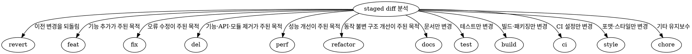

사용자가 스킬을 호출할 때 옵션 및 브랜치 인자를 파싱해 Git 관련 통합 작업을 수행한다.

# 호출할 에이전트 목록

| 에이전트명 | 하는일              |
| ---------- | ------------------- |
| coder      | 코드 검색, 조회     |
| architect  | 커밋,머지 작업 진행 |

# 사용자 입력 값 파싱

$ARGUMENTS

## `--commit <branch-name>`

1. 타겟 저장소의 절대 경로, 현재 브랜치와 전체 HEAD SHA를 확인한다. 현재 브랜치가 `<branch-name>`과 다르면 종료한다.
2. `git -C <TARGET_REPO_ABSOLUTE_PATH> status --short`로 변경사항을 확인하고 `git -C <TARGET_REPO_ABSOLUTE_PATH> add -A --`로 타겟 저장소의 변경사항을 stage한다.
3. `git -C <TARGET_REPO_ABSOLUTE_PATH> diff --cached --stat`, `git -C <TARGET_REPO_ABSOLUTE_PATH> diff --cached --`로 staged 변경 전체를 확인한다. staged 변경이 없으면 커밋하지 않고 종료한다.
4. staged diff의 주된 변경 목적에 따라 다음 알고리즘으로 prefix를 하나 선택한다.



5. 여러 변경이 하나의 기능 결과를 만들면 핵심 결과를 대표하는 prefix를 선택한다. 서로 독립적인 주요 목적이 두 개 이상이면 커밋하지 말고 분리가 필요함을 보고한 뒤 index를 그대로 보존하고 종료한다.
   - 기능·API·모듈 제거가 주목적이면 `del`을 사용한다.
   - 동작 변화 없이 미사용 코드를 정리하면 `refactor`를 사용한다.
   - 설정·일반 파일 정리가 주목적이면 `chore`를 사용한다.
   - 기능 변경에 테스트·문서 변경이 동반되면 `test`·`docs`가 아니라 기능 변경의 prefix를 사용한다.
6. 제목은 prefix를 제외한 한 줄짜리 한국어 요약으로 작성한다.
7. 변경 요약은 staged diff에서 확인한 의미 있는 세부 내역을 빠짐없이 `대상 + 구체적인 변경 내용` 형식의 한 줄로 작성한다. 개수를 3개로 제한하지 않으며 각 값에 `-`를 직접 붙이지 않는다.
8. 다음 명령만 사용해 커밋한다. `<INTEGRATION_SKILL_DIR>`은 이 `SKILL.md`가 있는 디렉터리의 절대 경로다.

```bash
python3 <INTEGRATION_SKILL_DIR>/scripts/commit.py \
  --repo <TARGET_REPO_ABSOLUTE_PATH> \
  --expected-branch <CURRENT_BRANCH> \
  --expected-head <FULL_HEAD_SHA> \
  --type <SELECTED_PREFIX> \
  --title "<KOREAN_TITLE>" \
  --summary "<CHANGE_DETAIL_1>" \
  --summary "<CHANGE_DETAIL_2>"
```

- 필요한 변경 요약 수만큼 `--summary`를 반복한다.
- 스크립트가 출력한 새 commit SHA와 `git -C <TARGET_REPO_ABSOLUTE_PATH> show -s --format=%B <NEW_COMMIT_SHA>`를 확인한다.

<HARD-GATE>

- `--commit`에서는 raw `git commit`, `git commit --no-verify` 또는 다른 우회 커밋 명령을 실행하지 않는다.
- 서로 독립적인 주요 목적이 두 개 이상이면 `commit.py`를 실행하지 않는다.
- staged diff에서 확인하지 않은 세부 내역을 만들거나 의미 있는 변경을 요약에서 누락하지 않는다.
- `commit.py`가 실패하면 오류를 그대로 보고하고 즉시 종료한다. raw `git commit`이나 hook 우회 옵션으로 재시도하지 않는다.

</HARD-GATE>

## `--merge --source <feature-branch> --target <target-branch>`

1. `<source-branch>`와 `<target-branch>`의 미커밋 내역을 확인한다.
2. 어느 한쪽에 미커밋 내역이 있으면 `${미커밋 브랜치} 에 commit 작업이 필요합니다.`를 보고하고 종료한다.
3. 양쪽 브랜치가 모두 clean이면 `<source-branch>`를 `<target-branch>`에 merge한다.
