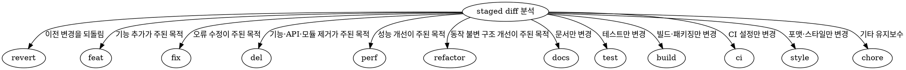

## 에이전트 호출 경계

- 새 에이전트를 생성하는 `spawn_agent`는 `root만` 호출한다.
- non-root 에이전트는 `spawn_agent`를 `직접 또는 간접`으로 호출하거나 다른 에이전트에게 생성을 요청하지 않는다.
- non-root 에이전트는 root가 이미 생성한 에이전트와 협력할 때 `send_message`, `followup_task`, `wait_agent`를 사용할 수 있다.
- 추가 역할이나 에이전트가 필요하면 필요한 역할, 작업 범위와 기대 증거를 `root에 handoff`한다.

사용자가 스킬을 호출할 때 옵션 및 브랜치 인자를 파싱해 Git 관련 통합 작업을 수행한다.

# root가 호출할 에이전트 목록

| 에이전트명 | 하는일              |
| ---------- | ------------------- |
| coder      | 코드 검색, 조회     |
| architect  | 병합 설계·위험 검토와 evidence 제공. `merge.py` mutation은 실행하지 않음 |
| root       | 모든 `merge.py` mutation 실행과 상태 전이를 단독 조정 |

# 사용자 입력 값 파싱

$ARGUMENTS

## `--commit <branch-name>`

1. 타겟 저장소의 절대 경로, 현재 브랜치와 전체 HEAD SHA를 확인한다. 현재 브랜치가 `<branch-name>`과 다르면 종료한다.
2. `git -C <TARGET_REPO_ABSOLUTE_PATH> status --short`로 변경사항을 확인하고 `git -C <TARGET_REPO_ABSOLUTE_PATH> add -A --`로 타겟 저장소의 변경사항을 stage한다.
3. `git -C <TARGET_REPO_ABSOLUTE_PATH> diff --cached --stat`, `git -C <TARGET_REPO_ABSOLUTE_PATH> diff --cached --`로 staged 변경 전체를 확인한다. staged 변경이 없으면 커밋하지 않고 종료한다.
4. staged diff의 주된 변경 목적에 따라 다음 알고리즘으로 prefix를 하나 선택한다.



5. 여러 변경이 하나의 기능 결과를 만들면 핵심 결과를 대표하는 prefix를 선택한다. 서로 독립적인 주요 목적이 두 개 이상이면 커밋하지 말고 분리가 필요함을 보고한 뒤 index를 그대로 보존하고 종료한다.
   - 기능·API·모듈 제거가 주목적이면 `del`을 사용한다.
   - 동작 변화 없이 미사용 코드를 정리하면 `refactor`를 사용한다.
   - 설정·일반 파일 정리가 주목적이면 `chore`를 사용한다.
   - 기능 변경에 테스트·문서 변경이 동반되면 `test`·`docs`가 아니라 기능 변경의 prefix를 사용한다.
6. 제목은 prefix를 제외한 한 줄짜리 한국어 요약으로 작성한다.
7. 변경 요약은 staged diff에서 확인한 의미 있는 세부 내역을 빠짐없이 `대상 + 구체적인 변경 내용` 형식의 한 줄로 작성한다. 개수를 3개로 제한하지 않으며 각 값에 `-`를 직접 붙이지 않는다.
8. 다음 명령만 사용해 커밋한다. `<INTEGRATION_SKILL_DIR>`은 이 `SKILL.md`가 있는 디렉터리의 절대 경로다.

```bash
python3 <INTEGRATION_SKILL_DIR>/scripts/commit.py \
  --repo <TARGET_REPO_ABSOLUTE_PATH> \
  --expected-branch <CURRENT_BRANCH> \
  --expected-head <FULL_HEAD_SHA> \
  --type <SELECTED_PREFIX> \
  --title "<KOREAN_TITLE>" \
  --summary "<CHANGE_DETAIL_1>" \
  --summary "<CHANGE_DETAIL_2>"
```

- 필요한 변경 요약 수만큼 `--summary`를 반복한다.
- 스크립트가 출력한 새 commit SHA와 `git -C <TARGET_REPO_ABSOLUTE_PATH> show -s --format=%B <NEW_COMMIT_SHA>`를 확인한다.

<HARD-GATE>

- `--commit`에서는 raw `git commit`, `git commit --no-verify` 또는 다른 우회 커밋 명령을 실행하지 않는다.
- 서로 독립적인 주요 목적이 두 개 이상이면 `commit.py`를 실행하지 않는다.
- staged diff에서 확인하지 않은 세부 내역을 만들거나 의미 있는 변경을 요약에서 누락하지 않는다.
- `commit.py`가 실패하면 오류를 그대로 보고하고 즉시 종료한다. raw `git commit`이나 hook 우회 옵션으로 재시도하지 않는다.

</HARD-GATE>

## `--merge --source <feature-branch> --target <target-branch>`

### root-only coordinator

- merge run의 생성, conflict 판정 반영, verification, reviewer evidence 연결, promotion, abort와 cleanup은 root만 조정한다.
- coder·tester·reviewer는 코드, 테스트와 리뷰 evidence를 제공하며 target ref를 직접 변경하지 않는다.
- 사용자 결정이 필요한 semantic conflict는 root가 질문하고 `user:<reference>` evidence를 확보한다.
- `<source-branch>`와 `<target-branch>`의 미커밋 내역을 확인한다.
- 어느 한쪽에 미커밋 내역이 있으면 `${미커밋 브랜치} 에 commit 작업이 필요합니다.`를 보고하고 종료한다.
- 양쪽 브랜치가 모두 clean이면 `<source-branch>`를 `<target-branch>`에 merge한다. 실제 merge는 아래 `merge.py` candidate workflow 안에서만 수행한다.

### 상태 머신

```text
INITIALIZING
   ├─ stale ref/manifest ─────────────────────────────> STALE
   ├─ invalid config/evidence/lock/runtime failure ──> FAILED
   ├─ source already contained by target ────────────> ALREADY_MERGED
   └─ refs·READY evidence·prepare checks 고정 ───────> PREPARED
                                                        │
                                  isolated no-ff merge ─┤
                                                        ├─ conflict ─> CONFLICTED
                                                        │                ├─ 결정 필요 ─> DECISION_REQUIRED
                                                        │                └─ evidence ──> RESOLVED
                                                        │                                  │
                                                        └──────────────────────────────────┤
                                                                                           v
                                                                                 CANDIDATE_COMMITTED
                                                                                           │
                                                                                      VERIFYING
                                                                                           │
                                                                                       VERIFIED
                                                                                           │
                                                                                      PROMOTING
                                                                                           │
                                                                                       PROMOTED
                                                                                           │
                                                                         ┌─────────────────┴────────────────┐
                                                                         v                                  v
                                                                      CLEANED                       CLEANUP_PARTIAL

어느 시점이든 root abort ──> ABORTED
```

- target branch는 `PROMOTING` 전까지 unchanged 상태여야 한다.
- 상태 전이는 `.yusung-harness/integrations/<run-id>/manifest.json`과 evidence artifact로만 증명한다.
- `STALE`, `DECISION_REQUIRED`, `FAILED`, `CLEANUP_PARTIAL`을 성공으로 승격하거나 다음 단계로 우회하지 않는다.

### source worktree precondition

- code workflow는 `scripts/worktree.py create`로 격리 source를 만들고 configured source profile을 각각 `--targeted-check-json`으로 기록한다.

```bash
python3 <CODE_SKILL_DIR>/scripts/worktree.py create \
  --repo <TARGET_REPO_ABSOLUTE_PATH> \
  --name <WORKTREE_NAME> \
  --base <BASE_BRANCH> \
  --expected-base-head <FULL_BASE_SHA> \
  --agent coder \
  --project-id <PROJECT_ID> \
  --task-id <TASK_ID> \
  --targeted-check-json <SOURCE_PROFILE_JSON> \
  --targeted-check-json <SOURCE_PROFILE_JSON>
```

- source commit 뒤 `scripts/worktree.py ready`가 HEAD drift, clean 상태와 targeted profile을 검증해 READY evidence를 생성한다.

```bash
python3 <CODE_SKILL_DIR>/scripts/worktree.py ready \
  --repo <TARGET_REPO_ABSOLUTE_PATH> \
  --branch <SOURCE_BRANCH> \
  --expected-head <FULL_SOURCE_HEAD_SHA>
```

- `merge.py prepare`는 READY manifest가 없거나 source HEAD/tree와 targeted evidence가 일치하지 않으면 fail-closed한다.

### 1. candidate 준비

1. source worktree manifest가 `READY`이고 source/target branch와 full SHA가 고정됐는지 확인한다.
2. target HEAD의 `.codex/integration.toml`을 authoritative config로 사용한다. source가 config를 바꿔도 candidate verification 정책으로 채택하지 않는다.
3. 다음 명령으로 source·candidate의 prepare profile을 실행하고 별도 candidate worktree에서 `--no-ff` merge commit을 만든다.

```bash
python3 <INTEGRATION_SKILL_DIR>/scripts/merge.py prepare \
  --repo <TARGET_REPO_ABSOLUTE_PATH> \
  --source <SOURCE_BRANCH> \
  --target <TARGET_BRANCH> \
  --expected-source-head <FULL_SOURCE_HEAD_SHA> \
  --expected-target-head <FULL_TARGET_HEAD_SHA>
```

- prepare profile은 source와 candidate 각각 `apps`에서 `pnpm install --frozen-lockfile`을 argv 직접 실행한다.
- source `worktree-engine`과 `integration-engine` targeted evidence의 head SHA, tree SHA와 digest를 READY manifest에서 가져온다.
- candidate branch는 `yusung-integration/` namespace에 만들고 target ref는 변경하지 않는다.
- `ALREADY_MERGED`이면 candidate를 만들거나 target을 다시 갱신하지 않는다.

```bash
python3 <INTEGRATION_SKILL_DIR>/scripts/merge.py status \
  --repo <TARGET_REPO_ABSOLUTE_PATH> \
  --run-id <RUN_ID>
```

### 2. conflict evidence와 resolution

- conflict가 발생하면 target을 unchanged로 유지하고 `conflicts.json`과 검증 가능한 Git `bundle`을 보존한다.
- conflict를 근거 없이 자동 해결하거나 ours/theirs 한쪽으로 일괄 선택하지 않는다. 코드와 테스트만으로 결과가 결정되는 mechanical conflict는 해당 evidence를 기록한 뒤 처리할 수 있다.
- 각 path를 `mechanical` 또는 `semantic`으로 분류한다.
- evidence는 `code|test|plan|user:<reference>` 형식으로 실제 근거를 가리켜야 한다.
  - `mechanical`: 동일 의미의 이동·rename·생성물 정렬처럼 코드/테스트 근거로 결정 가능한 충돌.
  - `semantic`: 동작, 데이터, API, 보안 또는 제품 의도가 달라지는 충돌. plan 또는 사용자 결정 evidence가 없으면 `DECISION_REQUIRED`로 중단한다.

```bash
python3 <INTEGRATION_SKILL_DIR>/scripts/merge.py resolve \
  --repo <TARGET_REPO_ABSOLUTE_PATH> \
  --run-id <RUN_ID> \
  --path <CONFLICT_PATH> \
  --classification mechanical|semantic \
  --evidence code|test|plan|user:<reference>
```

- 모든 conflict가 evidence와 함께 해결돼 `RESOLVED`가 된 뒤에만 candidate commit을 확정한다.

```bash
python3 <INTEGRATION_SKILL_DIR>/scripts/merge.py finalize \
  --repo <TARGET_REPO_ABSOLUTE_PATH> \
  --run-id <RUN_ID>
```

### 3. reviewer와 full verification gate

- conflict resolution이 있으면 독립 reviewer의 `PASS`와 evidence가 필수다. `FAIL`은 promotion을 차단한다.

```bash
python3 <INTEGRATION_SKILL_DIR>/scripts/merge.py review \
  --repo <TARGET_REPO_ABSOLUTE_PATH> \
  --run-id <RUN_ID> \
  --verdict PASS|FAIL \
  --reviewer <REVIEWER_ID> \
  --evidence <EVIDENCE_REFERENCE>
```

- candidate commit의 동일 head/tree에서 target config에 고정된 `test`, `typecheck`, `lint`, `build` 네 category를 모두 실행한다.
- `--` 뒤 argv는 config와 exact-match해야 하며 임의 command, shell string 또는 축소 gate를 허용하지 않는다.

```bash
python3 <INTEGRATION_SKILL_DIR>/scripts/merge.py verify \
  --repo <TARGET_REPO_ABSOLUTE_PATH> \
  --run-id <RUN_ID> \
  --phase candidate \
  --check test \
  -- pnpm test

python3 <INTEGRATION_SKILL_DIR>/scripts/merge.py verify \
  --repo <TARGET_REPO_ABSOLUTE_PATH> \
  --run-id <RUN_ID> \
  --phase candidate \
  --check typecheck \
  -- /usr/bin/env DATABASE_URL=file:./harness-board.db pnpm typecheck

python3 <INTEGRATION_SKILL_DIR>/scripts/merge.py verify \
  --repo <TARGET_REPO_ABSOLUTE_PATH> \
  --run-id <RUN_ID> \
  --phase candidate \
  --check lint \
  -- pnpm lint

python3 <INTEGRATION_SKILL_DIR>/scripts/merge.py verify \
  --repo <TARGET_REPO_ABSOLUTE_PATH> \
  --run-id <RUN_ID> \
  --phase candidate \
  --check build \
  -- /usr/bin/env DATABASE_URL=file:./harness-board.db pnpm build
```

- category 하나라도 누락·실패·stale이면 `VERIFIED`로 판정하지 않는다.

### 4. ff-only promotion과 cleanup

- promotion 직전에 source, target, candidate와 config digest가 run snapshot과 exact-match하는지 다시 확인한다.
- target이 아직 기대 target SHA일 때만 candidate SHA로 compare-and-swap `--ff-only` promotion한다.
- target이 checkout된 경우와 다른 branch가 checkout된 경우 모두 현재 사용자 worktree를 임의 switch하지 않는다.

```bash
python3 <INTEGRATION_SKILL_DIR>/scripts/merge.py promote \
  --repo <TARGET_REPO_ABSOLUTE_PATH> \
  --run-id <RUN_ID>
```

- `cleanup = "worktree-and-branch"`이면 성공 후 candidate worktree/branch와 local source worktree/branch만 제거한다.
- remote source branch는 삭제하지 않는다. remote ref 삭제, force push와 target rewrite를 수행하지 않는다.
- cleanup 일부가 실패하면 target promotion을 되돌리지 말고 `CLEANUP_PARTIAL`과 잔존 경로를 보고한다.

### 5. abort

```bash
python3 <INTEGRATION_SKILL_DIR>/scripts/merge.py abort \
  --repo <TARGET_REPO_ABSOLUTE_PATH> \
  --run-id <RUN_ID>
```

- abort는 candidate worktree/branch와 merge run 임시 상태만 정리한다.
- source worktree/branch, target branch, remote ref와 evidence bundle은 삭제하지 않는다.

<HARD-GATE>

- `merge.py` mutation은 root만 실행한다.
- target ref는 full verification과 필요한 reviewer `PASS` 전까지 변경하지 않는다.
- conflict evidence, failed gate, stale SHA 또는 `DECISION_REQUIRED`를 임의 판단으로 우회하지 않는다.
- raw `git merge`, `git update-ref`, `git worktree remove`, branch delete 또는 force 옵션으로 engine 상태를 우회하지 않는다.
- local cleanup을 remote branch 삭제로 확대하지 않는다.

</HARD-GATE>
