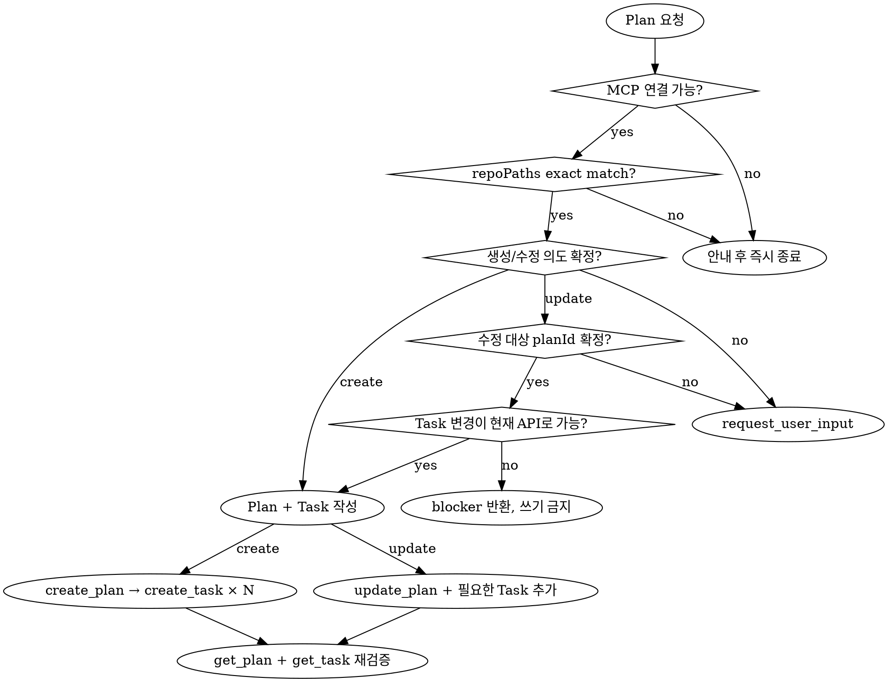

# 목적과 책임 경계

- 사용자의 구현 요구사항을 구현자가 추가 기획 결정을 하지 않아도 되는 Plan과 Task로 변환한다.
- 코드베이스와 프로젝트 문서로 확인한 사실만 근거로 사용한다.
- Plan은 구현 범위와 검증 방법을 설계하며 코드 구현, 테스트 실행 또는 새로운 아키텍처 결정을 대신하지 않는다.
- 목표, 사용자 가치 또는 핵심 범위가 안정되지 않았으면 Plan을 억지로 작성하지 말고 `draft` 단계가 필요하다는 blocker를 반환한다.
- 기술스택, 인프라, 배포, 로그 또는 시스템 경계의 새로운 결정이 필요하면 `architect`의 결정을 선행한다.

# 작업 에이전트

| 에이전트 | 호출 조건 | 책임 |
| --- | --- | --- |
| `doc-curator` | 항상 | MCP 연결, 프로젝트·기존 문서 조회, 최종 Plan·Task 저장과 재조회 검증 |
| `coder` | hard gate 통과 후 항상 | 코드 경로·심볼·현재 동작·컨벤션·source revision·검증 명령 확인 |
| `planner` | 근거 수집 후 항상 | 요구사항 분류, 가능성 판정, Plan 작성, 기능 결과 단위 Task 분해와 자체 검증 |
| `architect` | 아키텍처 결정이 필요할 때 | 기술스택·인프라·배포·관측성·시스템 경계 결정 |
| `researcher` | 시의성 있는 외부 사실이 필요할 때 | 공식 최신 자료와 외부 제약 검증 |
| `reviewer` | 고위험 변경 또는 독립 검토가 필요할 때 | 범위 누락, 충돌, 위험과 검증 가능성 검토 |

- root가 에이전트 호출과 재사용을 조율한다.
- planner가 다른 에이전트를 재귀적으로 호출하거나 전문 에이전트의 결정을 대신하지 않게 한다.

# Hard gate: MCP와 프로젝트 등록 확인

- 다른 에이전트를 호출하거나 Plan 초안을 작성하기 전에 `doc-curator`가 다음 순서로 확인하게 한다.
  1. `yusung-harness-doc` MCP와 `get_project` 도구가 노출됐는지 확인한다.
  2. 첫 실제 연결 확인을 겸해 `get_project({})`로 프로젝트 목록을 조회한다.
  3. 대상 저장소의 절대 경로와 `repoPaths[].path`를 exact-match하고 `repoType: LOCAL`인 프로젝트를 선택한다.
  4. 선택한 양의 정수 `projectId`로 `get_project({ projectId })`를 호출하여 프로젝트와 포함된 산출물 문맥을 조회한다.
  5. `get_plan({ projectId })`과 `get_task({ projectId })`로 기존 Plan과 Task를 조회한다.
- MCP 연결 실패, timeout, 권한 오류 또는 응답 검증 실패가 발생하면 `yusung-harness-doc MCP에 연결할 수 없어 Plan 작업을 시작하지 않습니다.`라고 반환하고 root의 현재 턴을 즉시 종료한다.
- 일치하는 프로젝트가 없으면 `project로 등록되지 않았습니다. 먼저 레포를 project로 등록하세요`라고 반환하고 `curate` 스킬을 안내한 뒤 root의 현재 턴을 즉시 종료한다.
- 여러 프로젝트가 일치하거나 프로젝트 식별자를 확정할 수 없으면 후보를 보고하고 Plan 작성을 시작하지 않는다.
- hard gate 실패 시 코드 탐색, 사용자 질문, Plan·Task 작성 또는 저장 호출을 수행하지 않는다.

# 입력 계약

## hard gate 통과 후 필수 입력

- 대상 저장소의 절대 경로와 `projectId`
- 사용자의 요구사항, 목표 결과, 포함 범위, 제외 범위와 제약
- `get_project`, `get_plan`, `get_task`로 확인한 프로젝트 문맥과 기존 문서
- coder가 확인한 코드 경로·모듈·심볼·현재 동작·컨벤션, source revision과 `worktreeState: clean | dirty`
- dirty worktree이면 분석에 포함한 변경 파일 목록과 working tree 상태
- 저장소에 실제로 선언된 테스트·lint·typecheck·build 명령
- 사용자 또는 프로젝트 문서가 정의한 완료 기준

## 조건부 입력

- 기존 Plan 수정 시 `planId`, 기존 Task 목록과 변경 의도
- Draft에서 승계한 목표, 범위, 결정과 가정
- 아키텍처 영향이 있으면 `get_architecturePlan({ projectId })`로 확인한 현행 ArchitecturePlan
- ArchitecturePlan이 없거나 새 결정·충돌 해소가 필요하면 architect가 승인한 아키텍처 결정
- researcher가 공식 자료로 검증한 시의성 있는 외부 제약

## 근거 분류

- `confirmed`: 코드, 프로젝트 문서, 도구 출력 또는 사용자 결정으로 확인한 사실
- `assumptions`: 진행을 위해 채택했지만 확인되지 않은 가정
- `decisions_needed`: 현재 Plan의 범위나 구현 방식을 확정하려면 필요한 사용자 선택
- `blockers`: Plan 작성 또는 저장을 막는 입력 누락, 기술 제약 또는 문서 충돌

- 확인되지 않은 내용을 `confirmed`로 기록하지 않는다.
- 저장소나 프로젝트 문서에서 확인할 수 있는 사실을 사용자에게 묻지 않는다.
- 되돌리기 어렵거나 목표·범위·호환성에 영향을 주는 결정을 임의의 가정으로 처리하지 않는다.

# 작업 흐름

```text
사용자 요청
   │
   ▼
doc-curator: MCP 연결 + get_project({}) + 저장소 경로 대조
   ├─ 연결 실패/미등록 ──> 안내 후 root 현재 턴 즉시 종료
   ▼
get_project({ projectId }) + get_plan + get_task
   │
   ▼
coder: AS-IS 코드·source revision·영향 범위·검증 명령 확인
   ├─ 필요 시 architect / researcher
   ▼
planner: 가능성·범위·의존성·사용자 결정 분류
   ├─ decisions_needed ──> root가 사용자 입력 수집
   ├─ blockers ─────────> 해소 전 최종본·저장 금지
   ▼
상위 Plan 작성 → 기능 결과 단위 Task 분해
   │
   ▼
추적성·중복·순환 의존성·검증 누락 자체 검사
   │
   ▼
doc-curator 저장 → get_plan/get_task 재조회 검증
```

# 사용자 결정 규칙

- 현재 Plan을 확정하는 데 필요한 선택만 `decisions_needed`로 반환한다.
- root만 `request_user_input`을 사용하여 한 번에 가장 중요한 결정 1~3개를 수집한다.
- 각 결정에 안정적인 `snake_case` ID, 질문, 상호 배타적인 선택지 2~3개, 추천안과 선택별 영향을 포함한다.
- 범위, 비용, 일정, 호환성, 데이터, 보안 또는 운영 결과가 달라지는 선택을 우선한다.
- 사용자 결정을 반영한 뒤 planner가 Plan과 Task의 자체 검증을 다시 수행하게 한다.
- 해결되지 않은 `decisions_needed` 또는 `blockers`가 하나라도 있으면 최종본으로 표시하거나 저장하지 않는다.

# Plan 생성·수정 선택 알고리즘



- 사용자가 신규 생성을 명시하면 `create`로 처리한다.
- 사용자가 기존 Plan 수정을 명시하면 양의 정수 `planId`를 사용한다.
- 수정 요청에 `planId`가 없으면 exact-match 제목이 한 개인 경우에만 그 Plan을 후보로 제시하고 root가 확인하게 한다.
- exact-match Plan이 없거나 여러 개인 경우 대상 선택을 `decisions_needed`로 반환한다.
- 신규 생성 요청과 exact-match 제목의 기존 Plan이 충돌하면 중복 생성 여부를 사용자에게 확인한다.

# Plan 출력 계약

- 다음 항목을 포함하는 하나의 상위 Plan을 먼저 작성한다.
  1. 사용자 가치가 드러나는 제목
  2. 가능성 판정: `가능`, `조건부 가능`, `불가능`과 근거
  3. 목표와 비목표
  4. 요구사항, 제약, `confirmed`, `assumptions`, `decisions_needed`, `blockers`
  5. AS-IS 코드 경로·심볼·현재 동작과 ASCII 구조도
  6. TO-BE 동작·데이터 흐름과 ASCII 구조도
  7. ArchitecturePlan 제약과 데이터 구조·migration 영향 또는 영향 없음의 근거
  8. Task 순서, 선행조건, 의존성, 병렬 가능 여부
  9. 테스트 작성 범위와 기존 검증 명령 실행 범위
  10. 위험, 복구·롤백 고려사항과 전체 완료 기준
  11. 요구사항 → Task → 완료 기준 → `requiredEvidence` 추적 관계
- AS-IS와 TO-BE 구조도는 저장소의 실제 컴포넌트 이름과 흐름을 사용한다.
- 저장소에서 확인하지 않은 코드 경로, API, 데이터 구조 또는 검증 명령을 만들지 않는다.

# Task 분해와 출력 계약

- Task를 파일이나 레이어가 아니라 독립적으로 검증 가능한 기능 결과 단위로 나눈다.
- 한 Task가 하나의 명확한 목표와 소유 범위를 갖게 한다.
- 여러 기능 결과를 한 Task에 묶거나 같은 결과를 여러 Task에 중복 배정하지 않는다.
- 횡단 관심사는 독립적인 완료 결과와 검증 기준이 있을 때만 별도 Task로 분리한다.
- `Task-N` 번호를 Plan 안에서 유일하게 유지하고 모든 의존 참조가 실제 존재하는 Task를 가리키게 한다.
- 각 Task에 다음 항목을 포함한다.
  1. 순서가 드러나는 Task 번호와 기능 결과 중심 제목
  2. 목표와 사용자에게 보이는 완료 결과
  3. 포함 범위와 제외 범위
  4. 선행조건, 의존 Task와 병렬 가능 여부
  5. 영향받는 코드 경로·모듈·심볼과 변경 이유
  6. 구현 절차 체크리스트
  7. 테스트 작성 범위와 실행할 기존 검증 명령
  8. 완료 기준과 향후 확보해야 하는 `requiredEvidence`
  9. 위험과 필요한 경우 복구·롤백 방법
- 신규 Task 체크리스트는 모두 `[ ]`로 시작한다.
- 실제 source revision과 테스트 결과인 `existingEvidence`로 완료가 확인된 기존 작업만 `[x]`로 표시한다.
- 테스트 코드 작성과 이미 선언된 테스트·lint·typecheck·build 실행을 별도 체크 항목으로 구분한다.

# doc-curator hand-off 계약

- planner가 저장 가능한 최종본을 다음 데이터와 함께 doc-curator에게 전달하게 한다.
  - `mode: Plan`
  - `operation: create | update`
  - `projectId`, `sourceRevision`
  - update인 경우 `planId`
  - Plan 제목과 전체 본문
  - create인 경우 `newTasks[{ title, content, expectedStatus: PENDING }]`
  - update인 경우 `unchangedExistingTasks[{ taskId, title, content, status }]`와 `newTasks[{ title, content, expectedStatus: PENDING }]`
  - 근거, 가정, 해결된 사용자 결정과 blocker 해소 내역
- update hand-off에 기존 Task를 `newTasks`로 다시 넣지 않는다.
- 기존 Task와 신규 Task의 `Task-N` 번호가 중복되면 hand-off하지 않는다.
- doc-curator가 추가 기획 판단 없이 MCP 입력을 만들 수 있을 때만 hand-off한다.
- MCP 도구 선택, 실제 호출, 반환 ID 기록과 재조회 검증은 doc-curator의 책임으로 둔다.

# MCP 저장 계약

## 실제 인터페이스

| 도구 | 입력과 용도 |
| --- | --- |
| `get_project` | `{ projectId?: positive integer }`; 생략 시 프로젝트 목록, 지정 시 구현에 포함된 프로젝트 산출물 문맥 조회 |
| `get_architecturePlan` | `{ projectId: positive integer }`; 아키텍처 영향이 있을 때 ArchitecturePlan 별도 조회 |
| `get_plan` | `{ projectId: positive integer }`; Plan은 최근 수정순, 각 Plan의 중첩 Task는 `createdAt` 오름차순으로 조회 |
| `get_task` | `{ projectId: positive integer, planId?: positive integer }`; 프로젝트 전체 또는 선택한 Plan의 Task를 최근 수정순으로 조회 |
| `create_plan` | `{ projectId, title, content }`; 초기 `PENDING` Plan 생성 |
| `update_plan` | `{ projectId, planId, title, content }`; 기존 Plan 제목과 본문 전체 교체 |
| `create_task` | `{ projectId, planId, title, content? }`; 선택한 Plan에 초기 `PENDING` Task 생성 |
| `update_task` | `{ projectId, taskId, status }`; `PENDING | COMPLETED` 상태만 변경 |

- 각 MCP 결과에서 `isError`를 먼저 확인하고 `content[0].type === "text"`를 확인한 뒤 `content[0].text`를 JSON으로 파싱한다.
- `isError: true`이면 `{ error: { code, status, message } }`를 오류로 처리하고 추가 MCP 호출 없이 root의 현재 턴을 즉시 종료한다.
- 응답 content가 없거나 JSON 파싱과 필수 필드 검증에 실패하면 응답 검증 실패로 처리한다.
- 저장 단계의 transport 오류, timeout, 권한 오류와 응답 검증 실패에도 같은 즉시 종료 규칙을 적용한다.

## 생성 순서

1. `create_plan(projectId, title, content)`를 호출한다.
2. 성공 payload의 양의 정수 `id`를 확인하고 `planId`로 기록한다.
3. 의존 순서에 따라 각 Task를 `create_task(projectId, planId, title, content)`로 생성한다.
4. 각 Task 성공 payload의 양의 정수 `id`를 `taskId`로 기록한다.
5. `get_plan({ projectId })`과 `get_task({ projectId, planId })`를 재호출한다.
6. 저장된 Plan과 Task의 ID, 번호가 포함된 제목, 본문, 개수와 신규 Task의 기본 `PENDING` 상태가 hand-off 및 서버 계약과 일치할 때만 저장 완료로 판정한다.

- Task의 논리적 순서는 Plan 본문의 의존성 표와 `Task-N` 제목을 정본으로 사용한다.
- Task 모델에는 명시적 순서 필드가 없으므로 `get_plan` 또는 `get_task` 배열 순서를 논리적 의존 순서의 정본으로 사용하지 않는다.

## 수정 제한

- `update_plan`은 사용자가 기존 Plan 수정을 명시하고 대상 `planId`가 확정된 경우에만 호출한다.
- `update_task`를 Task 제목, 본문 또는 체크리스트 수정 도구로 사용하지 않는다.
- Plan 작성·저장 단계에서 `update_task`를 호출하지 않는다. 체크리스트의 `[x]` 표시는 Task 상태를 자동으로 `COMPLETED`로 바꾸지 않는다.
- Task 상태는 `PENDING` 또는 `COMPLETED`만 사용한다.
- Plan 상태를 직접 갱신하지 않는다. 첫 Task 생성 이후 `IN_PROGRESS`, 모든 Task 완료 이후 `COMPLETED`가 되도록 서버의 Task 집계에 맡긴다.
- 기존 Task의 제목·본문 변경, 재정렬 또는 제거가 필요하면 어떤 쓰기도 시작하기 전에 API 한계를 `blockers`에 기록하고 현재 Plan 저장을 중단한다.
- 기존 Task를 유지하면서 새 기능 결과를 뒤에 추가하는 변경만 `create_task`로 처리한다.
- update 저장 전 `unchangedExistingTasks.taskId`가 재조회 결과와 일치하고 `newTasks`가 기존 Task와 중복되지 않는지 확인한다.

## 부분 실패

- Plan 또는 일부 Task만 저장된 상태에서 실패하면 성공으로 보고하지 않는다.
- MCP 도구가 오류를 반환하면 같은 턴에서 추가 MCP 호출을 하지 말고 성공 응답으로 이미 확보한 Plan·Task ID, 실패한 도구와 오류를 root에 반환한 뒤 즉시 종료한다.
- `create_plan` 또는 `create_task`를 맹목적으로 재호출하지 않는다.
- 다음 사용자 요청 턴의 hard gate를 통과한 뒤 `get_plan`과 `get_task`로 현재 상태를 다시 읽고, 중복 없이 재개할 수 있는지 확인한다.
- 다음 턴에는 재조회 결과를 기준으로 기존 Plan을 `update` 대상으로 선택하고, 저장된 Task는 `unchangedExistingTasks`, 아직 저장되지 않은 Task만 `newTasks`로 hand-off한다.

# 자체 검증과 완료 조건

- 최종 hand-off 전에 다음 항목을 모두 검사한다.
  - 모든 요구사항이 하나 이상의 Task, 완료 기준과 `requiredEvidence`에 연결되어 있다.
  - 모든 Task가 하나 이상의 요구사항을 충족한다.
  - Task 범위 중복, 누락과 순환 의존성이 없다.
  - 병렬 가능 여부가 실제 의존성과 일치한다.
  - `Task-N`이 유일하고 모든 의존 참조가 존재하며 순환 의존성이 없다.
  - AS-IS 코드 경로·심볼·현재 동작이 source revision과 worktreeState의 근거에 일치한다.
  - 필요한 데이터 변경, migration, 호환성, 보안, 배포, 관측성과 복구 작업이 빠지지 않았다.
  - ArchitecturePlan 또는 승인된 architect 결정과 충돌하지 않는다.
  - 저장소에서 확인한 검증 명령만 사용하며 각 완료 기준에 검증 방법이 연결되어 있다.
  - `decisions_needed`와 해결되지 않은 `blockers`가 없다.
  - doc-curator가 추가 판단 없이 Plan과 Task를 저장할 수 있다.
- 자체 검증에 실패하면 최종본으로 표시하거나 저장하지 않는다.
- MCP 호출 성공만으로 완료를 선언하지 않는다.
- 재조회한 Plan·Task가 hand-off와 일치할 때만 Plan 작업 완료를 보고한다.
