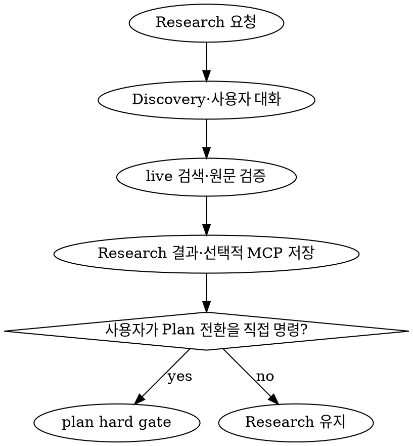

# Research Discovery and Evidence

Research는 제품 탐색 책임과 live 외부 근거 검증을 하나의 workflow로 통합한다.

<HARD-GATE>

- 새로운 Research를 만들 때는 항상 현재 시각 기준 live 웹 검색과 원문 확인을 수행한다.
- 기존 Research 수정은 유효한 evidence를 재사용할 수 있는 경우를 제외하고 live 검색을 다시 수행한다.
- 모델 기억, 검색 snippet, AI 요약만으로 외부 사실을 확정하지 않는다.
- 일반 Research는 Project 없이 사용자에게 반환할 수 있지만 MCP 저장·수정은 등록된 Project에서만 수행한다.
- Research는 잠정 제품 방향을 제안할 수 있지만 구현 Plan, Task, API, schema와 Architecture를 확정하거나 구현을 승인하지 않는다.
- Research 완료가 Plan 전환을 의미하지 않는다. 사용자가 Plan 전환을 직접 명령할 때만 `plan` 스킬을 새로 시작한다.

</HARD-GATE>

## 담당

| 담당 | 책임 |
| --- | --- |
| root | 사용자 질문·선호 수집, 조사 계약 확정, agent 조율 |
| researcher | Discovery 구조화, live 검색, 원문·최신성·상충 검증, 잠정 대안 종합 |
| doc-curator | Project 확인, Markdown 계약 검증, MCP 저장·재조회 |

- planner는 Research 작성에 참여하지 않는다. planner는 명시적으로 Plan 단계에 진입한 뒤 Research를 입력으로 사용한다.
- researcher는 하위 에이전트를 재귀 호출하지 않는다.

## 통합 workflow

```text
사용자 문제·아이디어
        │
        ▼
문제·대상·가치·성공 신호·가설·대안 탐색
        │
        ▼
조사 계약 정규화
        │
        ▼
현재 시각 기준 live 검색·원문 검증
        │
        ▼
사실 / 추론 / 대안 / 미확인 분리
        │
        ├─ Project 없음 ──> 사용자에게 결과 반환, 저장하지 않음
        └─ 저장·수정 요청
                 │
                 ▼
          Project hard gate
                 │
                 ▼
       create_research / update_research
                 │
                 ▼
           get_research 재검증
```

## 조사 계약

검색 전에 다음 값을 정규화한다.

```text
topic
problem / target_users / expected_value
required_questions / optional_questions
include_scope / exclude_scope
as_of / time_range
region / locale
product / version / platform / plan
source_constraints
success_signals
stakes / downstream_use
output_language
```

- 결론을 바꾸는 사용자 가치·우선순위·범위가 누락되면 root가 `request_user_input`으로 한 번에 1~3개만 확인한다.
- 안전하게 한정 가능한 값은 가정으로 기록하고 탐색을 계속한다.
- 검색은 후보 발견 → 공식·1차 원문 확인 → 상충·누락·반례 확인의 3단계로 진행한다.

## 사실과 제품 탐색의 구분

- `verified_fact`: 원문이 직접 뒷받침하는 외부 사실
- `inference`: 검증된 사실에서 도출한 해석
- `hypothesis`: 아직 검증되지 않은 문제·가치·방향 가설
- `alternative`: 비교 가능한 비구속 제품 방향
- `provisional_preference`: 사용자 선호와 근거를 종합한 현재의 잠정 방향
- `unknown`: 자료 부족·접근 실패·상충으로 확인하지 못한 내용
- 외부 사례에서 얻은 아이디어는 자동으로 제품 결정이 되지 않으며 `alternative` 후보로만 기록한다.

## Evidence 유효기간

- `evidence_valid_until`은 `searched_at + 7일`로 고정한다.
- `scope`는 한 줄 minified JSON `{"claims":[],"include":[],"exclude":[],"versions":[],"regions":[]}`로 기록한다. key 순서는 고정하고 각 배열은 trim·중복 제거 후 UTF-8 오름차순으로 정렬한다.
- 현재 시각이 `evidence_valid_until`보다 이르고 기존·신규 canonical `scope` 문자열이 byte-exact로 동일할 때만 update에서 기존 evidence를 재사용한다.
- 7일 경계에 도달했거나 이후이면 반드시 다시 검색한다.
- 유효기간 안이라도 scope, claim, version, region 중 하나가 달라지면 반드시 다시 검색한다.
- metadata, 직접 URL 또는 원문 확인 증거가 누락됐으면 기존 evidence를 재사용하지 않는다.
- 재사용 update는 기존 `searched_at`, `evidence_valid_until`, verified findings와 source provenance를 유지한다.
- 재검색 update는 실제 검색 완료 시각과 그 시각부터 7일 뒤를 기록한다.

## Project와 MCP 저장

- Project 없는 Research는 대화 결과로만 반환한다.
- 저장·수정 전 `get_project({})`와 `get_project({ projectId })`로 Project를 확인한다.
- update 전 `get_research({ projectId })`에서 `researchId` 소유권과 기존 metadata를 확인한다.
- Project 없음·중복, cross-project ID, MCP 연결 실패 또는 응답 검증 실패 시 write를 호출하지 않는다.

### Create

```json
{
  "projectId": 1,
  "title": "Research title",
  "content": "# Research title\n\n## Research Metadata\n..."
}
```

- create는 기존 Research가 있어도 live 검색을 새로 수행한다.
- `create_research` 성공 뒤 `get_research({ projectId })`로 양의 정수 ID, title, content와 Project 소유권을 재검증한다.

### Update

```json
{
  "projectId": 1,
  "researchId": 7,
  "title": "Updated research title",
  "content": "# Updated research title\n\n## Research Metadata\n..."
}
```

- evidence 재사용 조건을 먼저 판정하고 필요한 경우 검색을 다시 수행한다.
- `update_research` 성공 뒤 같은 `researchId`, Project 소유권, title과 전체 content를 재검증한다.
- 실패한 write를 같은 턴에 맹목적으로 반복하지 않는다.

## Markdown 출력 계약

- H1 제목 다음에 아래 H2를 정확한 제목과 순서로 모두 작성한다.

```text
Research Metadata
Problem and Audience
Expected Value and Success Signals
Goals and Non-goals
Verified Findings
Hypotheses and Assumptions
Alternatives and Provisional Preference
Decisions and Open Questions
Sources
Next Step
```

- `Research Metadata`에는 다음 key를 기록한다.
  - `mode: Research`
  - `status: complete | partial | blocked`
  - `searched_at`: offset 포함 ISO datetime
  - `evidence_valid_until`: searched_at부터 정확히 7일 뒤의 ISO datetime
  - `scope`: 고정 key 순서의 canonical minified JSON. claims, include, exclude, versions, regions를 정렬된 배열로 기록한다.
  - `projectId`: 저장되는 문서에서만 양의 정수
- `Sources`에는 실제로 연 원문의 제목, 발행 주체, 직접 URL, 날짜와 적용 버전을 기록한다.
- 값이 없는 section도 삭제하지 않고 `- 해당 없음: [근거]`를 기록한다.
- 구현 Task, 파일별 변경 목록, 확정 API·schema·Architecture를 포함하지 않는다.

## 결과 상태

- `complete`: 필수 질문과 원문 검증이 완료됐다.
- `partial`: 비핵심 정보나 선택 질문만 미확인이다.
- `blocked`: 필수 질문을 신뢰할 근거로 답할 수 없다.
- `blocked` 문서는 검색 실패 범위와 영향을 기록할 수 있지만 검증되지 않은 외부 주장을 사실처럼 쓰지 않는다.

## Plan 전환



## 완료 조건

- 문제, 대상 사용자, 가치, 성공 신호, 목표·비목표와 대안이 구분되어 있다.
- 현재 시각 기준 live 검색과 원문 검증을 수행했다.
- 핵심 주장에 직접 URL, 적용 날짜·버전·지역이 연결되어 있다.
- 사실, 추론, 가설, 대안, 잠정 선호와 미확인이 분리되어 있다.
- searched_at과 7일 evidence 유효기간이 기록되어 있다.
- 저장 작업이면 Project hard gate와 저장 후 재조회 검증을 통과했다.
- Plan 또는 구현 승인으로 오해될 확정 표현이 없다.
