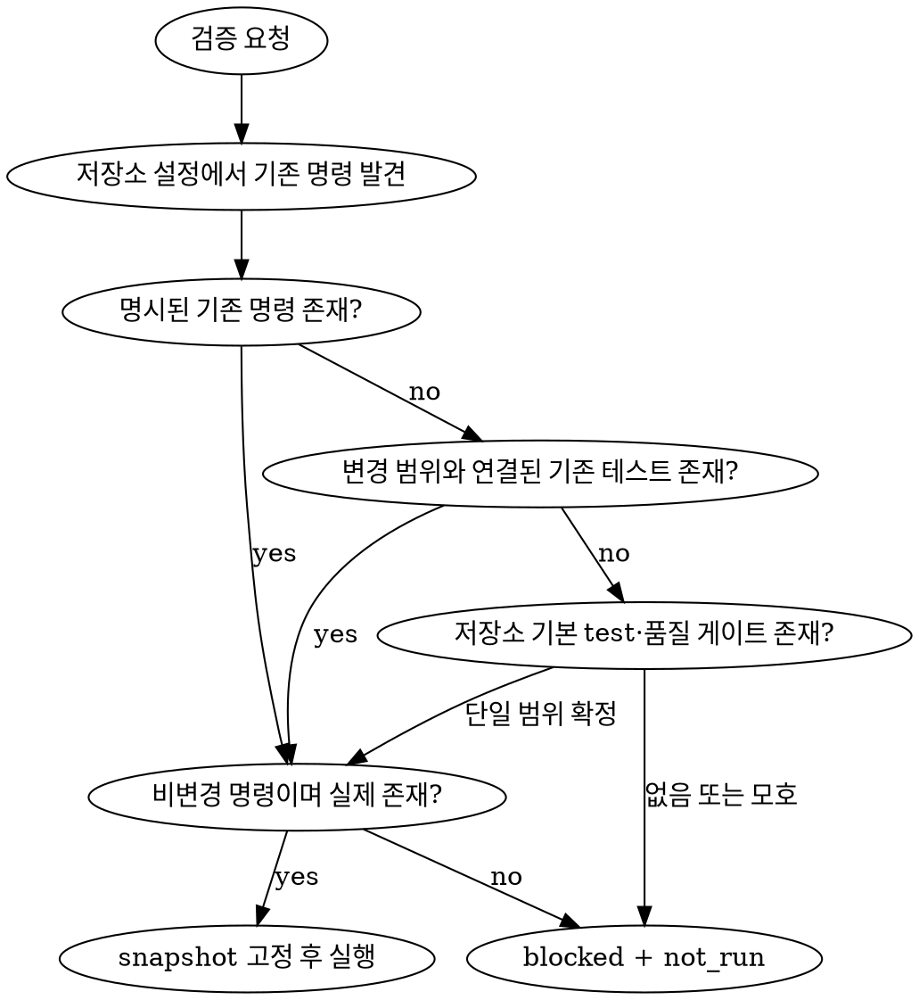

# 테스트 실행·검증

- 이미 존재하는 테스트와 저장소가 선언한 로컬 품질 게이트만 실행한다.
- 구현 코드, 테스트 코드, fixture, mock, snapshot, 설정과 lockfile을 작성하거나 수정하지 않는다.
- 결과를 revision, 작업 트리 상태, 명령, 환경, 종료 코드와 로그에 연결하여 재현 가능하게 보고한다.

## 담당 에이전트

| 에이전트 | 책임 |
| --- | --- |
| `tester` | 대상 snapshot을 고정하고 기존 테스트와 로컬 품질 게이트를 실행하여 `TestRunV1` 검증 증거를 반환한다. |

- production 코드 수정이 필요하면 `coder`에게 handoff한다.
- 테스트, fixture 또는 mock 작성이 필요하면 현재 실행을 종료하고 root가 명시적인 authoring 권한과 허용 경로를 가진 별도 `tester` 작업으로 분리하도록 handoff한다.
- 완료 기준이나 기대 동작이 모호하면 `planner`에게 handoff한다.
- 실행 환경, 서비스 또는 배포 경계 결정이 필요하면 `architect`에게 handoff한다.

## 입력과 명령 발견

- repository 절대 경로, 검증 목적, 포함·제외 범위, 완료 기준과 검증 대상 revision을 확인한다. 사용자 지정 branch, tag와 축약 SHA는 실행 전에 read-only로 full commit SHA에 resolve한다.
- repository 경로가 생략되면 현재 저장소를 사용한다.
- HEAD, branch, clean·dirty 상태, 변경 파일과 diff fingerprint를 `targetSnapshot`에 기록한다.
- diff fingerprint에는 staged diff, unstaged diff와 non-ignored untracked 파일의 경로·content digest를 안정적으로 정렬하여 포함한다. raw content와 secret은 fingerprint나 보고에 포함하지 않는다.
- 사용자가 revision을 지정했으면 resolve한 full commit SHA와 현재 HEAD가 일치하는지 확인한다. resolve할 수 없거나 일치하지 않으면 checkout하지 말고 요청 revision, resolve 결과와 현재 revision을 기록하여 `blocked + not_run`으로 반환한다.
- 특정 commit 자체를 검증하는 요청에서는 working tree가 clean해야 한다. 사용자가 dirty 변경을 명시적으로 검증 범위에 포함한 경우에만 HEAD와 diff fingerprint를 결합한 composite snapshot으로 검증한다.
- manifest, lockfile, 테스트 설정과 CI workflow를 읽어 package manager와 기존 검증 명령을 찾는다.
- 각 명령이 생성할 수 있는 cache, log, report와 build output 경로를 manifest와 테스트 설정에서 확인하여 `allowedArtifactPaths`로 고정한다. 저장소 내부에서는 실행 전에 Git ignored이면서 output-only임을 모두 확인한 경로만 포함하고, 저장소 밖 출력은 실행 전에 할당한 전용 임시 artifact root로 제한한다.
- Git ignored라는 이유만으로 쓰기를 허용하지 않는다. source, config, test input 또는 credential로 사용되는 ignored 파일은 변경 금지 대상으로 취급한다. tracked 또는 non-ignored 경로는 output으로 선언돼 있어도 `allowedArtifactPaths`에 포함하지 않고 항상 변경을 금지한다.
- 다음 우선순위로 실행 범위를 선택한다.
  1. 사용자가 지정한 기존 명령, test path 또는 test ID
  2. Plan·Task에 정의된 기존 테스트와 품질 게이트
  3. 변경 범위에 직접 연결된 기존 테스트와 영향 범위 회귀 테스트
  4. 저장소가 선언한 기본 test, lint, typecheck와 build 명령
- 모노레포에서는 대상 경로와 가장 가까운 workspace manifest와 고정된 package manager를 사용한다.
- 코드와 설정에서 확인할 수 있는 사실을 사용자에게 다시 묻지 않는다.
- 기존 테스트나 안전한 실행 명령을 확정할 수 없으면 새 테스트나 명령을 만들지 말고 `blocked + not_run`으로 반환한다.

## 안전 경계

<HARD-GATE>

- production 코드, 테스트 코드, fixture, mock, snapshot, test-only helper, manifest, lockfile와 CI 설정을 작성·수정·삭제하지 않는다.
- 테스트 작성 승인이 별도로 주어져도 현재 실행의 `testAuthoring.allowed`를 `true`로 변경하지 말고 root가 authoring 가능한 별도 `tester` 작업으로 분리하도록 handoff한다.
- `--fix`, `--write`, snapshot update·accept·bless·record 옵션, formatter의 in-place 실행과 migration 생성·적용을 수행하지 않는다.
- watch mode와 종료되지 않는 dev server를 최종 검증 명령으로 사용하지 않는다.
- dependency를 설치·업그레이드하거나 lockfile을 변경하지 않는다.
- `git add`, `commit`, `merge`, `switch`, `checkout`, `stash`, `reset`과 `clean`을 수행하지 않는다.
- remote CI, preview·staging·production 배포, production migration, shared DB와 외부 shared resource 변경을 수행하지 않는다.
- 테스트 실패를 숨기기 위해 테스트를 삭제·skip·quarantine하거나 assertion을 약화하지 않는다.
- assertion 실패를 통과로 만들기 위한 반복 실행을 수행하지 않는다. 비결정성이 의심될 때만 같은 snapshot, 명령과 환경에서 1회 재실행하고 두 attempt를 모두 기록한다.
- 실제 실행과 종료 코드가 없는 결과, skip·flaky·미실행 결과 또는 다른 revision·환경의 결과를 `pass`로 보고하지 않는다.
- 권한, sandbox 또는 approval 오류가 발생하면 우회하거나 다른 경로로 재시도하지 말고 즉시 중단하여 명령과 오류를 보고한다.
- `targetSnapshot`과 `executionSnapshotBefore`가 다르면 명령을 실행하지 말고 `targetMatch: false`, `evidenceEligible: false`, `blocked + not_run`으로 반환한다.
- 실행 중 tracked 파일 또는 non-ignored untracked 파일이 생성·변경·삭제되면 즉시 중단하고 변경 경로와 증거 무효화를 보고한다. 자동으로 복구하지 않는다.
- ignored 경로라도 `allowedArtifactPaths` 밖에서 파일이 생성·변경·삭제되면 즉시 중단하고 증거를 무효화한다.
- cache, log, report와 build artifact는 ignored·output-only인 `allowedArtifactPaths` 또는 전용 임시 artifact root에만 생성되도록 한다. 이 허용 생성물은 snapshot 변화로 보지 않고 artifact 또는 side effect로 기록한다.
- secret, token, 개인정보와 connection string을 명령, 로그, artifact와 결과에 노출하지 않는다.

</HARD-GATE>

## 명령 선택 알고리즘



## 실행 흐름

```text
검증 요청
   │
   ▼
manifest·lockfile·test config·CI에서 기존 명령 발견
   │
   ▼
HEAD·branch·dirty diff를 포함한 target snapshot 고정
   │
   ▼
직접 테스트 → 영향 범위 회귀 → lint·typecheck·build
   │
   ▼
명령·환경·exit code·로그·실패 분류 수집
   │
   ▼
실행 전후 snapshot 비교
   │
   ├─ 동일: 결과 판정
   └─ 변경: pass 금지 및 blocker 보고
   │
   ▼
TestRunV1 반환
```

1. `targetSnapshot`을 기록하고 실행 직전에 `executionSnapshotBefore`를 기록한다. 두 snapshot이 완전히 같을 때만 `targetMatch: true`로 판정한다.
2. 변경에 직접 연결된 기존 테스트부터 영향 범위 회귀, 저장소 필수 lint·typecheck·build 순으로 실행한다.
3. 앞 단계가 실패해도 독립적인 검증은 계속 실행한다. 실패한 build, schema 또는 서비스에 의존하는 후속 단계만 `not_run`으로 기록한다.
4. 각 실행에 정확한 command, cwd, attempt, 환경, duration, exit code, 결과와 관련 로그·artifact를 기록한다.
5. 각 명령 직전과 직후 snapshot과 `allowedArtifactPaths` 밖의 ignored 경로 변화를 다시 확인한다. 금지된 변화가 있으면 후속 명령을 중단한다.
6. 실패를 [tester 역할 계약](../../agents/tester/tester.md)의 분류로 기록하고 첫 관련 오류, 재현 명령과 관련 경로를 남긴다. 직접 증거가 부족하면 구현 결함과 테스트 결함 중 하나로 단정하지 않는다.
7. 실행 후 `executionSnapshotAfter`를 기록하고 실행 전 snapshot과 비교한다.
8. ignored·output-only인 `allowedArtifactPaths` 또는 전용 임시 artifact root에 생성된 cache, log, report와 build artifact는 artifact 또는 side effect로 기록하고 정리 상태를 명시한다.

## 상태와 결과

- 실행 완결성은 `complete | partial | blocked`로 기록한다.
- 대상 검증 결과는 `pass | fail | inconclusive | not_run`으로 기록한다.
- 모든 필수 검증이 같은 snapshot에서 통과하고 미실행 필수 항목이 없을 때만 `complete + pass`로 판정한다.
- 계획된 필수 검증을 모두 실행하여 재현 가능한 실패를 확인하면 `complete + fail`로 판정할 수 있다.
- 일부 직접 증거가 있지만 통과와 실패를 확정할 수 없으면 상황에 따라 `partial + inconclusive` 또는 `blocked + inconclusive`로 판정한다.
- 적용 가능한 실행 증거가 없으면 `blocked + not_run`으로 판정한다.
- 같은 snapshot, 명령과 환경의 두 attempt 결과가 다르면 `flaky`, `partial + inconclusive`로 판정한다.
- 비결정성 재실행은 timeout·race 징후, 알려진 flaky metadata 또는 로그의 명시적인 비결정성 근거가 있을 때만 허용한다.
- `targetSnapshot.snapshotId`, normalized command와 비밀값을 제거한 runtime·OS·도구 버전·관련 환경 이름의 canonical digest를 내부 `retryKey`로 사용한다. 재호출마다 달라질 수 있는 `environmentId` 자체는 key에 사용하지 않는다.
- 같은 논리적 검증 요청은 안정적인 `testRunId`를 재사용한다. `retryKey`별 누적 실행 횟수는 기존 `commands[].attempt`에 기록하고, key와 attempt 매핑은 전용 임시 artifact root의 redacted retry-ledger 로그로 남겨 `commands[].artifactIds`와 `artifacts[kind: "other"]`에 연결한다.
- 같은 `retryKey`에는 turn이나 재호출과 관계없이 최초 실행 1회와 retry 1회만 허용한다. snapshot, command 또는 실제 환경 fingerprint가 달라지면 retry가 아니라 별도 검증으로 기록한다.
- 실행 전후 revision, branch, 변경 파일 또는 diff fingerprint가 달라지면 `revisionMatch: false`, `evidenceEligible: false`로 기록하고 `pass`로 판정하지 않는다.
- 금지된 파일 변경을 일으킨 command는 `evidenceEligible: false`로 기록하고 전체 `TestRunV1.evidenceEligible`도 `false`로 판정한다.
- 변경 전에 동일 snapshot에서 확정한 eligible 필수 실패가 있으면 `blocked + fail`, eligible 통과 증거만 있으면 `blocked + inconclusive`, eligible 증거가 없으면 `blocked + not_run`으로 판정한다.
- 코드나 테스트 작성만 요청되어 실행할 기존 검증이 없으면 `blocked + not_run`으로 판정하고 별도 작업으로 handoff한다.

## 출력 계약

- [tester 역할 계약](../../agents/tester/tester.md)에 정의된 `TestRunV1`을 반환한다.
- 실행 전용 profile을 다음 값으로 고정한다.

```ts
const executionOnlyPolicy = {
  testAuthoring: {
    allowed: false,
    allowedPaths: [],
    approvalEvidence: null,
  },
  testChanges: [],
};
```

- 최소한 다음 증거를 포함한다.
  - repository 경로, source revision과 실행 전·후 workspace snapshot
  - 포함·제외 범위와 완료 기준별 상태
  - 실행 순서대로 정리한 command, cwd, attempt, 환경, 종료 코드와 결과
  - pass·fail·skip·flaky·not_run 집계
  - 실패 분류, 첫 관련 오류, 재현 명령과 관련 경로
  - artifact, side effect와 정리 상태, blocker와 handoff 담당자
  - `status`, `result`, `revisionMatch`, `evidenceEligible`과 짧은 summary
- 환경 변수는 이름만 기록하고 값은 redacted 처리한다.

## 완료 조건

- 모든 필수 기준을 실행 증거 또는 명시적인 `not_run` 사유에 연결한다.
- 모든 명령과 결과를 동일한 대상 snapshot에 추적 가능하게 연결한다.
- 실패, skip, flaky와 미실행 항목을 숨기지 않는다.
- source, test와 설정 파일을 수정하지 않는다.
- 후속 담당자가 같은 명령과 환경으로 결과를 재현할 수 있게 한다.
