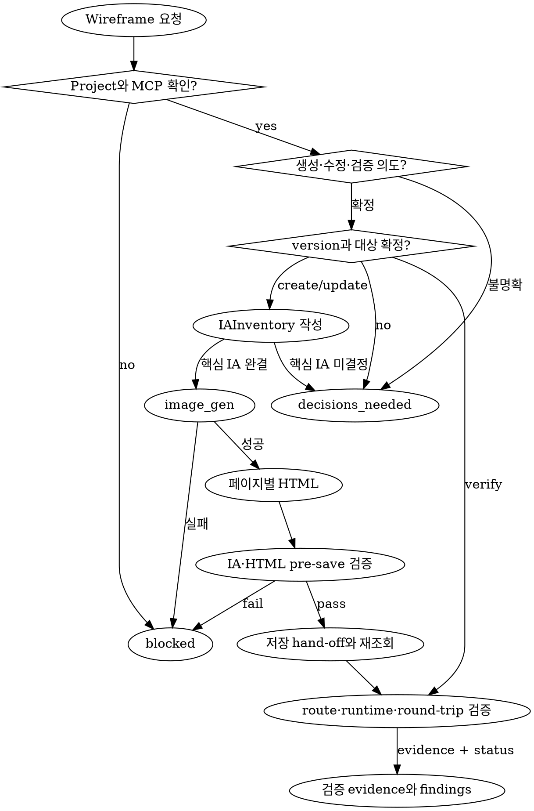
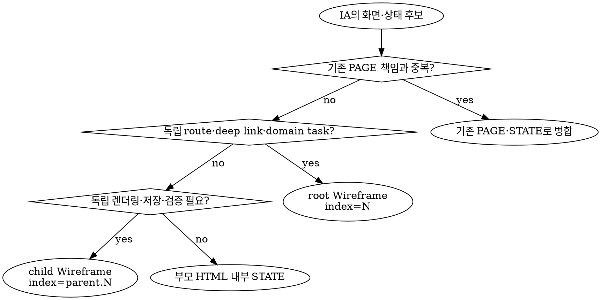

## 에이전트 호출 경계

- 새 에이전트를 생성하는 `spawn_agent`는 `root만` 호출한다.
- non-root 에이전트는 `spawn_agent`를 `직접 또는 간접`으로 호출하거나 다른 에이전트에게 생성을 요청하지 않는다.
- non-root 에이전트는 root가 이미 생성한 에이전트와 협력할 때 `send_message`, `followup_task`, `wait_agent`를 사용할 수 있다.
- 추가 역할이나 에이전트가 필요하면 필요한 역할, 작업 범위와 기대 증거를 `root에 handoff`한다.

UX 디자인 기반의 와이어 프레임을 만드는 스킬. click, scroll, page navigation 등의 인터렉트가 구현되어야 함.

<HARD-GATE>
- doc-curator는 먼저 yusung-harness-doc mcp 서버의 'get_project'를 통해 작업 지시가 내려진 레포가 project로 등록이 되어있는지 확인한다.
- 만약 project로 등록이 되어있지 않으면, 'project로 등록되지 않았습니다. 먼저 레포를 project로 등록하세요' 라고 반환한 후 메인 에이전트의 대화를 종료한다.
</HARD-GATE>

## root가 호출할 에이전트 목록

| 에이전트명  | 하는일                                                          |
| ----------- | --------------------------------------------------------------- |
| coder       | 코드 검색, 코드 작성, 코드 수정                                 |
| designer    | 유저 journey, IA, UX 기반 와이어프레임 디자인                   |
| researcher  | 비슷한 컨셉의 도메인을 서비스하는 각종 사이트들의 레퍼런스 체크 |
| doc-curator | yusung-harness-doc mpc를 통한 와이어프레임 문서 저장            |

## 워크플로우

> - 와이어 프레임의 페이지 레이아웃과 IA를 디자인 시 항상 image_gen 툴을 호출한다.
>   - image_gen 호출이 불가능하면, 메인 에이전트 스레드에 이 사실을 전달 한 후 작업을 중단하고, 이유를 보고한다.
>   - image_gen 으로 산출된 image의 레이아웃, UX, IA 구조를 참고하여 와이어 프레임을 구현한다.
> - coder는 html 을 작업한 후 doc-curator에게 전달하여 저장한 후 워크스페이스에서 개발용으로 저장한 파일을 삭제한다.

### 와이어 프레임의 생성 원칙

<RULE>
- 와이어 프레임은 페이지 컴포넌트 별로 저장한다.
  - 예시)
    |id|projectId|title|html|...|
    |---|---|---|---|---|
    |1|1|로그인 화면|...|...|
    |2|1|홈 화면|...|...|
    |3|1|작품 화면|...|...|

- 각 화면의 html들은 서로 이어져있어 유저 action에 따른 인터렉티브 ux 트랜지션이 가능해야 한다.
  - 예시)
    > 유저가 '로그인' 버튼 클릭 -> home 화면 -> '작품 보러가기' 버튼 클릭 -> 작품 화면

- 와이어 프레임은 같은 page(cuid식별)에 대해 여러 version이 존재 가능하다.
  - 예시)
    |id|title|page|version|
    |---|---|---|---|
    |1|로그인 화면|cmry...|1|
    |2|로그인 화면|cmry...|2|
    |3|...|...|...|

- yusung-harness-doc mcp 웹 대시보드에서 와이어 프레임의 관리 단위는 version이다.
  - version 별로 html간의 라우팅을 연결한다.

- 와이어 프레임의 페이지들은 페이지간 부모 자식 관계가 존재한다.
  - 예시)
    > 유저-로그인 페이지(index:1)<br>
    > └── (로그인 실패시 ) -> 로그인이 실패 모달 페이지(index: 1.1)<br>
    > └── (같은 페이지의 회원가입 버튼) -> 회원 가입 페이지(index: 1.2)<br>
    > └── (비밀번호 변경 버튼) -> 비밀 번호 변경 모달 페이지(index: 1.3)

- index가 양수 정수인 페이지들은 도메인적으로 구분된 라우팅 기반의 페이지이다
  - 예시)
    > `로그인`, `home`, `작품페이지`, `마이페이지` ...

- 와이어 프레임의 수정이 일어날 경우, 같은 버전의 다른 페이지 와이어프레임과의 라우팅 연결이 자연스러운지를 확인한다.

- 와이어 프레임은 유저 여정 기반으로 index가 설정되어야 함.

- 와이어 프레임으로 분배된 페이지들은 영역이 겹치는 부분이 없어야 함.

</RULE>

## 목적과 책임 경계

- Wireframe을 단순한 시각 초안이 아니라 승인된 요구사항과 사용자 목표를 검증 가능한 화면, 상태와 전환으로 변환한 IA source of truth로 사용한다.
- 다음 추적 관계를 끊지 않는다.

```text
요구사항 → Journey → IA node → 화면·상태 → action·transition → HTML → 검증 증거
```

- Wireframe에서는 정보 구조, 사용자 흐름, 콘텐츠 우선순위, 상호작용, 반응형과 접근성 동작을 결정한다.
- 브랜드 표현과 시각 자산은 Asset의 책임으로 남긴다.
- designer는 IA와 화면 명세, coder는 완전한 HTML, researcher는 외부 근거, doc-curator는 MCP 조회·저장·재조회를 담당한다.
- IAInventory와 검증 매트릭스는 에이전트 간 hand-off 계약으로 사용하고 MCP나 DB의 미지원 필드로 전달하지 않는다.

## 작업 모드와 선택 알고리즘

| mode | 사용 조건 | 결과 |
| --- | --- | --- |
| `WIREFRAME_CREATE` | 명시한 version의 Wireframe 집합을 새로 만들 때 | 전체 IA, 페이지별 HTML, create hand-off |
| `WIREFRAME_UPDATE` | 기존 Wireframe의 구조, title 또는 HTML을 수정할 때 | 대상 변경과 같은 version 핵심 Journey 회귀 검증, update hand-off |
| `WIREFRAME_VERIFY` | 기존 Wireframe을 수정하지 않고 검증할 때 | findings와 verification evidence |



```text
Project·요구사항
       │
       ▼
핵심 IA gate
       │
       ▼
사이트맵·페이지 인벤토리
       │
       ▼
Journey·State·Transition
       │
       ▼
IA 기반 image_gen
       │
       ▼
페이지별 HTML
       │
       ▼
IA·HTML pre-save 검증
       │
       ▼
부모 우선 저장 → 실제 ID 반영 → 재조회
       │
       ▼
Route·접근성·Viewport round-trip 검증
```

## 입력 계약과 핵심 IA gate

- doc-curator는 다음 순서로 Project hard gate를 통과시킨다.
  1. yusung-harness-doc MCP와 `get_project` 노출·연결 여부를 확인한다.
  2. `get_project({})`로 Project 목록을 조회한다.
  3. 대상 저장소의 정규화한 절대 경로와 `repoPaths[].path`가 exact-match하고 `repoType: LOCAL`인 Project를 하나만 선택한다.
  4. 선택한 양의 정수 `projectId`로 `get_project({ projectId })`를 호출한다.
  5. `get_wireframe({ projectId })`로 기존 version 전체를 조회하고 create의 충돌 여부 또는 update·verify 대상을 고정한다.
- MCP 연결에 실패하면 `yusung-harness-doc MCP에 연결할 수 없어 Wireframe 작업을 시작하지 않습니다.`를 blocker로 반환하고 중단한다.
- 일치하는 Project가 없거나 둘 이상이면 기존 HARD-GATE의 미등록 안내 또는 후보 충돌을 반환하고 중단한다.
- 다음 입력을 확인한 뒤 IA를 고정한다.
  - Project, 저장소 절대 경로, 작업 mode와 명시적인 양의 정수 Wireframe version
  - 대상 사용자, 역할·권한, 사용자 목표와 관찰 가능한 성공 조건
  - 승인된 요구사항, 포함 범위, 제외 범위와 비목표
  - 핵심 Journey, 진입점, 성공·중단·복귀 종료점과 primary action
  - 전체 페이지 인벤토리와 각 action의 transition target
  - 대상 플랫폼, 좁은 모바일·중간 폭·데스크톱 viewport, 입력 방식과 접근성 요구사항
  - create이면 해당 version의 전체 페이지 범위
  - update 또는 verify이면 대상 Wireframe ID와 같은 version의 전체 Wireframe 목록
- 사용자 목표, 성공 조건, 핵심 Journey, 페이지 책임 또는 route target을 바꾸는 누락은 추측하지 말고 `decisions_needed`로 반환한다.
- 결과를 바꾸지 않는 보조 상태와 표현만 영향과 근거를 `assumptions`에 기록하고 보완할 수 있다.
- 각 페이지에 `default` 상태를 정의한다. 데이터·비동기 화면에는 적용 가능한 `loading`, `empty`, `error`, 입력 화면에는 `invalid`, `disabled`, 완료 action에는 `success`를 검토한다.
- `permission`, `offline`이나 그 밖의 보조 상태를 포함하지 않으면 해당 페이지에 적용되지 않는 이유를 기록한다.
- 핵심 IA gate를 통과하기 전에는 `image_gen`, HTML 구현 또는 저장 hand-off를 시작하지 않는다.

## `IAInventory/1.0` hand-off 계약

- 다음 구조를 designer, coder, tester와 doc-curator 사이의 정본으로 사용한다.

```ts
interface IAInventory {
  scope: {
    projectId: number;
    repositoryPath: string;
    mode: "WIREFRAME_CREATE" | "WIREFRAME_UPDATE" | "WIREFRAME_VERIFY";
    version: number;
    requirementIds: string[];
    nonGoals: string[];
  };
  journeys: Array<{
    id: string;
    actor: string;
    goal: string;
    entryRef: string;
    successRef: string;
    primary: boolean;
    steps: Array<{
      id: string;
      nodeRef: string;
      state: string;
      actionId: string;
      transitionId: string;
    }>;
  }>;
  nodes: Array<{
    ref: string;
    index: string;
    parentRef: string | null;
    kind: "root-route" | "child-page" | "modal" | "drawer";
    title: string;
    journeyIds: string[];
    goal: string;
    contentPriority: string[];
    states: string[];
    actions: Array<{
      id: string;
      label: string;
    }>;
    terminal: boolean;
  }>;
  transitions: Array<{
    id: string;
    fromRef: string;
    fromState: string;
    actionId: string;
    trigger: string;
    guard: string | null;
    toRef: string;
    toState: string;
    expectedResult: string;
    recoveryRef: string | null;
  }>;
  coverage: Array<{
    requirementId: string;
    journeyIds: string[];
    nodeRefs: string[];
    transitionIds: string[];
    transitionFreeReason: string | null;
    htmlSelectors: string[];
    evidenceIds: string[];
  }>;
}
```

### 페이지와 내부 상태 분배



- 독립 route나 도메인 task는 단일 segment의 root Wireframe으로 분배한다.
- modal, drawer와 종속 sub-flow 중 독립 렌더링·저장·검증이 필요한 단위는 direct-child Wireframe으로 분배한다.
- loading, empty, validation, tooltip처럼 같은 화면 책임과 DOM 문맥 안에서 끝나는 상태는 소유 페이지 HTML에 포함한다.
- 공통 header, navigation과 footer는 shared shell로 명시할 수 있지만 각 요구사항의 primary content owner는 하나의 페이지로 제한한다.
- 의도한 modal·drawer layer 외에는 콘텐츠, control과 focus 영역이 겹치지 않게 한다.

### IA 불변식

- 모든 요구사항을 하나 이상의 Journey, node, HTML selector와 evidence에 연결한다. 동작 요구사항은 transition에도 연결하고 정적 콘텐츠 요구사항은 `transitionFreeReason`을 기록한다.
- 모든 Journey step에 안정적인 ID를 부여하고 `nodeRef`, `actionId`, `transitionId`로 추적한다.
- 모든 transition의 `actionId`가 source node에 선언된 action을 가리키게 한다.
- 모든 node를 진입점에서 도달 가능하게 하고, terminal이 아닌 dead-end와 근거 없는 cycle을 허용하지 않는다.
- 모든 transition의 source, target, state와 recovery target이 IAInventory에 존재하게 한다.
- 같은 version에서 `ref`와 `index`를 각각 유일하게 유지한다.
- root index는 양의 정수 한 segment를 사용하고 priority Journey의 최초 등장 순서로 배치한다.
- child index는 direct parent index에 양의 정수 segment 하나만 추가한다.
- parent와 child를 같은 Project와 version에 두고 orphan, self-parent와 parent cycle을 허용하지 않는다.
- parent/index 트리는 IA 소유 계층만 표현한다. sibling이나 다른 branch로 이동하는 사용자 흐름은 transition graph로 표현한다.
- page inventory node 수, WireframeSpec 수, HTML 수와 create hand-off 수를 일치시킨다.

## IA 기반 `image_gen` 계약

- 완결된 IAInventory를 입력으로 `image_gen`을 호출한다.
- prompt에 page tree와 index, Journey, 화면별 정보 우선순위, primary·secondary action, 상태·overlay와 제외 범위를 포함한다.
- IAInventory에 없는 페이지, navigation, action이나 콘텐츠 책임을 추가하지 말라고 명시한다.
- 생성 결과마다 대상 IA ID, 판단과 이유를 다음 값으로 기록한다.
  - `adopted`: IA를 그대로 시각화하여 채택함
  - `modified`: IA를 유지하며 레이아웃만 조정함
  - `rejected`: IA 또는 요구사항과 충돌하여 사용하지 않음
- 생성 이미지는 레이아웃 탐색 자료로만 사용하고 IAInventory를 계속 source of truth로 유지한다.

## 페이지별 `WireframeSpec`과 HTML 계약

- 다음 구조로 각 저장 record의 구현·검증 명세를 전달한다.

```ts
interface WireframeSpec {
  ref: string;
  title: string;
  index: string;
  parentRef: string | null;
  kind: "root-route" | "child-page" | "modal" | "drawer";
  version: number;
  journeyIds: string[];
  goal: string;
  entryConditions: string[];
  exitOutcomes: string[];
  contentPriority: string[];
  domOrder: string[];
  states: string[];
  interactions: Array<{
    actionId: string;
    transitionId: string;
    semanticControl: string;
    trigger: string;
    guard: string | null;
    routeOrScrollTarget: string;
    keyboard: string;
    focusResult: string;
  }>;
  responsiveRules: string[];
  accessibilityRules: string[];
  includedScope: string[];
  excludedScope: string[];
  acceptanceCriteria: string[];
  evidenceIds: string[];
}
```

- 각 저장 record의 WireframeSpec에 다음을 포함한다.
  - `ref`, title, index, parentRef, kind, version과 연결 Journey
  - 화면 목표, 진입·종료 조건, 정보 우선순위와 DOM 순서
  - state, semantic control, action, trigger, guard와 route·scroll target
  - 좁은 모바일·중간 폭·데스크톱에서 reflow, reposition, resize, show/hide 규칙
  - keyboard activation, focus 진입·복귀, 접근 가능한 이름과 상태 알림
  - 포함·제외 범위, acceptance criterion과 evidence ID
- 각 화면을 `<!doctype html>`, `html`, `head`, `body`를 포함하는 완전한 독립 HTML 문서로 구현한다.
- CSS와 필요한 최소 JavaScript를 문서 내부에 포함하고 핵심 콘텐츠와 action을 외부 stylesheet, script, font, form action이나 runtime fetch에 의존하지 않는다.
- JavaScript나 이미지가 실패해도 핵심 정보와 action을 식별할 수 있게 한다.
- 같은 record 안의 state와 scroll 이동은 semantic control, fragment 또는 hash route로 구현한다.
- 다른 record 이동은 상대 `.html` 링크에 `data-wireframe-id`를 우선 사용하고 `data-wireframe-index`를 보조 정보로 포함한다.
- 저장 전 ID가 없을 때만 같은 version에서 유일함을 검증한 provisional index를 사용한다. 저장 후 실제 ID로 링크를 갱신한다.
- click뿐 아니라 keyboard-only로 핵심 Journey, cancel, back과 error recovery를 완료할 수 있게 한다.

## MCP 저장 hand-off 계약

- 실제 MCP 입력과 다른 필드를 만들지 않는다.

```ts
interface CreateWireframePayload {
  projectId: number;
  parentId: number | null;
  index: string;
  title: string;
  html: string;
  version: number;
}

interface UpdateWireframePayload {
  projectId: number;
  wireframeId: number;
  parentId: number | null;
  index: string;
  title: string;
  html: string;
}

interface WireframeCreateHandoff {
  ref: string;
  parentRef: string | null;
  payload: Omit<CreateWireframePayload, "parentId">;
}

interface RouteBindingManifest {
  fromRef: string;
  transitionId: string;
  href: string;
  toRef: string;
  provisionalIndex: string;
  persistedWireframeId: number | null;
  sourceVersion: number;
  targetVersion: number;
  evidenceId: string | null;
}
```

- create hand-off를 parent-first 위상 순서로 정렬하고 root의 `parentRef`를 `null`로 둔다.
- doc-curator는 생성된 ID를 `ref`별로 수집하고 child의 `parentRef`를 실제 `parentId`로 치환한다.
- 모든 page를 생성한 뒤 route link를 실제 `data-wireframe-id`로 갱신하고 target ID의 Project와 version이 manifest의 source·target version과 같은지 재조회한 다음 전체 핵심 Journey를 다시 실행한다.
- update 전에 Project 소유권, 기존 record와 새 parent의 version 일치, 같은 version index 중복과 child 존재 여부를 확인한다.
- child가 있는 record의 parent 또는 index 이동을 시도하지 않는다. title이나 HTML만 바꾸면 전체 핵심 Journey를 회귀 검증한다.
- update payload로 `page`나 `version`을 변경하지 않고 version을 자동 증가시키지 않는다.
- 같은 page CUID를 유지하는 새 version이 필요하면 현재 capability를 먼저 확인한다. 지원되지 않으면 임의의 새 page로 대체하지 말고 blocker로 반환한다.
- 저장 후 `get_wireframe`을 재조회하여 record 수, ID-ref 매핑, parentId, index, version, title, HTML과 route target을 hand-off와 대조한다.

```text
IA·route matrix 확정
  → 같은 version의 ref·index 중복 검사
  → root부터 parent-first 생성
  → ref별 실제 ID 수집
  → child parentId 치환
  → route를 data-wireframe-id로 2차 갱신
  → get_wireframe 재조회
  → 개수·계층·version·route round-trip 검증
```

- create 또는 update가 중간에 실패하면 `partial`로 반환하고 성공한 record ID, 실패한 ref·도구·오류와 미저장 범위를 기록한다.
- 부분 실패 후 create를 맹목적으로 재호출하거나 기존 record를 삭제하지 않는다. 다음 작업에서 재조회한 상태를 기준으로 중복 없이 재개한다.

## 현재 구현 공백과 차단 조건

- 다음 항목을 코드가 보장한다고 가정하지 말고 `implementation_gaps`에 기록한다.
  - `IG-WF-001`: `create_wireframe`에 `page` 입력이 없어 같은 page CUID의 새 version을 직접 생성할 수 없음
  - `IG-WF-002`: ID와 index routing이 Project 전체에서 target을 찾고 source version을 검사하지 않아 stale ID나 여러 version의 같은 index가 오라우팅될 수 있음
  - `IG-WF-003`: update 시 서버가 새 parent와 기존 record의 version 일치를 완전히 보장하지 않음
  - `IG-WF-004`: DB가 `(projectId, version, index)` 유일성을 보장하지 않음
  - `IG-WF-005`: non-leaf 구조 이동과 여러 페이지의 원자적 batch 저장을 지원하지 않음
- 같은-page lineage, 같은-version target 또는 고유 route를 현재 도구로 증명할 수 없으면 저장하지 않는다.
- `data-wireframe-id`와 `data-wireframe-index`를 runtime의 version 보장으로 간주하지 않는다. 실제 target record의 Project와 version을 manifest와 대조한다.
- `data-wireframe-index`만으로 target이 모호하면 실제 ID를 반영하고 version을 재검증하기 전까지 완료로 판정하지 않는다.

## 검증과 완료 조건

- 저장 전 정적 검증으로 requirement coverage, node·HTML·handoff 개수, ref·index 유일성, parent topology, reachability, dead-end와 route target을 확인한다.
- 저장 전 중립 렌더러에서 source 충실도, state, keyboard, focus와 viewport 동작을 확인한다.
- create·update 저장 후 재조회한 실제 ID·Project·version을 route manifest와 대조하고 dashboard preview에서 CSP, navigation bridge와 route round-trip을 검증한다.
- verify에서는 기존 record와 승인된 범위를 조회한 뒤 저장 없이 중립 렌더러와 dashboard preview 검증을 수행한다.
- 좁은 모바일, 중간 폭과 데스크톱 viewport에서 각 페이지의 default와 적용 가능한 보조 상태를 렌더링한다.
- 핵심 Journey의 happy, alternate, validation·system recovery를 click과 keyboard-only로 끝까지 실행한다.
- modal·drawer의 focus 진입·복귀, back·cancel, scroll target, 긴 콘텐츠, 빈 콘텐츠, clipping, overlap과 비의도적 가로 overflow를 확인한다.
- 실행하지 않은 항목을 통과했다고 선언하지 않는다.
- finding에 안정적인 ID, 우선순위, page·state·viewport, 재현 action, 기대·실제 결과, 사용자 영향, owner와 종료 evidence를 기록한다.
- 미결정, blocker, 누락 페이지, unresolved route 또는 P0·P1 finding이 있으면 저장 hand-off와 `complete` 판정을 금지한다.

## 출력 계약

- 다음 항목을 포함하는 Markdown으로 반환한다.
  - `mode`와 `status: complete | partial | blocked`
  - Project, version과 대상 범위
  - `verified_facts`와 source 근거
  - create·update에서는 IAInventory와 requirement coverage, verify에서는 기존 IA source 또는 `not_available` 사유와 재구성한 source matrix
  - 페이지별 WireframeSpec과 route·state matrix
  - create·update에서는 `image_gen` evidence와 `adopted | modified | rejected` 판단, verify에서는 기존 evidence 또는 `not_applicable` 사유
  - create·update에서는 coder hand-off와 MCP hand-off, verify에서는 `not_applicable`
  - verification evidence와 우선순위가 있는 findings
  - `decisions_needed`, `assumptions`, `blockers`, `implementation_gaps`
- `complete`는 핵심 IA, 전체 페이지, 전체 route, 필수 상태와 runtime 검증이 모두 통과한 경우에만 사용한다. create·update에서는 저장 재조회까지 통과하고 verify에서는 승인된 검증 범위의 evidence가 모두 있어야 한다.
