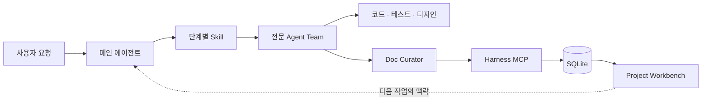
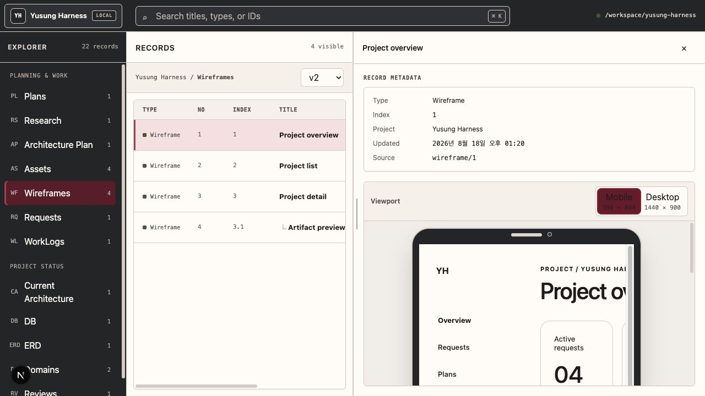
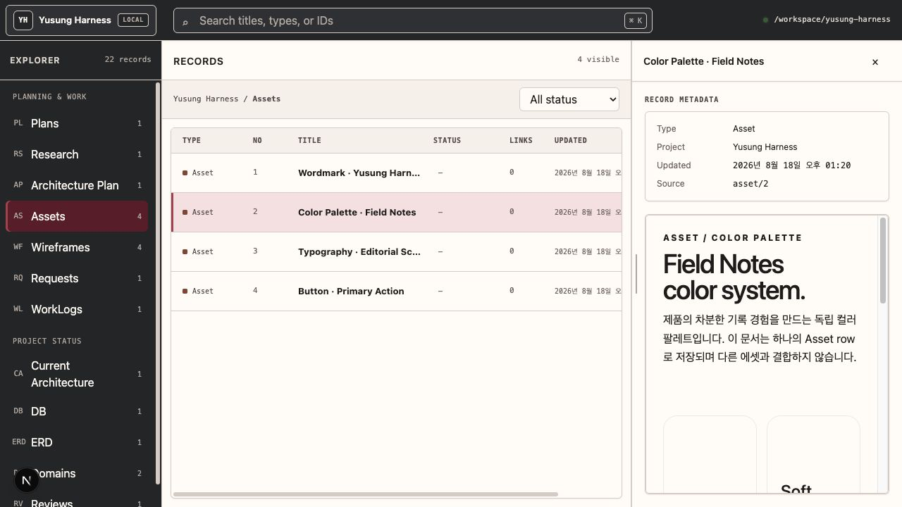

<div align="center">
  <h1>yusung-harness</h1>
  <p><strong>기획부터 구현, 검증, 기록까지<br />에이전트 팀이 하나의 맥락으로 움직이게 만드는 개발 하네스</strong></p>
  <p>
    
    
    
    
  </p>
</div>

> [!NOTE]
> yusung-harness는 프롬프트 모음이 아닙니다. 역할이 분리된 에이전트, 단계별 스킬, 프로젝트 규칙, 산출물 저장용 MCP 서버와 대시보드를 하나의 개발 워크플로우로 묶습니다.

## 왜 yusung-harness인가

- 긴 작업에서도 기획 의도와 구현 맥락이 사라지지 않습니다.
- 에이전트마다 역할과 책임이 분리되어 계획, 구현, 테스트와 리뷰가 뒤섞이지 않습니다.
- Research, Plan, Task, Asset, Wireframe, Review 같은 산출물이 채팅 안에서 휘발되지 않고 프로젝트 단위로 축적됩니다.
- Codex 전용 설정과 Project Workbench를 같은 설치 흐름으로 대상 프로젝트에 배포할 수 있습니다.
- 기존 프로젝트에 안전하게 설치하고, 충돌을 확인하며 업데이트할 수 있습니다.

## 한눈에 보는 구성

| 구성 요소 | 역할 |
| --- | --- |
| Agent Team | Architect, Coder, Designer 등 8개 역할이 작업을 분담합니다. |
| Workflow Skills | 조사, 설계, 구현, 검증, 통합과 운영을 14개 스킬로 표준화합니다. |
| Installer | Codex 하네스와 전체 `apps/` workspace를 프로젝트에 안전하게 배포합니다. |
| Document MCP | 에이전트 산출물을 39개 MCP 도구로 조회·생성·수정합니다. |
| Project Workbench | 프로젝트의 요청, 계획, 태스크, 설계와 작업 기록을 웹에서 탐색합니다. |
| Conventions | NestJS, TypeScript, React와 Next.js 코드 규칙을 저장소 안에서 공유합니다. |

## 워크플로우



- 메인 에이전트가 요청에 맞는 스킬과 담당 에이전트를 선택합니다.
- 전문 에이전트는 독립적인 작업을 병렬로 수행하고 결과를 조율합니다.
- Doc Curator가 계획과 산출물을 MCP 서버에 기록합니다.
- 다음 작업은 저장된 프로젝트 맥락을 다시 읽고 이어서 진행합니다.

## 실제 사용 예시

`wireframe`, `asset` 워크플로우에서 만든 산출물은 Project Workbench에서 프로젝트 맥락과 함께 탐색하고 바로 미리 볼 수 있습니다.

### 1. 와이어프레임 검토



- 화면 구조와 콘텐츠 흐름을 구현 전에 확인합니다.
- 레코드 메타데이터와 HTML 미리보기를 한 화면에서 비교합니다.

### 2. 디자인 에셋 탐색



- 워드마크, 로고, 컬러 팔레트 같은 디자인 자산을 프로젝트별로 축적합니다.
- 에셋 항목마다 독립된 HTML과 Asset 레코드를 저장하고 브라우저에서 미리 봅니다.

## Agent Team

| Agent | 책임 |
| --- | --- |
| `architect` | 시스템 구조, 기술 스택, 인프라와 배포 전략을 설계합니다. |
| `coder` | 코드베이스를 탐색하고 기능을 구현하거나 수정합니다. |
| `designer` | UX/UI, 디자인 에셋과 실제 화면 디자인을 담당합니다. |
| `doc-curator` | 다른 에이전트의 산출물을 MCP 문서 저장소에 보관하고 관리합니다. |
| `planner` | 요구사항을 분석하고 Plan과 Task로 실행 범위를 나눕니다. |
| `researcher` | 제품 Discovery와 최신 웹 근거 검증을 하나의 Research로 작성합니다. |
| `reviewer` | 구현 결과를 프로젝트 전체 관점에서 비판적으로 검토합니다. |
| `tester` | 테스트 작성, 실행, 회귀 검증과 배포 전 확인을 담당합니다. |

## Workflow Skills

| 단계 | Skill | 결과 |
| --- | --- | --- |
| 발견 | `curate`, `research` | 프로젝트 등록, 제품 탐색, live 근거 조사와 초기 제안 |
| 설계 | `plan`, `architecturePlan`, `domain`, `db`, `erd` | 실행 계획, 아키텍처, 계층형 업무 Domain 문서와 데이터 구조 |
| 제작 | `asset`, `wireframe`, `code` | 디자인 자산, 화면 흐름과 실제 코드 |
| 검증·통합 | `test`, `integration` | 테스트, 격리 worktree 생성, READY 검증, 커밋과 병합 |
| 운영 | `infra`, `deploy` | 원격 인프라 제어, push, IaC, CI/CD, 배포·승격과 롤백 |

`integration`은 구현 브랜치의 전체 수명주기를 소유합니다.

```text
integration --worktree
        │
        ▼
ACTIVE: .worktree/<name>에서 구현·테스트
        │
        ▼
integration --commit → source 검증 → READY
        │
        ▼
integration --merge → candidate 품질 게이트 → target 반영
```

- `infra`의 변경 작업과 `deploy`의 `PUSH`, `INFRA_CHANGE`, `PIPELINE_RUN`, `RELEASE`, `ROLLBACK`은 정확한 대상과 revision을 사용자에게 제시하고 작업별 명시 승인을 받은 뒤 실행합니다.
- 외부 작업은 명령 성공만으로 완료 처리하지 않고 authoritative 상태를 다시 조회해 결과를 검증합니다.

## 빠른 설치

### 요구 사항

- Python 3.10 이상
- Node.js 22 이상
- pnpm 11.7.0
- 설치할 대상 프로젝트
- 역할 기반 병렬 작업을 사용할 수 있는 에이전트 런타임

Codex 프로필은 저장소의 `.codex/config.toml`에 멀티 에이전트 설정을 포함합니다.

```toml
[features.multi_agent_v2]
enabled = true
max_concurrent_threads_per_session = 5
```

### 1. 변경 범위 미리 확인

```bash
python3 install.py /path/to/target-project \
  --dry-run
```

### 2. 대상 프로젝트에 설치

```bash
python3 install.py /path/to/target-project
```

> [!TIP]
> 처음에는 항상 `--dry-run`으로 생성·충돌 범위를 확인하는 것을 권장합니다. 기본 설치는 대상 프로젝트에서 이미 수정된 파일을 덮어쓰지 않습니다.

### 3. 프로젝트별 통합 프로필 설정

설치기는 대상 프로젝트의 `.codex/integration.toml`이 없을 때 다음과 같이 fail-closed 상태로 생성합니다.

```toml
configured = false
```

- 대상 저장소에서 실제로 실행할 `verification.source.*`와 `verification.candidate.*` 명령을 설정한 뒤 `configured = true`로 전환합니다.
- `configured = false`이거나 필수 source 검증 프로필이 없으면 `integration --worktree`는 worktree와 branch를 만들지 않고 중단합니다.
- 이 파일은 프로젝트별 설정이므로 이후 `--force`, `--backup`, `--sync`에서도 기존 내용을 보존합니다.

## 설치 범위

```text
yusung-harness                 대상 프로젝트
├── AGENTS.md ───────────────> ├── AGENTS.md
├── docs/ ───────────────────> ├── docs/
├── .codex/ ─────────────────> ├── .codex/
│                                 └── integration.toml # 최초 생성 후 보존
└── apps/ ───────────────────> ├── apps/
                                  ├── server/.env       # 최초 생성 후 보존
                                  └── web/.env.local    # 최초 생성 후 보존
                                └── .yusung-harness/
                                    └── install-manifest.json
```

- 설치기는 Codex 전용이며 `AGENTS.md`, `docs/`, `.codex/`, 전체 `apps/` workspace를 함께 배포합니다.
- `--profile codex`는 기존 자동화 호환을 위한 deprecated no-op입니다. `agents`, `claude`, `all`은 지원하지 않습니다.
- server·web source, workspace 설정, lockfile, Prisma schema와 migration, scripts와 tests를 포함합니다.
- 실제 `.env`, DB, `node_modules`, build·cache 산출물은 source payload와 manifest에서 제외합니다.
- 설치기가 처음 만든 `apps/server/.env`와 `apps/web/.env.local`은 이후 강제 업데이트와 sync에서도 보존합니다.
- 파일 적용 후 `TARGET/apps`에서 `pnpm install --frozen-lockfile`만 실행합니다.
- build, Prisma generate/migrate, DB 작업, dev/start와 service 관리는 실행하지 않습니다.
- Git 대상에서는 `.git/info/exclude`의 managed block에 `/.worktree/`와 `/.yusung-harness/`를 한 번씩 등록합니다.
- 설치기는 `.worktree/`를 만들지 않습니다. `integration --worktree`가 `TARGET/.worktree/<name>`에 격리 source를 만들고 lifecycle manifest와 검증 evidence를 `TARGET/.yusung-harness/state/worktrees/`에 기록합니다.

### 기존 설치 업데이트

```bash
python3 install.py /path/to/target-project \
  --sync \
  --force \
  --backup
```

| 옵션 | 동작 |
| --- | --- |
| `--dry-run` | 파일을 변경하지 않고 예상 작업과 요약만 출력합니다. |
| `--force` | 내용이 다른 기존 하네스 파일을 새 버전으로 갱신합니다. |
| `--backup` | `--force` overwrite 전에 installer-managed 파일을 백업합니다. |
| `--sync` | manifest로 소유권과 hash가 확인된 stale 파일만 안전하게 정리합니다. |
| `--profile codex` | 기존 명령 호환용 deprecated no-op입니다. |

- manifest는 `TARGET/.yusung-harness/install-manifest.json`에 관리 경로별 SHA-256을 기록합니다.
- `.yusung-harness/.gitignore`와 제한된 POSIX 권한으로 manifest·lock·backup의 Git 노출을 막습니다.
- 원본에 없는 대상 전용 파일과 사용자가 수정한 stale 파일은 삭제하지 않습니다.
- 동일한 파일은 `skip`, 변경된 파일은 기본적으로 `conflict` 처리합니다.
- `--sync`도 manifest hash가 현재 파일과 일치할 때만 obsolete 파일을 삭제합니다.
- 안전 삭제 대상은 `--backup` 옵션과 관계없이 `.yusung-harness/backups/<run-id>/`에 먼저 보관합니다.
- 환경 파일, DB와 runtime 산출물은 `--force`, `--backup`, `--sync`와 관계없이 보존합니다.
- 이전 manifest가 소유권을 증명하는 `.codex/skills/code/scripts/worktree.py`는 `--sync`에서 먼저 backup한 뒤 정리하고, 새 엔진은 `.codex/skills/integration/scripts/worktree.py`에 설치합니다. 사용자가 수정한 이전 파일은 보존하고 충돌로 보고합니다.
- 자세한 설치 정책은 [`install.md`](./install.md)에서 확인할 수 있습니다.

## Project Workbench 실행

`apps/`에는 에이전트 산출물을 저장하는 NestJS MCP 서버와 이를 탐색하는 Next.js 대시보드가 들어 있습니다.

### 요구 사항

- Node.js 22 이상
- pnpm 11.7.0

### 1. 설치된 환경 변수 확인

설치기는 다음 파일이 없을 때만 생성하고, 이후 업데이트에서는 내용을 보존합니다.

`TARGET/apps/server/.env`:

```dotenv
DATABASE_URL="file:./harness-board.db"
PORT=4000
```

`TARGET/apps/web/.env.local`:

```dotenv
HARNESS_API_URL="http://127.0.0.1:4000"
HARNESS_MCP_URL="http://127.0.0.1:4000/mcp"
```

필요한 경우 실행 전에 값을 직접 조정합니다.

### 2. 서버와 웹 앱 실행

```bash
cd /path/to/target-project/apps
pnpm dev
```

- installer가 이미 `pnpm install --frozen-lockfile`로 의존성을 준비합니다.
- installer 자체는 build, Prisma generate/migrate, DB 작업이나 process start를 수행하지 않습니다.
- 사용자가 `pnpm dev`를 실행하면 서버의 `predev` 단계가 Prisma Client 생성, SQLite 파일 준비와 migration 적용을 수행합니다.
- 웹 대시보드는 저장된 첫 번째 프로젝트로 자동 진입합니다.

| 주소 | 용도 |
| --- | --- |
| `http://127.0.0.1:3000` | Project Workbench |
| `http://127.0.0.1:4000/mcp` | MCP Streamable HTTP endpoint |
| `http://127.0.0.1:4000/projects` | 프로젝트 REST API |

### Workbench 정보 구조

```text
Project Explorer
├── Planning & Work
│   ├── Plans
│   │   └── Tasks
│   ├── Research
│   ├── Architecture Plan
│   ├── Assets
│   ├── Wireframes
│   ├── Requests
│   └── WorkLogs
└── Project Status
    ├── Current Architecture
    ├── DB
    ├── ERD
    ├── Domains
    └── Reviews
```

- Task는 별도 최상위 메뉴가 아니라 소속 Plan 아래에서 관리합니다.
- Architecture workspace는 구현 전 `Plan`과 구현 후 `Current(PRODUCTION)`를 구분합니다.
- 각 workspace는 Records 목록과 선택 레코드의 Metadata·미리보기 detail pane을 함께 제공합니다.

## MCP 연결

Codex의 `doc-curator` 프로필에는 로컬 문서 서버 연결이 미리 정의되어 있습니다.

```toml
[mcp_servers.yusung-harness-doc]
url = "http://127.0.0.1:4000/mcp"
```

MCP 서버는 프로젝트와 산출물을 다루는 39개 도구를 제공합니다.

| 분류 | 대표 도구 | 용도 |
| --- | --- | --- |
| Context | `get_context`, `get_project` | DB 구조와 프로젝트 전체 맥락을 조회합니다. |
| Research | `get_research`, `create_research`, `update_research` | 제품 탐색과 live 근거를 프로젝트별 Research로 저장·수정합니다. |
| Planning | `create_plan`, `update_plan`, `create_task`, `update_task` | 실행 계획을 저장하고 진행 상태를 갱신합니다. |
| Architecture & Data | `get_architecture`, `upsert_architecture`, `create_domain`, `update_domain`, `create_db`, `update_db`, `create_erd`, `update_erd` | PLAN·PRODUCTION Architecture, 계층형 업무 Domain, DB 문서와 canonical ERD를 기록합니다. |
| Visual | `get_asset`, `create_asset`, `update_asset`, `get_wireframe`, `create_wireframe`, `update_wireframe` | 항목별 독립 Asset HTML과 버전·계층형 Wireframe HTML을 저장합니다. |
| Execution | `create_request`, `update_request`, `create_workLog`, `get_review` | 요청 수명주기와 작업 기록, 리뷰를 관리합니다. |
| Files | `create_file`, `get_file`, `update_file`, `delete_file` | 프로젝트에 연결된 임시 파일과 업로드 상태를 관리합니다. |

## 대시보드에서 관리하는 산출물

- `Request` → `Plan` → `Task`로 이어지는 실행 흐름
- 문제·사용자·가치·가설·대안과 live 근거를 함께 담는 `Research`
- 하나의 `Architecture` 안에서 관리하는 구현 전 `Plan`과 구현 후 `Current(PRODUCTION)`
- 한 업무 Domain당 한 Markdown 페이지로 구성된 무제한 `Domain` 계층과 테이블별 DB 문서
- memo나 annotation 없이 테이블·컬럼·PK·UK와 FK 관계를 담는 canonical Dineug ERD Editor v3 `.erd` JSON
- 디자인 요소마다 독립된 완전한 HTML 문서로 저장하는 `Asset`
- 버전과 계층 구조를 가진 `Wireframe`
- 작업 과정의 `WorkLog`와 결과를 평가하는 `Review`
- Markdown 문서와 sandbox iframe으로 미리 보는 HTML 아티팩트

## 개발 명령어

다음 명령어는 `apps/` 디렉터리에서 실행합니다.

| 명령어 | 설명 |
| --- | --- |
| `pnpm dev` | MCP 서버와 웹 대시보드를 병렬로 실행합니다. |
| `pnpm dev:server` | NestJS 서버만 watch 모드로 실행합니다. |
| `pnpm dev:web` | Next.js 웹 앱만 실행합니다. |
| `pnpm build` | 모든 workspace package를 빌드합니다. |
| `pnpm typecheck` | 전체 TypeScript 타입을 검사합니다. |
| `pnpm lint` | lint script가 있는 workspace를 검사합니다. |
| `pnpm test` | 서버와 웹 앱의 단위·경계 테스트를 실행합니다. |

## 저장소 구조

```text
yusung-harness/
├── .codex-plugin/            # Codex plugin manifest, installer 제외
├── .codex/
│   ├── agents/              # Codex 전용 역할과 실행 설정
│   ├── skills/              # 단계별 워크플로우 스킬
│   ├── config.toml          # 모델, 권한과 멀티 에이전트 설정
│   └── integration.toml     # worktree·merge 검증 프로필
├── .agents/                 # 범용 에이전트용 역할과 스킬, installer 제외
├── .claude/                 # Claude Code용 에이전트 정의, installer 제외
├── apps/
│   ├── server/              # NestJS + MCP + Prisma + SQLite
│   └── web/                 # Next.js Project Workbench
├── docs/
│   ├── architecture/        # 하네스 문서 도메인 구조
│   └── conventions/         # Backend / Frontend 코드 규칙
├── examples/
│   └── commerce-erd-example.erd # memo-free Dineug v3 ERD 예시
├── tests/                   # installer와 agent policy 테스트
├── AGENTS.md                # 에이전트 공통 운영 규칙
├── install.py               # Codex + apps 설치·안전 동기화 도구
└── install.md               # 설치기의 상세 동작 문서
```

## 기술 스택

| 영역 | 기술 |
| --- | --- |
| Agent Runtime | Codex multi-agent, repo-local agents & skills |
| MCP Server | NestJS 11, MCP TypeScript SDK, Zod 4 |
| Database | Prisma 7, SQLite, better-sqlite3 adapter |
| Dashboard | Next.js 16, React 19, Tailwind CSS 4, Geist |
| Test | Node.js Test Runner, Vitest, Testing Library |
| Installer | Python 3.10+, `pathlib`, `shutil`, SHA-256 manifest |

## 디자인 생성 전제와 선택 연동

- `asset`, `wireframe` 생성·수정 워크플로우는 디자인과 IA를 확정할 때 `image_gen`을 필수로 호출합니다.
- `image_gen`을 호출할 수 없거나 생성에 실패하면 임의의 대체 이미지나 HTML로 진행하지 않고 작업을 중단합니다.
- Open Design 같은 외부 디자인 도구는 선택적으로 활용할 수 있지만 필수 전제나 `image_gen`의 대체 경로는 아닙니다.
- 일반적인 기획, 코딩, 테스트, 문서 관리, 인프라 조회와 배포 상태 조회에는 `image_gen`이 필요하지 않습니다.

## 운영 원칙

- 매 단계에서 현재 작업을 평가하고 필요한 전문 에이전트만 호출합니다.
- 하나의 root task 안에서는 역할별로 하나의 에이전트만 유지합니다.
- 매 작업 배정 전에 `list_agents`를 확인하고, 같은 역할이 `completed`, `idle`, `running` 상태로 존재하면 `followup_task`로 재사용합니다.
- `send_message`는 보조 정보 전달에만 사용하며 새 작업 배정에는 사용하지 않습니다.
- 같은 역할이 없을 때만 canonical 역할별 `task_name`으로 `spawn_agent`를 호출하고, `doc-curator`의 `task_name`만 `doc_curator`를 사용합니다.
- 재사용이 실패해도 중복 에이전트를 생성하지 않고 원인을 보고합니다.
- 격리 worktree의 생성, READY 검증과 병합 상태 전이는 `integration`이 소유하고 root만 mutation을 실행합니다.
- 원격 인프라와 배포 mutation은 대상·revision·영향 범위를 고정해 작업별 사용자 승인을 받은 뒤 root가 실행하고, 실제 원격 상태를 재조회해 검증합니다.
- 구현은 저장소의 conventions와 테스트 우선 원칙을 따릅니다.
- 에이전트가 만든 계획과 산출물은 Doc Curator를 통해 프로젝트 문맥에 연결합니다.
- 하네스 자체의 Markdown 정책 파일은 사용자의 명시적인 요청 없이 수정하지 않습니다.
- 설치와 업데이트는 삭제보다 보존을 우선하며, 충돌을 숨기지 않고 보고합니다.
